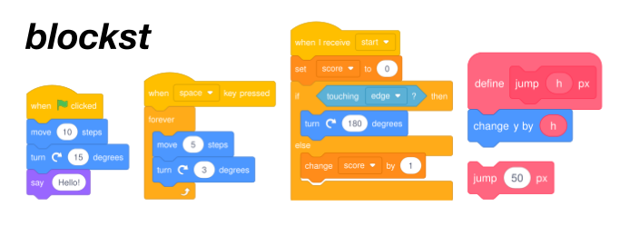
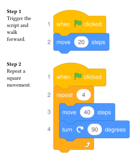
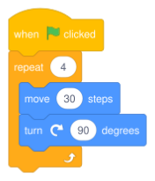
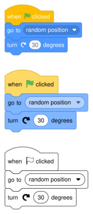
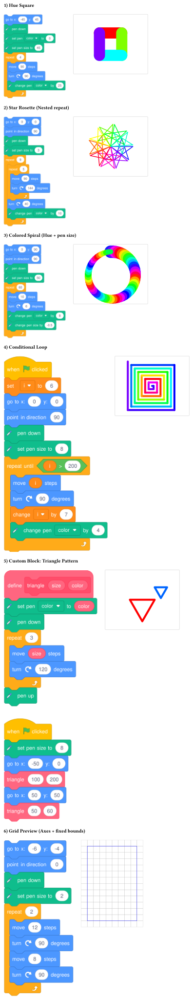
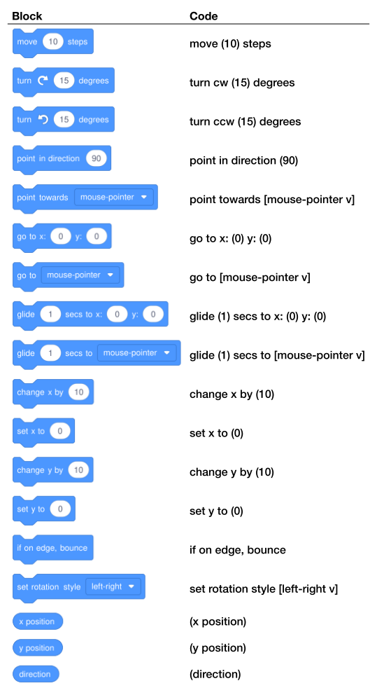
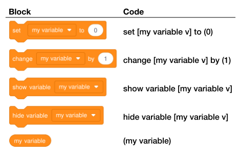
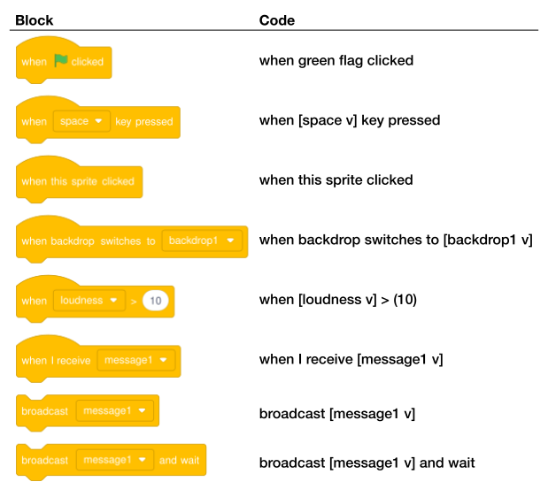
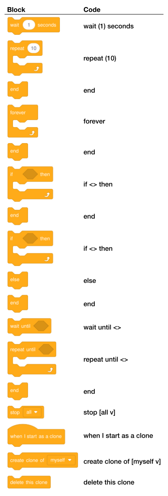
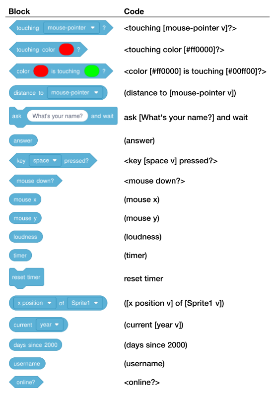

# Blockst - Scratch Blocks in Typst

<p align="left">
  <a href="https://typst.app/universe/package/blockst"></a>
  <a href="LICENSE"></a>
</p>



Blockst renders Scratch-style programming blocks directly in Typst documents.
It is made for worksheets, tutorials, teaching material, and visual programming explanations.

The current renderer is text-based: Typst passes Scratch text to a bundled WASM plugin, the plugin parses and renders SVG, and Typst embeds the SVG output.

> ⚠️ **BREAKING CHANGE (since `0.2.0`)**
>
> ❌ The old pre-`0.2.0` syntax is **removed** and no longer available.
>
> ✅ From `0.2.0` onward, Blockst supports **only** the text-to-WASM pipeline.
>
> 🔧 Documents that still rely on the previous native Typst renderer syntax **must be migrated**.

Starting with version 0.2.0, Blockst uses only the WASM-based text parser and renderer. The earlier native Typst rendering approach was dropped because it ran into Typst's limits on more complex Scratch layouts.

### New in 0.3.0

- **Right-to-left rendering** for Arabic, Hebrew and Persian, plus a new
  **Arabic locale** — see [Right-to-Left Languages](#right-to-left-languages)
- **`grayscale` theme**: one distinct grey per category, for photocopied worksheets
- **`font:` parameter** on `scratch()` and `blockst()`
- French localisation completed (`définir`, `appeler`, `tourner à droite/gauche`,
  French pen-effect values) — thanks to @remiangot and @XanderLeaDaren
- Fixes: block labels no longer fall back to the surrounding font inside
  ```` ```scratch ```` blocks; non-Latin locales are matched correctly
  (the spec hash used to mangle multi-byte characters); C-block headers are
  no longer drawn twice

## Contents

- [Highlights](#highlights)
- [Install and Import](#install-and-import)
- [Quick Start](#quick-start)
- [Example Gallery](#example-gallery)
- [SB3 Import via Typst Plugin WASM](#sb3-import-via-typst-plugin-wasm)
- [Right-to-Left Languages](#right-to-left-languages)
- [Catalog](#catalog)
- [Contributing](#contributing)

## Highlights

- Scratchblocks-style syntax for scripts, reporters, booleans, inputs, dropdowns, and nested control blocks
- Themes: normal, high-contrast, print
- Localized text rendering through the WASM locale data
- **Right-to-left languages** (Arabic, Hebrew, Persian): the block layout is
  mirrored automatically — notch, hat, C-block mouth, loop arrow and label
  order all follow the reading direction
- Category suffixes via `::motion`, `::control`, ... (scratchblocks-style)
- Optional line numbers and `#label` references for line-aware worksheets
- Optional compact block geometry with `inset-scale` (text size unchanged, e.g. `60%`, `90%`, `125%`)
- **experimental:** SB3 import helpers for scripts, lists, variables, images, and static screen previews

## Install and Import

```typst
#import "@preview/blockst:0.3.0": blockst, scratch, raw-scratch, sb3
```

> Font requirement: Blockst is designed for Helvetica Neue (Scratch-like look).
> On Linux/Windows install a compatible font, for example Nimbus Sans,
> or override globally with `set-blockst(font: "...")`.

## Quick Start


<details>
<summary><strong>Show code</strong></summary>

```typst
#scratch("
when green flag clicked
move (10) steps
turn cw (15) degrees
")
```

</details>

Source: [examples/example-quickstart.typ](examples/example-quickstart.typ)

## Example Gallery

All long snippets below use the same pattern: result first, code in a collapsible block.

### Localized Text


<details>
<summary><strong>Show code</strong></summary>

```typst
#set-blockst(scale: 67.5%)

#scratch("Wenn die grüne Flagge angeklickt
wiederhole (4) mal 
  gehe (30) er Schritt
  drehe dich nach rechts um (90) Grad
end", language: "de")
```

</details>

Source: [examples/example-de.typ](examples/example-de.typ)

### Inline Usage Without blockst Container



<details>
<summary><strong>Show code</strong></summary>

```typst
#grid(
  columns: (1fr, auto),
  gutter: 6mm,
  [*Step 1*\
  Trigger the script and walk forward.],
  [#scratch(line-numbers: true, "when green flag clicked\nmove (20) steps")],
  [*Step 2*\
  Repeat a square movement.],
  [#scratch(line-numbers: true, "when green flag clicked\nrepeat (4)\nmove (40) steps\nturn cw (90) degrees\nend")],
)
```

</details>

Source: [examples/example-inline.typ](examples/example-inline.typ)

### Dedicated Label Walkthrough (Euclidean Algorithm)


<details>
<summary><strong>Show code</strong></summary>

```typst
#let gcd-script = "when green flag clicked #start
set [a v] to (48)
set [b v] to (18)
repeat until <(b) = (0)> #loop
set [r v] to ((a) mod (b)) #compute-rem
set [a v] to (b)
set [b v] to (r) #update-b
end"

#grid(
  columns: (1.25fr, 1fr),
  gutter: 8mm,

  [
    *Euclidean Algorithm (gcd label walkthrough)*

    #blockst(line-numbers: true, inset-scale: 90%)[
      #scratch(gcd-script)
    ]
  ],

  [
    *Explanation of labeled lines*

    - *Line #blockst-labels("loop")*: Loop condition `b != 0` controls termination.
    - *Line #blockst-labels("compute-rem")*: Core rule: `r = a mod b`.
    - *Line #blockst-labels("update-b")*: State update that advances to the next pair.
  ],
)
```

</details>

Source: [examples/example-labels.typ](examples/example-labels.typ)

### Markdown Code Blocks with raw-scratch



<details>
<summary><strong>Show code</strong></summary>

````typst
#show: raw-scratch()

```scratch
when green flag clicked
repeat (4)
  move (30) steps
  turn cw (90) degrees
end
```
````

</details>

Source: [examples/example-raw-scratch.typ](examples/example-raw-scratch.typ)

### Theme and Scale



<details>
<summary><strong>Show code</strong></summary>

```typst
#let script = "when green flag clicked
go to (random position v)
turn cw (30) degrees"

#blockst(inset-scale: 50%)[
  #scratch(script)
]

#v(5mm)

#blockst(theme: "high-contrast")[
  #scratch(script)
]

#v(5mm)

#blockst(theme: "print")[
  #scratch(script)
]
```

</details>

Source: [examples/example-theme.typ](examples/example-theme.typ)

Use `::category` (for example `::motion`, `::looks`, `::control`) to force a block category in scratchblocks style.
Examples:

- `move (10) steps ::motion`
- `ajouter (5) à [i v] ::variables`
- `::control` (category default block)

### Executable Preview (scratch-run)



<details>
<summary><strong>Show code</strong></summary>

```typst
#let square-program = "
go to x: (-45) y: (45)
pen down
set pen [color v] to (0)
set pen size to (45)
repeat (4)
  move (90) steps
  turn cw (90) degrees
  change pen [color v] by (25)
end"

#let star-rosette-program = "
go to x: (0) y: (0)
point in direction (90)
pen down
set pen size to (3)
repeat (9)
  repeat (5)
    move (90) steps
    turn cw (144) degrees
  end
  turn cw (40) degrees
  change pen [color v] by (10)
end"

#let spiral-program = "
go to x: (0) y: (90)
point in direction (90)
pen down
set pen size to (50)
repeat (60)
  move (10) steps
  turn cw (6) degrees
  change pen [color v] by (8)
  change pen size by (-0.5)
end"

#let conditional-program = "
when green flag clicked
set [i v] to (6)
go to x: (0) y: (0)
point in direction (90)
pen down
set pen size to (8)
repeat until <(i) > (200)>
  move (i) steps
  turn cw (90) degrees
  change [i v] by (7)
  change pen [color v] by (4)
end"

#let custom-block-program = "
define triangle (var [size]) (color)
set pen [color v] to (var [color])
pen down
repeat (3)
  move (var [size]) steps
  turn cw (120) degrees
end
pen up

when green flag clicked
set pen size to (8)
go to x: (-50) y: (0)
call triangle (100) (200)
go to x: (50) y: (50)
call triangle (50) (60)
"

#let grid-square-program = "
go to x: (-6) y: (-4)
point in direction (0)
pen down
set pen size to (2)
repeat (2)
  move (12) steps
  turn cw (90) degrees
  move (8) steps
  turn cw (90) degrees
end
"

#set-scratch-run(
  stage: (size: (300, 240)),
  start: (x: 0, y: 0, angle: 90),
  grid: (visible: false, axes: false),
  cursor: false,
  scale: 2,
)

#stack(
  spacing: 6mm,

  [*1) Hue Square*],
  grid(
    columns: (auto, auto),
    gutter: 6mm,
    [#scratch(square-program)],
    [#scratch-run.stage(square-program)],
  ),

  [*2) Star Rosette (Nested repeat)*],
  grid(
    columns: (auto, auto),
    gutter: 6mm,
    [#scratch(star-rosette-program)],
    [#scratch-run.stage(star-rosette-program)],
  ),

  [*3) Colored Spiral (Hue + pen size)*],
  grid(
    columns: (auto, auto),
    gutter: 6mm,
    [#scratch(spiral-program)],
    [#scratch-run.stage(spiral-program)],
  ),

  [*4) Conditional Loop*],
  grid(
    columns: (auto, auto),
    gutter: 6mm,
    [#scratch(conditional-program)],
    [#scratch-run.stage(conditional-program)],
  ),

  [*5) Custom Block: Triangle Pattern*],
  grid(
    columns: (auto, auto),
    gutter: 6mm,
    [#scratch(custom-block-program)],
    [#scratch-run.stage(custom-block-program, cursor: false)],
  ),

  [*6) Grid Preview (Axes + fixed bounds)*],
  grid(
    columns: (auto, auto),
    gutter: 6mm,
    [#scratch(grid-square-program)],
    [#scratch-run.grid(
      grid-square-program,
      step: 1,
      scale: 0.5,
      grid: true,
      fit: true,
      cursor: false,
    )],
  ),
)

```

</details>

Source: [examples/example-executable.typ](examples/example-executable.typ)

## Experimental: SB3 Import via Typst Plugin WASM

Recommended workflow:

1. Read `.sb3` as bytes via `read(..., encoding: none)`.
2. Use the `sb3` helpers to extract scripts, monitors, images, or screen previews.
3. Render imported scripts through the same text-to-WASM pipeline as `scratch(...)`.

### SB3 Scripts and Screen Preview


<details>
<summary><strong>Show code</strong></summary>

```typst
#let project = read("../examples/Mampf-Matze Lösung.sb3", encoding: none)

#blockst[
  #sb3.sb3-screen-preview(project, unit: 1.5)

  #v(4mm)

  #sb3.render-sb3-scripts(
    project,
    language: "en",
    target: "Pacman",
    target-script-number: 2,
    show-headers: true,
  )
]
```

</details>

Source: [examples/example-sb3-import.typ](examples/example-sb3-import.typ)

### Variable and List Monitors


<details>
<summary><strong>Show code</strong></summary>

```typst
#let project = read("Mampf-Matze Lösung.sb3", encoding: none)

#stack(
  spacing: 4mm,
  sb3.render-sb3-variables(project, language: "en", show-target-headers: false),
  sb3.render-sb3-lists(project, language: "en", show-target-headers: false),
)
```

</details>

Source: [examples/example-monitors.typ](examples/example-monitors.typ)

### SB3 API at a Glance

- Scripts: `sb3.render-sb3-scripts(...)` with target and script filters
- Lists: `sb3.render-sb3-lists(...)` by target, name, or local index
- Variables: `sb3.render-sb3-variables(...)` by target, name, or local index
- Images: `sb3.sb3-images-catalog(...)`, `sb3.sb3-image(...)`
- Screen: `sb3.sb3-screen-preview(...)`
- Catalogs: `sb3.sb3-scripts-catalog(...)`, `sb3.sb3-state-catalog(...)`

## Right-to-Left Languages

Arabic, Hebrew and Persian render right-to-left. Nothing extra is required:
pass the language and the renderer mirrors the layout.

```typ
#scratch("
عند نقر @greenFlag
تحرك (10) خطوة
كرر (4) مرة
استدر @turnRight (90) درجة
نهاية
", language: "ar")
```


> Right-to-left layout, the Arabic locale and the `grayscale` theme arrived in
> `0.3.0`. The Arabic and Hebrew scripts need fonts that cover them — see
> [examples/README-rtl.md](examples/README-rtl.md).

What is mirrored: the order of labels and inputs, the top/bottom notch, the
hat dome, the C-block mouth and its indented body, the loop arrow, and the
text/arrow inside a dropdown. What is *not* mirrored: the glyphs themselves
and the digits, which stay upright and in Western form.

A language is right-to-left when its locale says so — the TOML carries a
top-level `dir = "rtl"`. Contributing another RTL translation therefore needs
no change to the renderer:

```toml
# data/locales/ar.toml
dir = "rtl"

[specs]
MOTION_MOVESTEPS = "تحرك %1 خطوة"
```

Arabic short vowels are optional in practice, so `كرِّر` and `كرر` match the
same block; the matcher folds harakat and normalises alef/te-marbuta
variants before comparing.

## Catalog

The catalog is split by Scratch 3 category so each file stays readable and can be regenerated independently.

<details>
<summary><strong>Motion</strong></summary>



Source: [examples/catalog/motion.typ](examples/catalog/motion.typ)

</details>

<details>
<summary><strong>Looks</strong></summary>


Source: [examples/catalog/looks.typ](examples/catalog/looks.typ)

</details>

<details>
<summary><strong>Sound</strong></summary>


Source: [examples/catalog/sound.typ](examples/catalog/sound.typ)

</details>

<details>
<summary><strong>Pen</strong></summary>


Source: [examples/catalog/pen.typ](examples/catalog/pen.typ)

</details>

<details>
<summary><strong>Variables</strong></summary>



Source: [examples/catalog/variables.typ](examples/catalog/variables.typ)

</details>

<details>
<summary><strong>Lists</strong></summary>


Source: [examples/catalog/lists.typ](examples/catalog/lists.typ)

</details>

<details>
<summary><strong>Events</strong></summary>



Source: [examples/catalog/events.typ](examples/catalog/events.typ)

</details>

<details>
<summary><strong>Control</strong></summary>



Source: [examples/catalog/control.typ](examples/catalog/control.typ)

</details>

<details>
<summary><strong>Sensing</strong></summary>



Source: [examples/catalog/sensing.typ](examples/catalog/sensing.typ)

</details>

<details>
<summary><strong>Operators</strong></summary>


Source: [examples/catalog/operators.typ](examples/catalog/operators.typ)

</details>

## Contributing

Contributions are welcome: bug reports, missing blocks, parser improvements, rendering polish, docs, and new localizations.
