# Blockst — Block-based programs in Typst

<p align="left">
  <a href="https://typst.app/universe/package/blockst"></a>
  <a href="LICENSE"></a>
</p>

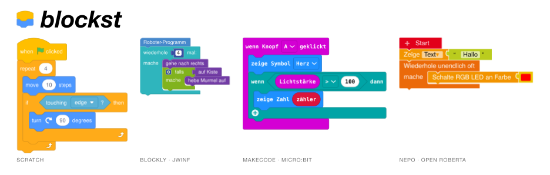

Blockst renders block-based programs in Typst documents, each drawn the way
its editor draws it — for worksheets, tutorials, teaching material and
anything else where block code has to appear in print or online.

| Editor | Function | What you get |
| --- | --- | --- |
| **Scratch 3** | `scratch()` | the Scratch look in 26 languages, right-to-left included; turtle graphics that run the program; import of real `.sb3` projects — [Scratch](#scratch) |
| **Blockly** | `blockly()` | today's flat Blockly and the pre-2019 look, with profiles for the Jugendwettbewerb Informatik (jwinf.de) and its robot and turtle blocks, 24 languages — [Blockly and jwinf](#blockly-and-jwinf) |
| **MakeCode** | `makecode()` | the micro:bit and Calliope mini editors' blocks, LED matrix and melody editor included, in all 36 editor languages — [MakeCode](#makecode) |
| **NEPO** | `nepo()` | Open Roberta Lab's Calliope mini and micro:bit blocks — [NEPO (Open Roberta)](#nepo-open-roberta) |

All four share one text notation: a block per line, `(…)` for a value,
`[… v]` for a dropdown, `<…>` for a condition, indentation and an end marker
for the body of a loop. Typst hands the text to a bundled WASM plugin, the
plugin parses it and returns SVG, Typst embeds the SVG. Themes, colours,
fonts, scale and line numbers work the same for every editor.

**Manual:** [loewe1000.github.io/blockst](https://loewe1000.github.io/blockst/) — the
newest version; every released version stays readable under its own number,
e.g. [/0.3.0/](https://loewe1000.github.io/blockst/0.3.0/), and as a PDF in each.

> ⚠️ **Breaking change since `0.2.0`:** the pre-`0.2.0` native-Typst renderer
> syntax is removed. Blockst uses only the text-to-WASM pipeline; documents
> written for the old syntax must be migrated.

### New in 0.4.0

- **Blockly** as a second block language: `blockly()` renders the same text
  notation with Blockly's shapes — notch, puzzle tab, boxed fields — in the
  current flat look. See [Blockly and jwinf](#blockly-and-jwinf)
- **jwinf profiles**: the Jugendwettbewerb Informatik's classic-Blockly look
  and its robot and turtle blocks, with the palette of the robot training
  tasks (`jwinf`) or of the turtle sandbox (`jwinf-turtle`)
- **`colors`** on `set-blockst()`, `blockst()`, `blockly()` and `scratch()`:
  the document's own category colours over any profile's palette
- **MakeCode** as a third block language: `makecode()` draws the micro:bit
  and Calliope mini editors' blocks — Blockly's zelos look, MakeCode's
  monospace labels, the editors' own block texts in all 36 of their
  languages. See [MakeCode](#makecode)
- **NEPO (Open Roberta)** for the Calliope mini and micro:bit, contributed by
  @lkoehl as a renderer of its own — see [examples/nepo](examples/nepo/README.md)
- Arabic: the common assignment wordings `مساوية لـ` / `مساويًا لـ` now resolve (#13)

### New in 0.3.0

- **Right-to-left rendering** for Arabic, Hebrew and Persian, plus a new
  **Arabic locale** — see [Right-to-Left Languages](#right-to-left-languages)
- **`grayscale` theme**: one distinct grey per category, for photocopied worksheets
- **`font:` parameter** on `scratch()` and `blockst()`
- French localisation completed (`définir`, `appeler`, `tourner à droite/gauche`,
  French pen-effect values) — thanks to @remiangot and @XanderLeaDaren
- Fixes: block labels no longer fall back to the surrounding font inside
  ```` ```scratch ```` blocks; non-Latin locales are matched correctly
  (the spec hash used to mangle multi-byte characters); C-block headers are
  no longer drawn twice

## Contents

- [Highlights](#highlights)
- [Install and Import](#install-and-import)
- [Quick Start](#quick-start)
- [Scratch](#scratch) — [example gallery](#example-gallery), [SB3 import](#experimental-sb3-import), [right-to-left languages](#right-to-left-languages)
- [Blockly and jwinf](#blockly-and-jwinf)
- [MakeCode](#makecode)
- [NEPO (Open Roberta)](#nepo-open-roberta)
- [Scratch block catalog](#scratch-block-catalog)
- [Contributing](#contributing)

## Highlights

- **Four block languages, one notation.** Scratch, Blockly, MakeCode and NEPO
  from the same plain-text syntax — scripts, reporters, booleans, inputs,
  dropdowns and nested control blocks — with `scratch`, `blockly`, `makecode`
  and `nepo` code fences for Markdown-style documents
- **Drawn like the editor.** Scratch 3's shapes; Blockly's thrasos and classic
  geometry, measured on jwinf.de; MakeCode's zelos renderer as the micro:bit
  and Calliope editors run it; Open Roberta's NEPO blocks
- **The editors' own words.** Scratch's translations in 26 languages, Blockly's
  message files in 24, the MakeCode editors' strings in 36 — plus
  right-to-left layout for Arabic, Hebrew and Persian
- **Made for paper.** Themes `print`, `grayscale` and `high-contrast`, the
  document's own category colours over any palette (`colors`), compact or
  generous block geometry with `inset-scale`, line numbers and `#label`
  references for line-aware worksheets
- **Beyond the picture.** Turtle graphics that run a Scratch program on a stage
  or a coordinate grid; import of real `.sb3` projects — scripts, variables,
  lists, costumes and a stage preview (experimental)

## Install and Import

```typst
#import "@preview/blockst:0.4.0": scratch, blockly, makecode, nepo, blockst, set-blockst
```

`raw-scratch`, `raw-blockly`, `raw-makecode` and `raw-nepo` add the code
fences, `sb3` and `scratch-run` the project import and the execution engine.

> Font requirement: Scratch and Blockly labels are designed for Helvetica Neue.
> On Linux/Windows install a compatible font, for example Nimbus Sans, or set
> one with `set-blockst(font: "...")`. MakeCode labels use a monospace face
> (Menlo, Consolas or DejaVu Sans Mono, whichever is installed).

## Quick Start

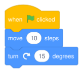

```typst
#scratch("
when green flag clicked
move (10) steps
turn cw (15) degrees
")
```

The other editors read the same way — a jwinf task and a micro:bit program:

```typst
#blockly("
Roboter-Programm
wiederhole (4) mal:
  gehe nach rechts
  falls <auf Kiste>
    hebe Murmel auf ::aktionen
  ende
ende
", profile: "jwinf")

#makecode("
beim Start
  zeige Symbol [Herz v]
ende
wenn Knopf [A v] geklickt
  zeige Zahl ((1) + (2))
  pausiere (ms) (100)
ende
")
```

Source: [examples/example-quickstart.typ](examples/example-quickstart.typ),
[examples/example-blockly.typ](examples/example-blockly.typ),
[examples/example-makecode.typ](examples/example-makecode.typ)

## Scratch

`scratch()` renders Scratch 3 blocks from text in any of 26 languages. What
follows is the gallery: localized text, inline use, labels, code fences,
themes and the execution engine, then the `.sb3` import and the
right-to-left languages.

### Example gallery

All long snippets below use the same pattern: result first, code in a collapsible block.

#### Localized Text

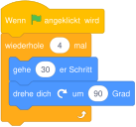

<details>
<summary><strong>Show code</strong></summary>

```typst
#set-blockst(scale: 67.5%)

#scratch("Wenn die grüne Flagge angeklickt
wiederhole (4) mal 
  gehe (30) er Schritt
  drehe dich nach rechts um (90) Grad
end", language: "de")
```

</details>

Source: [examples/example-de.typ](examples/example-de.typ)

#### Inline Usage Without blockst Container


<details>
<summary><strong>Show code</strong></summary>

```typst
#grid(
  columns: (1fr, auto),
  gutter: 6mm,
  [*Step 1*\
  Trigger the script and walk forward.],
  [#scratch(line-numbers: true, "when green flag clicked\nmove (20) steps")],
  [*Step 2*\
  Repeat a square movement.],
  [#scratch(line-numbers: true, "when green flag clicked\nrepeat (4)\nmove (40) steps\nturn cw (90) degrees\nend")],
)
```

</details>

Source: [examples/example-inline.typ](examples/example-inline.typ)

#### Dedicated Label Walkthrough (Euclidean Algorithm)

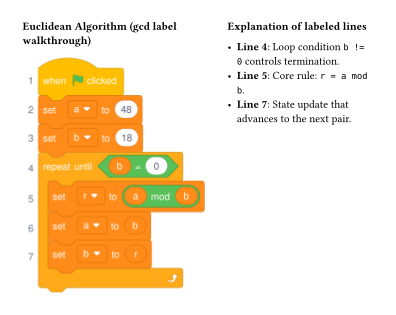

<details>
<summary><strong>Show code</strong></summary>

```typst
#let gcd-script = "when green flag clicked #start
set [a v] to (48)
set [b v] to (18)
repeat until <(b) = (0)> #loop
set [r v] to ((a) mod (b)) #compute-rem
set [a v] to (b)
set [b v] to (r) #update-b
end"

#grid(
  columns: (1.25fr, 1fr),
  gutter: 8mm,

  [
    *Euclidean Algorithm (gcd label walkthrough)*

    #blockst(line-numbers: true, inset-scale: 90%)[
      #scratch(gcd-script)
    ]
  ],

  [
    *Explanation of labeled lines*

    - *Line #blockst-labels("loop")*: Loop condition `b != 0` controls termination.
    - *Line #blockst-labels("compute-rem")*: Core rule: `r = a mod b`.
    - *Line #blockst-labels("update-b")*: State update that advances to the next pair.
  ],
)
```

</details>

Source: [examples/example-labels.typ](examples/example-labels.typ)

#### Markdown Code Blocks with raw-scratch


<details>
<summary><strong>Show code</strong></summary>

````typst
#show: raw-scratch()

```scratch
when green flag clicked
repeat (4)
  move (30) steps
  turn cw (90) degrees
end
```
````

</details>

Source: [examples/example-raw-scratch.typ](examples/example-raw-scratch.typ)

#### Theme and Scale


<details>
<summary><strong>Show code</strong></summary>

```typst
#let script = "when green flag clicked
go to (random position v)
turn cw (30) degrees"

#blockst(inset-scale: 50%)[
  #scratch(script)
]

#v(5mm)

#blockst(theme: "high-contrast")[
  #scratch(script)
]

#v(5mm)

#blockst(theme: "print")[
  #scratch(script)
]
```

</details>

Source: [examples/example-theme.typ](examples/example-theme.typ)

Use `::category` (for example `::motion`, `::looks`, `::control`) to force a block category in scratchblocks style.
Examples:

- `move (10) steps ::motion`
- `ajouter (5) à [i v] ::variables`
- `::control` (category default block)

#### Executable Preview (scratch-run)

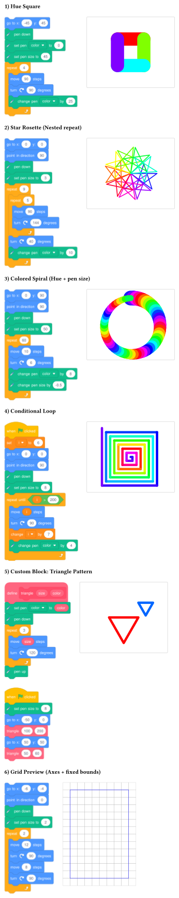

<details>
<summary><strong>Show code</strong></summary>

```typst
#let square-program = "
go to x: (-45) y: (45)
pen down
set pen [color v] to (0)
set pen size to (45)
repeat (4)
  move (90) steps
  turn cw (90) degrees
  change pen [color v] by (25)
end"

#let star-rosette-program = "
go to x: (0) y: (0)
point in direction (90)
pen down
set pen size to (3)
repeat (9)
  repeat (5)
    move (90) steps
    turn cw (144) degrees
  end
  turn cw (40) degrees
  change pen [color v] by (10)
end"

#let spiral-program = "
go to x: (0) y: (90)
point in direction (90)
pen down
set pen size to (50)
repeat (60)
  move (10) steps
  turn cw (6) degrees
  change pen [color v] by (8)
  change pen size by (-0.5)
end"

#let conditional-program = "
when green flag clicked
set [i v] to (6)
go to x: (0) y: (0)
point in direction (90)
pen down
set pen size to (8)
repeat until <(i) > (200)>
  move (i) steps
  turn cw (90) degrees
  change [i v] by (7)
  change pen [color v] by (4)
end"

#let custom-block-program = "
define triangle (var [size]) (color)
set pen [color v] to (var [color])
pen down
repeat (3)
  move (var [size]) steps
  turn cw (120) degrees
end
pen up

when green flag clicked
set pen size to (8)
go to x: (-50) y: (0)
call triangle (100) (200)
go to x: (50) y: (50)
call triangle (50) (60)
"

#let grid-square-program = "
go to x: (-6) y: (-4)
point in direction (0)
pen down
set pen size to (2)
repeat (2)
  move (12) steps
  turn cw (90) degrees
  move (8) steps
  turn cw (90) degrees
end
"

#set-scratch-run(
  stage: (size: (300, 240)),
  start: (x: 0, y: 0, angle: 90),
  grid: (visible: false, axes: false),
  cursor: false,
  scale: 2,
)

#stack(
  spacing: 6mm,

  [*1) Hue Square*],
  grid(
    columns: (auto, auto),
    gutter: 6mm,
    [#scratch(square-program)],
    [#scratch-run.stage(square-program)],
  ),

  [*2) Star Rosette (Nested repeat)*],
  grid(
    columns: (auto, auto),
    gutter: 6mm,
    [#scratch(star-rosette-program)],
    [#scratch-run.stage(star-rosette-program)],
  ),

  [*3) Colored Spiral (Hue + pen size)*],
  grid(
    columns: (auto, auto),
    gutter: 6mm,
    [#scratch(spiral-program)],
    [#scratch-run.stage(spiral-program)],
  ),

  [*4) Conditional Loop*],
  grid(
    columns: (auto, auto),
    gutter: 6mm,
    [#scratch(conditional-program)],
    [#scratch-run.stage(conditional-program)],
  ),

  [*5) Custom Block: Triangle Pattern*],
  grid(
    columns: (auto, auto),
    gutter: 6mm,
    [#scratch(custom-block-program)],
    [#scratch-run.stage(custom-block-program, cursor: false)],
  ),

  [*6) Grid Preview (Axes + fixed bounds)*],
  grid(
    columns: (auto, auto),
    gutter: 6mm,
    [#scratch(grid-square-program)],
    [#scratch-run.grid(
      grid-square-program,
      step: 1,
      scale: 0.5,
      grid: true,
      fit: true,
      cursor: false,
    )],
  ),
)

```

</details>

Source: [examples/example-executable.typ](examples/example-executable.typ)

### Experimental: SB3 import

Recommended workflow:

1. Read `.sb3` as bytes via `read(..., encoding: none)`.
2. Use the `sb3` helpers to extract scripts, monitors, images, or screen previews.
3. Render imported scripts through the same text-to-WASM pipeline as `scratch(...)`.

#### SB3 Scripts and Screen Preview

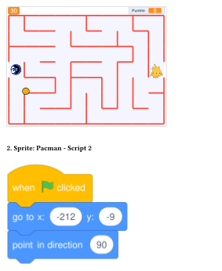

<details>
<summary><strong>Show code</strong></summary>

```typst
#let project = read("../examples/Mampf-Matze Lösung.sb3", encoding: none)

#blockst[
  #sb3.sb3-screen-preview(project, unit: 1.5)

  #v(4mm)

  #sb3.render-sb3-scripts(
    project,
    language: "en",
    target: "Pacman",
    target-script-number: 2,
    show-headers: true,
  )
]
```

</details>

Source: [examples/example-sb3-import.typ](examples/example-sb3-import.typ)

#### Variable and List Monitors

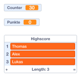

<details>
<summary><strong>Show code</strong></summary>

```typst
#let project = read("Mampf-Matze Lösung.sb3", encoding: none)

#stack(
  spacing: 4mm,
  sb3.render-sb3-variables(project, language: "en", show-target-headers: false),
  sb3.render-sb3-lists(project, language: "en", show-target-headers: false),
)
```

</details>

Source: [examples/example-monitors.typ](examples/example-monitors.typ)

#### SB3 API at a Glance

- Scripts: `sb3.render-sb3-scripts(...)` with target and script filters
- Lists: `sb3.render-sb3-lists(...)` by target, name, or local index
- Variables: `sb3.render-sb3-variables(...)` by target, name, or local index
- Images: `sb3.sb3-images-catalog(...)`, `sb3.sb3-image(...)`
- Screen: `sb3.sb3-screen-preview(...)`
- Catalogs: `sb3.sb3-scripts-catalog(...)`, `sb3.sb3-state-catalog(...)`

### Right-to-left languages

Arabic, Hebrew and Persian render right-to-left. Nothing extra is required:
pass the language and the renderer mirrors the layout.

```typ
#scratch("
عند نقر @greenFlag
تحرك (10) خطوة
كرر (4) مرة
استدر @turnRight (90) درجة
نهاية
", language: "ar")
```

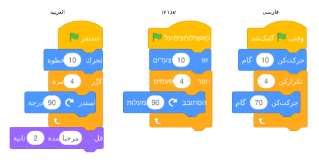

> Right-to-left layout, the Arabic locale and the `grayscale` theme arrived in
> `0.3.0`. The Arabic and Hebrew scripts need fonts that cover them — see
> [examples/README-rtl.md](examples/README-rtl.md).

What is mirrored: the order of labels and inputs, the top/bottom notch, the
hat dome, the C-block mouth and its indented body, the loop arrow, and the
text/arrow inside a dropdown. What is *not* mirrored: the glyphs themselves
and the digits, which stay upright and in Western form.

A language is right-to-left when its locale says so — the TOML carries a
top-level `dir = "rtl"`. Contributing another RTL translation therefore needs
no change to the renderer:

```toml
# data/locales/ar.toml
dir = "rtl"

[specs]
MOTION_MOVESTEPS = "تحرك %1 خطوة"
```

Arabic short vowels are optional in practice, so `كرِّر` and `كرر` match the
same block; the matcher folds harakat and normalises alef/te-marbuta
variants before comparing.

## Blockly and jwinf

`blockly()` draws Blockly blocks from the same notation `scratch()` uses. A
*profile* chooses the look and the vocabulary:

| Profile | Look | Vocabulary |
| --- | --- | --- |
| `"blockly"` (default) | today's flat Blockly (thrasos) | Blockly's standard blocks, German by default, 24 languages |
| `"blockly-klassisch"` | Blockly before 2019 | same |
| `"jwinf"` | jwinf.de — classic geometry, the palette of the robot training tasks | robot and turtle world blocks, plus the standard blocks in the old wording |
| `"jwinf-turtle"` | the same, with the colours of the Freie Turtle-Umgebung | same |

```typst
#blockly("
Roboter-Programm
wiederhole (4) mal:
  gehe nach rechts
  falls <auf Kiste>
    hebe Murmel auf ::aktionen
  ende
ende
", profile: "jwinf")
```

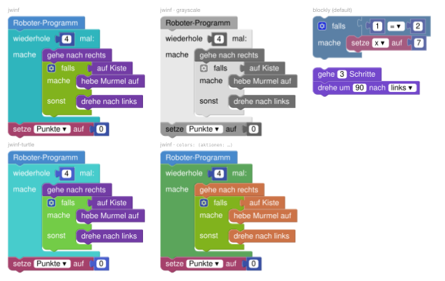

On jwinf the same block reads differently from task to task — „hebe Murmel
auf", „nimm Fisch", „Holzstapel einsammeln" — so there is no fixed
vocabulary to match against. Write the label as it appears and name the
category with a `::` suffix: `aktionen`, `schildkroete`, `sensoren`,
`schleifen`, `logik`, `mathe`, `variablen`, `funktionen`, `text`, `listen`,
`ausgeben`, `einlesen`. Blocks the profile knows — loops, conditions,
variables, the robot and turtle commands — are recognised without a suffix.

The standard blocks read Blockly's own message files: `language: "fr"`
gives `répéter (10) fois`, `"ja"` gives `(10) 回繰り返す`, in ar, ca, cs, de,
el, en, es, fa, fr, he, hi, hr, hu, id, it, ja, nb, nl, pl, pt, ro, ru, sl
and tr. The jwinf world blocks exist in German only. Each language closes
a C-block with the marker its Scratch locale uses (`ende`, `end`, `fin`, …)
and opens the else branch with Blockly's word for it (`sonst`, `else`,
`sinon`, …); `ende`, `end` and `else` work in every language.

C-blocks close with `ende`; `sonst` opens the else branch. `<…>` and `(…)`
are equivalent: Blockly draws no hexagon, a boolean plugs in with the same
puzzle tab as any other value.

In Markdown-style raw blocks, `#show: raw-blockly()` renders ````blockly`
fences with the default profile and ````jwinf` fences with the jwinf
profile. `set-blockst(profile: …)` sets the default profile for `blockly()`;
`scratch()` is never affected by it.

Themes work as for Scratch: `print`, `high-contrast` and `grayscale` are
derived from the profile's palette, so a jwinf worksheet photocopies with its
categories still told apart.

jwinf colours its categories per task family: the robot training tasks
(`jwinf`) and the turtle sandbox (`jwinf-turtle`) differ in loops, logic and
maths. A task that deviates from both is covered by `colors`, which lays the
document's own category colours over any profile's palette — globally, per
group, or per call:

```typst
#set-blockst(profile: "jwinf", colors: (logik: "#73cc47"))
#blockly("falls <auf Kiste>\nende", colors: (logik: rgb("#5ba55b")))
```

The shades a theme derives — bevel, stroke, `high-contrast`, `grayscale` —
follow the new fill. `scratch()` takes `colors` as well, keyed by Scratch's
category names (`motion`, `looks`, …).

Block texts and colours are generated from the published sources — Blockly
(Apache-2.0) and France-IOI's bebras-modules (MIT) — by
[scripts/blockly-data](scripts/blockly-data/README.md), which also reports
the gaps in the upstream translations.

## MakeCode

`makecode()` draws the blocks of the MakeCode editors for the micro:bit and
the Calliope mini, from the same notation `scratch()` uses. The look is
Blockly's zelos renderer as the editors run it: 4px corners, a 36px notch,
pills for values, hexagons for booleans, literals as white pills, a 12pt
semibold monospace label. Event blocks (`beim Start`, `wenn Knopf [A v]
geklickt`) have no hat and no notch, exactly as in the editor.

| Profile | Target | Colours |
| --- | --- | --- |
| `"makecode"` (default) | makecode.microbit.org | the micro:bit palette |
| `"makecode-calliope"` | makecode.calliope.cc | the Calliope mini palette, plus its motor and RGB-LED blocks |

```typst
#makecode("
beim Start
  zeige Symbol [Herz v]
ende
wenn Knopf [A v] geklickt
  zeige Zahl ((1) + (2))
  wenn <(Lichtstärke) > (100)> dann
    zeige Text [hell]
  ansonsten
    pausiere (ms) (100)
  ende
ende
", language: "de")
```

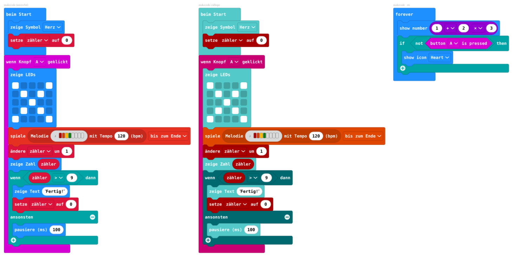

The block texts are the editors' own — read off makecode.microbit.org and
makecode.calliope.cc in German and English by
[scripts/makecode-data](scripts/makecode-data/README.md), and for the
other 34 editor languages taken from the translation service the editors
load at run time (cdn.makecode.com, approved strings only). `language:` is
any language the editors offer: `"de"` (the default), `"en"`, `"fr"`,
`"es"`, `"ja"`, `"zh-cn"`, … — a bare code picks the regional variant the
editor ships (`"es"` → es-ES, `"pt"` → pt-BR). A block whose translation
is not approved yet keeps its English text, as in the editor. The end
marker follows the language (`fin`, `終わり`, …), the else marker is the
editor's word (`sinon`, `でなければ`, …); `ende`, `end` and `else` work
everywhere. A unit the editor shows in
parentheses is typed like a value and drawn as the label: `pausiere (ms)
(100)`, `Temperatur (°C)`. `ende`/`end` closes a C-block, `ansonsten`/`else`
opens the else branch, which gets the editor's − and + buttons. Operators
take the editor's glyph or a spelling: `×` or `*`, `÷` or `/`, `≥` or `>=`,
`≤` or `<=`, `≠` or `!=`. Unknown labels are
drawn as written with the category from a `::kategorie` suffix (`basic`,
`input`, `music`, `led`, `radio`, `loops`, `logic`, `variables`, `math`,
`functions`, `arrays`, `text`, `game`, `images`, `pins`, `serial`,
`control`).

Two of MakeCode's editor fields have a notation of their own. The LED
matrix takes 25 cells, `#` lit and `.` dark, in any grouping:
`zeige LEDs [#...#|.#.#.|..#..|.#.#.|#...#]`. The melody editor takes
eight notes or rests: `spiele (Melodie [C D E F - - - -] mit Tempo (120)
(bpm)) [bis zum Ende v]`.

In raw blocks, `#show: raw-makecode()` renders ````makecode` and
````microbit` fences with the micro:bit profile and ````calliope` fences
with the Calliope mini profile. MakeCode's labels are measured and drawn in
a monospace face (Menlo, Consolas or DejaVu Sans Mono, whichever is
installed); `set-blockst(font: …)` picks another.

## NEPO (Open Roberta)

`nepo()` draws the blocks of Open Roberta Lab for the Calliope mini and the
micro:bit — a renderer of its own, contributed by
[@lkoehl](https://github.com/lkoehl). Block text prints in Open Roberta's own
German wording; `platform` picks the robot: `calliope` (default),
`calliopev3` or `microbit`.

```typst
#nepo("
Start
  Zeige Text \"Hallo\"
  Wiederhole unendlich oft
    Schalte RGB LED an (#ff0000)
  Ende
")

#nepo("Start\n  Zeige Text \"Hi\"", platform: "microbit")
```

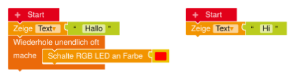

`#show: raw-nepo()` renders ````nepo` fences; `nepo-parse()` returns the block
tree. The renderer is a prototype covering the beginner block set of the three
platforms — [examples/nepo](examples/nepo/README.md) holds the programme
collection and the comparison sheet against Open Roberta's own drawings.

## Scratch block catalog

Every Scratch 3 block, split by category so each file stays readable and can be regenerated independently.

<details>
<summary><strong>Motion</strong></summary>


Source: [examples/catalog/motion.typ](examples/catalog/motion.typ)

</details>

<details>
<summary><strong>Looks</strong></summary>

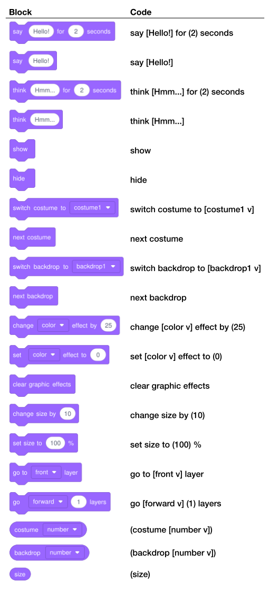

Source: [examples/catalog/looks.typ](examples/catalog/looks.typ)

</details>

<details>
<summary><strong>Sound</strong></summary>

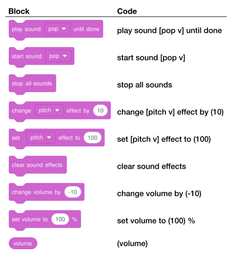

Source: [examples/catalog/sound.typ](examples/catalog/sound.typ)

</details>

<details>
<summary><strong>Pen</strong></summary>

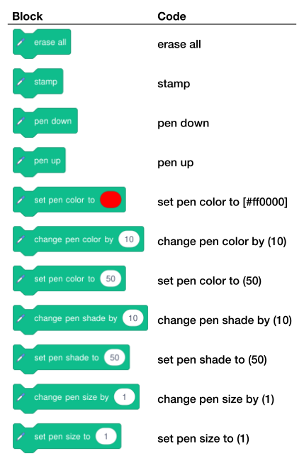

Source: [examples/catalog/pen.typ](examples/catalog/pen.typ)

</details>

<details>
<summary><strong>Variables</strong></summary>


Source: [examples/catalog/variables.typ](examples/catalog/variables.typ)

</details>

<details>
<summary><strong>Lists</strong></summary>

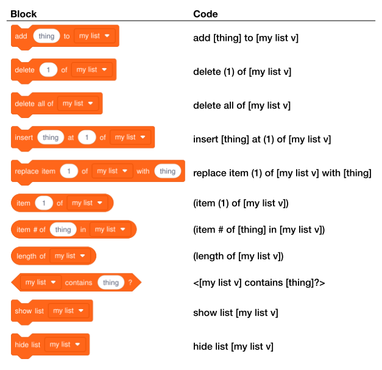

Source: [examples/catalog/lists.typ](examples/catalog/lists.typ)

</details>

<details>
<summary><strong>Events</strong></summary>


Source: [examples/catalog/events.typ](examples/catalog/events.typ)

</details>

<details>
<summary><strong>Control</strong></summary>


Source: [examples/catalog/control.typ](examples/catalog/control.typ)

</details>

<details>
<summary><strong>Sensing</strong></summary>


Source: [examples/catalog/sensing.typ](examples/catalog/sensing.typ)

</details>

<details>
<summary><strong>Operators</strong></summary>

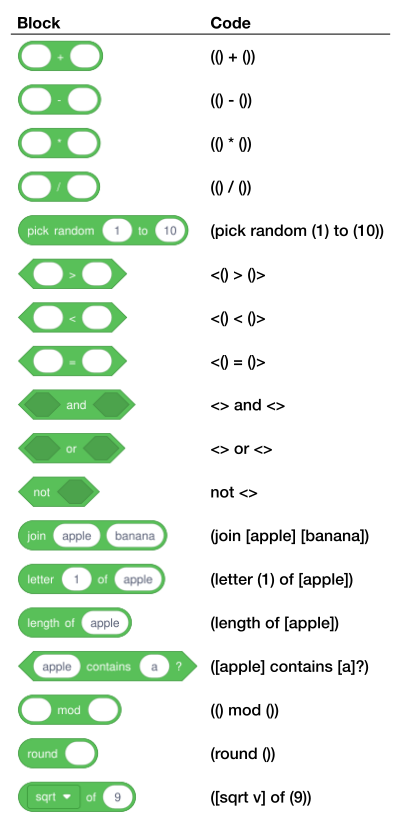

Source: [examples/catalog/operators.typ](examples/catalog/operators.typ)

</details>

## Contributing

Contributions are welcome: bug reports, missing blocks, parser improvements, rendering polish, docs, and new localizations.

The renderers are Rust plugins compiled to WASM. Rebuild them from source
with `./scripts/build-plugins.sh` (it pins the rustup toolchain; a Homebrew
rust lacks the wasm target) and check that the committed binaries still
reproduce with `./scripts/build-plugins.sh --check`.
`./scripts/compare-examples.sh baseline|check` renders every example and
compares it pixel by pixel with the recorded baseline.
