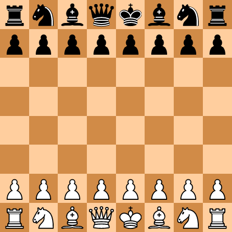
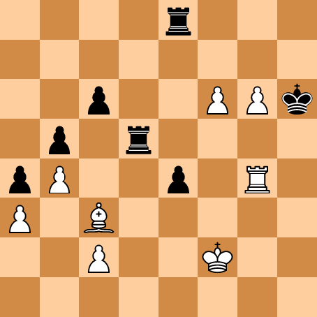
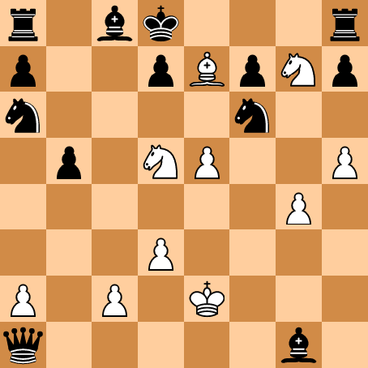
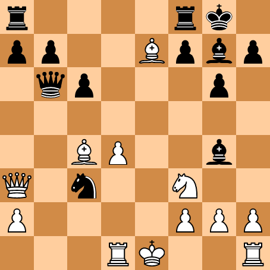

# Board & Pieces

Display chessboards in Typst.


## Displaying chessboards

The main function of this package is `board`. It lets you display a specific position on a board.

```typ
#board(starting-position)
```




`starting-position` is a position that is provided by the package. It represents the initial position of a chess game.

You can create a different position using the `position` function. It accepts strings representing each rank. Use upper-case letters for white pieces, and lower-case letters for black pieces. Dots and spaces correspond to empty squares.

```typ
#board(position(
  "....r...",
  "........",
  "..p..PPk",
  ".p.r....",
  "pP..p.R.",
  "P.B.....",
  "..P..K..",
  "........",
))
```




Alternatively, you can use the `fen` function to create a position from a [FEN](https://en.wikipedia.org/wiki/Forsyth%E2%80%93Edwards_Notation) string:

```typ
#board(fen("r1bk3r/p2pBpNp/n4n2/1p1NP2P/6P1/3P4/P1P1K3/q5b1 b - - 1 23"))
```




Note that you can also specify only the first part of the FEN string:

```typ
#board(fen("r4rk1/pp2Bpbp/1qp3p1/8/2BP2b1/Q1n2N2/P4PPP/3RK2R"))
```




## Customizing a chessboard

The `board` function lets you customize the appearance of the board with multiple arguments. They are described below.

- `highlighted-squares` is a list of squares to highlight (e.g. `("d3", "d2", "e3")`).

- `reverse` is a boolean indicating whether to reverse the board, displaying it from black's point of view. This is `false` by default, meaning the board is displayed from white's point of view.

- `display-numbers` is a boolean indicating whether ranks and files should be numbered. This is `false` by default.

- `rank-numbering` and `file-numbering` are functions describing how ranks and files should be numbered. By default they are respectively `numbering.with("1")` and `numbering.with("a")`.

- `square-size` is a length describing the size of each square. By default, this is `1cm`.

- `white-square-color` and `black-square-color` correspond to the background color of squares.

- `highlighted-white-square-color` and `highlighted-black-square-color` correspond to the background color of highlighted squares.

- `pieces` is a dictionary containing images representing each piece. If specified, the dictionary must contain an entry for every piece kind in the displayed position. Keys are single upper-case letters for white pieces and single lower-case letters for black pieces. The default images are taken from [Wikimedia Commons](https://commons.wikimedia.org/wiki/Category:SVG_chess_pieces), and licensed under the [GNU Free Documentation License](https://commons.wikimedia.org/wiki/Commons:GNU_Free_Documentation_License,_version_1.2). This means you should credit their authors if you use them in your document.


## Chess symbols

This package also exports chess-related symbols under `chess-sym.{pawn,knight,bishop,rook,queen,king}.{filled,stroked,white,black}`. `filled` and `black` variants are equivalent, and `stroked` and `white` as well.


## Changelog

### Version 0.1.0 (initial version)

- Display a chess position on a chessboard with the `board` function.

- Get the starting position with `starting-position`.

- Use chess-related symbols with the `chess-sym` module.