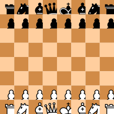
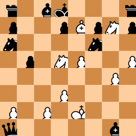
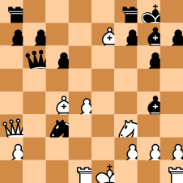
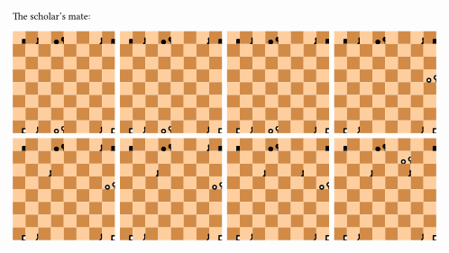

# Board & Pieces

Display chessboards in Typst.


## Displaying chessboards

The main function of this package is `board`. It lets you display a specific position on a board.

```typ
#board(starting-position)
```



`starting-position` is a position that is provided by the package. It represents the initial position of a chess game.

You can create a different position using the `position` function. It accepts strings representing each rank. Use upper-case letters for white pieces, and lower-case letters for black pieces. Dots and spaces correspond to empty squares.

```typ
#board(position(
  "....r...",
  "........",
  "..p..PPk",
  ".p.r....",
  "pP..p.R.",
  "P.B.....",
  "..P..K..",
  "........",
))
```


Alternatively, you can use the `fen` function to create a position using [Forsyth–Edwards notation](https://en.wikipedia.org/wiki/Forsyth%E2%80%93Edwards_Notation):

```typ
#board(fen("r1bk3r/p2pBpNp/n4n2/1p1NP2P/6P1/3P4/P1P1K3/q5b1 b - - 1 23"))
```



Note that you can also specify only the first part of the FEN string:

```typ
#board(fen("r4rk1/pp2Bpbp/1qp3p1/8/2BP2b1/Q1n2N2/P4PPP/3RK2R"))
```




## Using the `game` function

The `game` function creates an array of positions from a full chess game. A game is described by a series of turns written using [standard algebraic notation](https://en.wikipedia.org/wiki/Algebraic_notation_(chess)). Those turns can be specified as an array of strings, or as a single string containing whitespace-separated moves.

```typ
The scholar's mate:
#let positions = game("e4 e5 Qh5 Nc6 Bc4 Nf6 Qxf7")
#grid(
  columns: 4,
  gutter: 0.2cm,
  ..positions.map(board.with(square-size: 0.5cm)),
)
```



You can specify an alternative starting position to the `game` function with the `starting-position` named argument.


## Using the `pgn` function to import PGN files

Similarly to the `game` function, the `pgn` function creates an array of positions. It accepts a single argument, which is a string containing [portable game notation](https://en.wikipedia.org/wiki/Portable_Game_Notation). To read a game from a PGN file, you can use this function in combination with Typst's native [`read`](https://typst.app/docs/reference/data-loading/read/) function.

```typ
#let positions = pgn(read("game.pgn"))
```

Note that the argument to `pgn` must describe a single game. If you have a PGN file containing multiple games, you will need to split them using other means.


## Customizing a chessboard

The `board` function lets you customize the appearance of the board with multiple arguments. They are described below.

- `highlighted-squares` is a list of squares to highlight (e.g. `("d3", "d2", "e3")`). It can also be specified as a single string containing whitespace-separated squares (e.g. `"d3 d2 e3"`).

- `reverse` is a boolean indicating whether to reverse the board, displaying it from black's point of view. This is `false` by default, meaning the board is displayed from white's point of view.

- `display-numbers` is a boolean indicating whether ranks and files should be numbered. This is `false` by default.

- `rank-numbering` and `file-numbering` are functions describing how ranks and files should be numbered. By default they are respectively `numbering.with("1")` and `numbering.with("a")`.

- `square-size` is a length describing the size of each square. By default, this is `1cm`.

- `white-square-fill` and `black-square-fill` indicate how squares should be filled. They can be colors, gradient or patterns.

- `highlighted-white-square-fill` and `highlighted-black-square-fill` indicate how highlighted squares should be filled. For highlighted squares, this is applied instead of `white-square-fill` and `black-square-fill`.

- `pieces` is a dictionary containing images representing each piece. If specified, the dictionary must contain an entry for every piece kind in the displayed position. Keys are single upper-case letters for white pieces and single lower-case letters for black pieces. The default images are taken from [Wikimedia Commons](https://commons.wikimedia.org/wiki/Category:SVG_chess_pieces). Please refer to [the section on licensing](#licensing) for information on how you can use them in your documents.

- `stroke` has the same structure as [`rect`'s `stroke` parameter](https://typst.app/docs/reference/visualize/rect/#parameters-stroke) and corresponds to the stroke to use around the board. If `display-numbers` is `true`, the numbers are displayed outside the stroke. The default value is `none`.


## Chess symbols

This package also exports chess-related symbols under `chess-sym.{pawn,knight,bishop,rook,queen,king}.{filled,stroked,white,black}`. `filled` and `black` variants are equivalent, and `stroked` and `white` as well.


## Licensing

The default images for chess pieces used by the `board` function come from [Wikimedia Commons](https://commons.wikimedia.org/wiki/Category:SVG_chess_pieces). They are all licensed the [GNU General Public License, version 2](https://www.gnu.org/licenses/old-licenses/gpl-2.0.html) by their original author: [Cburnett](https://en.wikipedia.org/wiki/User:Cburnett).


## Changelog

### Version 0.3.0

- Detect moves that put the king in check as illegal, improving SAN support.

- Add `stroke` argument to the `board` function.

- Rename `{highlighted-,}{white,black}-square-color` arguments to the `board` function to `{highlighted-,}{white,black}-square-fill`.

### Version 0.2.0

- Allow using dashes for empty squares in `position` function.

- Allow passing highlighted squares as a single string of whitespace-separated squares.

- Describe entire games using algebraic notation with the `game` function.

- Initial PGN support through the `pgn` function.

### Version 0.1.0

- Display a chess position on a chessboard with the `board` function.

- Get the starting position with `starting-position`.

- Use chess-related symbols with the `chess-sym` module.
