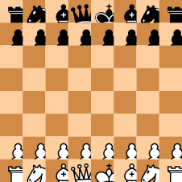
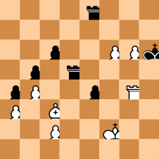
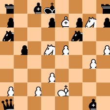
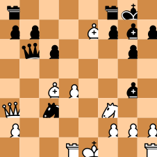
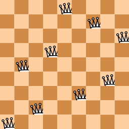
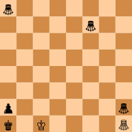

# Board & Pieces

Display chessboards in Typst.


## Displaying chessboards

The main function of this package is `board`. It lets you display a specific position on a board.

```typ
#board(starting-position)
```



`starting-position` is a position that is provided by the package. It represents the initial position of a chess game.

You can create a different position using the `position` function. It accepts strings representing each rank. Use upper-case letters for white pieces, and lower-case letters for black pieces. Dots and spaces correspond to empty squares.

```typ
#board(position(
  "....r...",
  "........",
  "..p..PPk",
  ".p.r....",
  "pP..p.R.",
  "P.B.....",
  "..P..K..",
  "........",
))
```



Alternatively, you can use the `fen` function to create a position using [Forsyth–Edwards notation](https://en.wikipedia.org/wiki/Forsyth%E2%80%93Edwards_Notation):

```typ
#board(fen("r1bk3r/p2pBpNp/n4n2/1p1NP2P/6P1/3P4/P1P1K3/q5b1 b - - 1 23"))
```



Note that you can specify only the first part of the FEN string:

```typ
#board(fen("r4rk1/pp2Bpbp/1qp3p1/8/2BP2b1/Q1n2N2/P4PPP/3RK2R"))
```



Also note that positions do not need to be on a standard 8×8 board:

```typ
#board(position(
  "....Q....",
  "......Q..",
  "........Q",
  "...Q.....",
  ".Q.......",
  ".......Q.",
  ".....Q...",
  "..Q......",
  "Q........",
))
```




## Using the `game` function

The `game` function creates an array of positions from a full chess game. A game is described by a series of turns written in [standard algebraic notation](https://en.wikipedia.org/wiki/Algebraic_notation_(chess)). Those turns can be specified as an array of strings, or as a single string containing whitespace-separated moves.

```typ
The scholar's mate:
#let positions = game("e4 e5 Qh5 Nc6 Bc4 Nf6 Qxf7")
#grid(
  columns: 4,
  gutter: 0.2cm,
  ..positions.map(board.with(square-size: 0.5cm)),
)
```


You can specify an alternative starting position to the `game` function with the `starting-position` named argument.


## Using the `pgn` function to import PGN files

Similarly to the `game` function, the `pgn` function creates an array of positions. It accepts a single argument, which is a string containing [portable game notation](https://en.wikipedia.org/wiki/Portable_Game_Notation). To read a game from a PGN file, you can use this function in combination with Typst's native [`read`](https://typst.app/docs/reference/data-loading/read/) function.

```typ
#let positions = pgn(read("game.pgn"))
```

Note that the argument to `pgn` must describe a single game. If you have a PGN file containing multiple games, you will need to split them using other means.


## Using non-standard chess pieces

The `board` function's `pieces` argument lets you specify how to display each piece by mapping each piece character to some content. You can use this feature to display non-standard chess pieces:

```typ
#board(
  fen("g7/5g2/8/8/8/8/p6g/k1K4G"),
  pieces: (
    // We use symbols for the example.
    // In practice, you should import your own images.
    g: chess-sym.queen.black.b,
    p: chess-sym.pawn.black,
    k: chess-sym.king.black,
    K: chess-sym.king.white,
    G: chess-sym.queen.white.b,
  ),
)
```




## Customizing a chessboard

The `board` function lets you customize the appearance of the board in various ways, as illustrated in the example below.

```typ
// From https://lichess.org/study/Xf1PGrM0.
#board(
  fen("3k4/7R/8/2PK4/8/8/8/6r1 b - - 0 1"),

  marked-squares: "c7 c6 h6",
  arrows: ("d8 c8", "d8 c7", "g1 g6", "h7 h6"),
  display-numbers: true,

  white-square-fill: rgb("#d2eeea"),
  black-square-fill: rgb("#567f96"),
  marking-color: rgb("#2bcbC6"),
  arrow-stroke: 0.2cm + rgb("#38f442df"),

  stroke: 0.8pt + black,
)
```


Here is a list of all the available arguments:

- `marked-squares` is a list of squares to mark (e.g., `("d3", "d2", "e3")`). It can also be specified as a single string containing whitespace-separated squares (e.g., `"d3 d2 e3"`).

- `arrows` is a list of arrows to draw (e.g., `("e2 e4", "e7 e5")`).

- `reverse` is a boolean indicating whether to reverse the board, displaying it from black's point of view. This is `false` by default, meaning the board is displayed from white's point of view.

- `display-numbers` is a boolean indicating whether ranks and files should be numbered. This is `false` by default.

- `rank-numbering` and `file-numbering` are functions describing how ranks and files should be numbered. By default they are respectively `numbering.with("1")` and `numbering.with("a")`.

- `square-size` is a length describing the size of each square. By default, this is `1cm`.

- `white-square-fill` and `black-square-fill` indicate how squares should be filled. They can be colors, gradient or patterns.

- `marking-color` is the color to use for markings (marked squares and arrows).

- `marked-white-square-background` and `marked-black-square-background` define the content to display in the background of marked squares. By default, this is a circle using the `marking-color`.

- `arrow-stroke` is the stroke to draw the arrows with. If only a length is given, `marking-color` is used. Alternatively, a stroke can be passed to specify a different color.

- `pieces` is a dictionary containing images representing each piece. If specified, the dictionary must contain an entry for every piece kind in the displayed position. Keys are single upper-case letters for white pieces and single lower-case letters for black pieces. The default images are taken from [Wikimedia Commons](https://commons.wikimedia.org/wiki/Category:SVG_chess_pieces). Please refer to [the section on licensing](#licensing) for information on how you can use them in your documents.

- `stroke` has the same structure as [`rect`'s `stroke` parameter](https://typst.app/docs/reference/visualize/rect/#parameters-stroke) and corresponds to the stroke to use around the board. If `display-numbers` is `true`, the numbers are displayed outside the stroke. The default value is `none`.


## Chess symbols

This package also exports chess symbols for all Unicode chess-related codepoints under the `chess-sym` submodule. Standard chess pieces are available as `chess-sym.{pawn,knight,bishop,rook,queen,king}.{white,black,neutral}`. Alternatively, you can use `stroked` and `filled` instead of, respectively, `white` and `black`. They can be rotated rightward, downward, and leftward respectively with with `.r`, `.b`, and `.l`. Chinese chess pieces are also available as `chess-sym.{soldier,cannon,chariot,horse,elephant,mandarin,general}.{red,black}`. Similarly, you can use `stroked` and `filled` as alternatives to, respectively, `red` and `black`. Note that most fonts only support black and white versions of standard pieces. To use the other symbols, you may have to use a font such as Noto Sans Symbols 2.

```typ
The best move in this position is #chess-sym.knight.white;c6.
```


## Licensing

The default images for chess pieces used by the `board` function come from [Wikimedia Commons](https://commons.wikimedia.org/wiki/Category:SVG_chess_pieces). They are all licensed the [GNU General Public License, version 2](https://www.gnu.org/licenses/old-licenses/gpl-2.0.html) by their original author: [Cburnett](https://en.wikipedia.org/wiki/User:Cburnett).


## Changelog

### Version 0.5.0

- Add symbols for all Unicode chess-related codepoints.

- Change the signature of the `board` function.
    - Rename argument `highlighted-squares` to `marked-squares`.
    - Remove arguments `highlighted-white-square-fill` and `highlighted-black-square-fill`.
    - Add argument `marking-color`, together with `marked-white-square-background` and `marked-black-square-background`.
    - Support passing a length as `arrow-stroke`.

- Fix arrows not being displayed properly on reversed boards.

### Version 0.4.0

- Add the ability to draw arrows in `board`.

### Version 0.3.0

- Detect moves that put the king in check as illegal, improving SAN support.

- Add `stroke` argument to the `board` function.

- Rename `{highlighted-,}{white,black}-square-color` arguments to the `board` function to `{highlighted-,}{white,black}-square-fill`.

### Version 0.2.0

- Allow using dashes for empty squares in `position` function.

- Allow passing highlighted squares as a single string of whitespace-separated squares.

- Describe entire games using algebraic notation with the `game` function.

- Initial PGN support through the `pgn` function.

### Version 0.1.0

- Display a chess position on a chessboard with the `board` function.

- Get the starting position with `starting-position`.

- Use chess-related symbols with the `chess-sym` module.