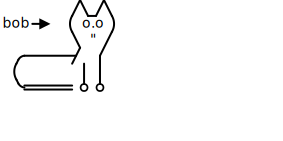

# `bob-draw`
 svgbob for typst, powered by wasm

This package provides a typst plugin for rendering [svgbob](https://github.com/ivanceras/svgbob) diagrams.

# Basic example
````typ
#import "@preview/bob-draw:0.1.0": *
#render(```
         /\_/\
bob ->  ( o.o )
         \ " /
  .------/  /
 (        | |
  `====== o o
```)
````
output:




## Full example
````typ
#import "@preview/bob-draw:0.1.0": *
#show raw.where(lang: "bob"): it => render(it)

#let svg = bob2svg("<--->")
#render("<--->")
#render(
    ```
      0       3  
       *-------* 
    1 /|    2 /| 
     *-+-----* | 
     | |4    | |7
     | *-----|-*
     |/      |/
     *-------*
    5       6
    ```,
    width: 25%,
)

```bob
"cats:"
 /\_/\  /\_/\  /\_/\  /\_/\ 
( o.o )( o.o )( o.o )( o.o )
```
````