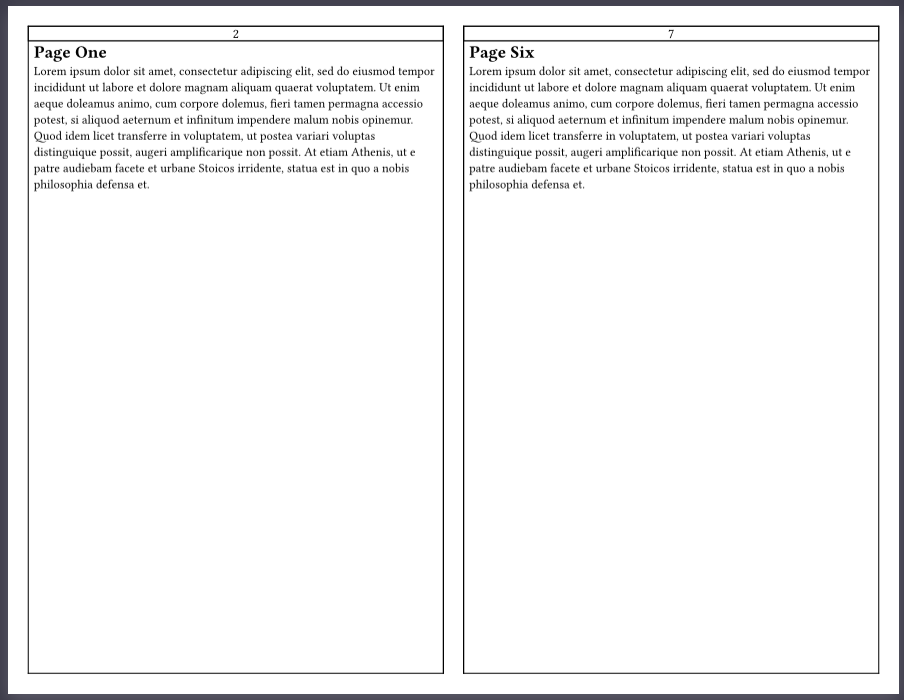
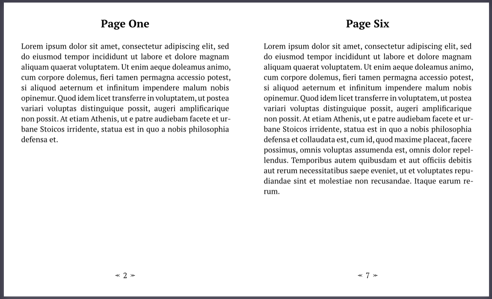

  # Bookletic :book:
Create beautiful booklets with ease.

The current version of this library (0.1.0) contains a single function to take in an array of content blocks and order them into a ready to print booklet, bulletin, etc. No need to fight with printer settings or document converters. 

### Example Output

Here is an example of the output generated by the `sig` function (short for a book's signature) with default parameters and some sample content:



Here is an example with some customization applied:



## `sig` Function

The `sig` function is used to create a signature (booklet) layout from provided content. It takes various parameters to automatically configure the layout. 

### Parameters

- `signature_paper`: The paper size for the booklet. Currently supports `"us-letter"` and `"us-legal"`.
- `page_margin_top`: The top margin for each page in the booklet.
- `page_margin_bottom`: The bottom margin for each page in the booklet.
- `page_margin_binding`: The binding margin for each page in the booklet.
- `page_margin_edge`: The edge margin for each page in the booklet.
- `page_border`: Takes a color space value to draw a border around each page. If set to none no border will be drawn.
- `draft`: A boolean value indicating whether to output an unordered draft or final layout.
- `pNum_pattern`: The pattern for page numbering (e.g., `"1"`, `"01"`, `"a"`, `"A"`).
- `pNum_placment`: The placement of page numbers on each page. Can be `top` or `bottom`.
- `pNum_align_horizontal`: The horizontal alignment of page numbers. Can be `left`, `center`, or `right`.
- `pNum_align_vertical`: The vertical alignment of page numbers. Can be `top`, `horizon`, or `bottom`.
- `pNum_size`: The size of the page numbers.
- `pNum_pad_horizontal`: The horizontal padding for the page numbers.
- `pNum_border`: The border color for the page numbers. If set to none no border will be drawn.
- `pad_content`: The padding around the page content.
- `contents`: The content to be laid out in the booklet. This should be an array of blocks.

### Usage

To use the `sig` function, simply call it with the desired parameters and provide the content to be laid out in the booklet:

```typst
#sig(
  signature_paper: "us-letter",
  contents: [
    ["Page 1 content"],
    ["Page 2 content"],
    ["Page 3 content"],
    ["Page 4 content"],
  ],
)
```

This will create a signature layout with the provided content, using the default values for the other parameters.

You can customize the layout by passing different values for the various parameters. For example:

```typst
#sig(
  signature_paper: "us-legal",
  page_margin_top: 0.5in,
  page_margin_bottom: 0.5in,
  page_margin_binding: 0.5in,
  page_margin_edge: 0.5in,
  page_border: none,
  draft: true,
  pNum_pattern: "-1-",
  pNum_placment: bottom,
  pNum_align_horizontal: right,
  pNum_align_vertical: bottom,
  pNum_size: 10pt,
  pNum_pad_horizontal: 2pt,
  pNum_border: rgb("#ff4136"),
  pad_content: 10pt,
  contents: [
    ["Page 1 content"],
    ["Page 2 content"],
    ["Page 3 content"],
    ["Page 4 content"],
  ],
)
```

This will create an unordered draft signature layout with US Legal paper size, larger margins, no page borders, page numbers at the bottom right corner with a red border, and more padding around the content.

### Notes

- The `sig` function is currently hardcoded to only handle two-page single-fold signatures. Other more complicated signatures may be supported in the future.
- Paper size is also currently hardcoded to only handle US Letter and US Legal.
- The function does not handle odd numbers of pages correctly yet. There is a TODO comment to implement this functionality.
- The `booklet` function is a placeholder for automatically break a single content block into pages dynamically. It is not implemented yet but will be added in coming versions.

### Collaboration
I would love to see this package eventually turn into a community effort. So any interest in collaboration is very welcome! However, at this point bookletic is still in its first iteration and can no doubt use a lot more field testing and improvements. If there is enough interest for collaboration, I will gladly create a public repository for bookletic. In the mean time, if you are interested you can ping me on the typst discord server with the username: `harrellbm`
