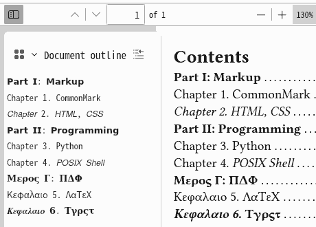

# bookmark-kabob
> Bold and italic heading styles in PDF readers' bookmarks.

1. When reading e-books, bookmarks of PDF viewers are more useful than outlines (Tables of Contents), which can't float and are on some constant PDF pages.
2. If too many headings to read, it would be better to style them.
3. However, the bold or italic styles in outlines are not in sync with bookmarks'.

That's the blank this package fills in.

[Usage](#usage) | [Status](#status) | [LICENSE](#license)

## Usage


```typ
#import "@preview/bookmark-kabob:0.1.0": *

#show: bobak  // take outline and heading back home

#outline()

= #kabob("*Part I: Markup")
= Chapter 1. CommonMark
= #kabob("_Chapter 2. HTML, CSS")

= #kabob("*Part II: Programming")
= Chapter 3. Python
= Chapter 4. #kabob("_POSIX Shell")

= #kabob("*Μερος Γ: ΠΔΦ")
= Κεφαλαιο 5. ΛαΤεΧ
= #kabob("*_Κεφαλαιο 6.") #kabob("*Τγρςτ")
```

## Status
- Tricky math forms used, only English Sans and Greek Serif letters usable.
- Sort of slow? Try `typst compile example.typ --ignore-system-fonts`
- Why "str" rather than \[content\]?
  - Strings don't disturb external functions or show rules.
- Why `= _*Some Heading*_` won't be bold-italic in bookmarks (e.g. Document outline of PDF.js)?
  - Bookmarks are finished before everything, so can't be changed by emph(), strong(), show emph, etc.
- Why `#show: bobak`?
  - Outline and heading, as well as bookmark, be changed by `kabob()`, bobak takes them back home.
- Why styles instead of hierarchies?
  - In the same one logical level, there will be no hierarchies.
- Would my device, system, font, run the package?
  - Sure for all! It is because no `text(font:"Font")` in the source code.
  - If your device have 0 font, the Typst CLI embedded fonts are enough to run.
- How about [PDF Accessibility (PA)?](https://pdfa.org/accessibility/)
  1. PA is for the blind to listen and for LLM AI to train, not for everyone.
  2. All contents of a PDF, such as cover, preface, ToC, heading, par, are independent to the package by the show rule `bobak`.
  3. A bookmark is not a content but a flexible interactive feature. Just like one can rename Demo.pdf as Demo.pdg, Demo.pde or Pdf.demo, bookmarks are not a serious part of PA.
  4. I search out **0** PA law or iso on bookmark styles, no matter which PDF version (1.7, 2.0, U/A-1,2). If there are, show me please.

| Test | Typst | Trace |
| ---: | :---: | :--- |
| **PASS** | 0.15.1-0.6.0 | --- |
| *import err* | 0.5.0 | file not found: search preview |
| *compile err* | 0.4.0 | function `str` does not contain field `to-unicode` | 
| *compile err* | 0.3.0-0.1.0 | type function has no method `to-unicode` |

## LICENSE
[Apache-2.0](LICENSE)
