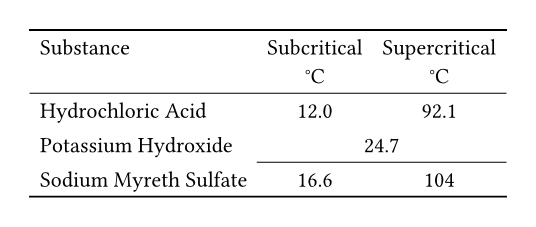

# Booktabs

Booktabs is a Typst package inspired by the fabulous LaTeX's Booktabs package.


## Usage

To use this package, simply add the following code to your document:

```typ
#import "@preview/booktabs:0.0.2": *

#set table(stroke: none)

#table(
  columns: 3,
  align: (left, center, center),
  toprule(), // added by this package
  table.header(
    [Substance],
    [Subcritical \ °C],
    [Supercritical \ °C],
  ),
  midrule(), // added by this package
  [Hydrochloric Acid],
  [12.0],
  [92.1],
  [Potassium Hydroxide],
  table.cell(colspan: 2)[24.7],
  cmidrule(start: 1, end: -1), // added by this package
  [Sodium Myreth Sulfate],
  [16.6],
  [104],
  bottomrule() // added by this package
)
```
[](./examples/simple_table.pdf)
