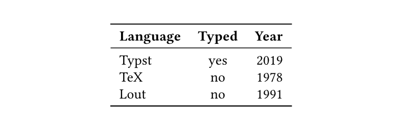
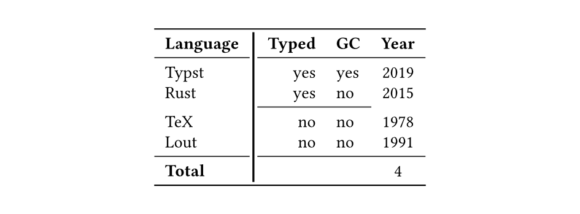
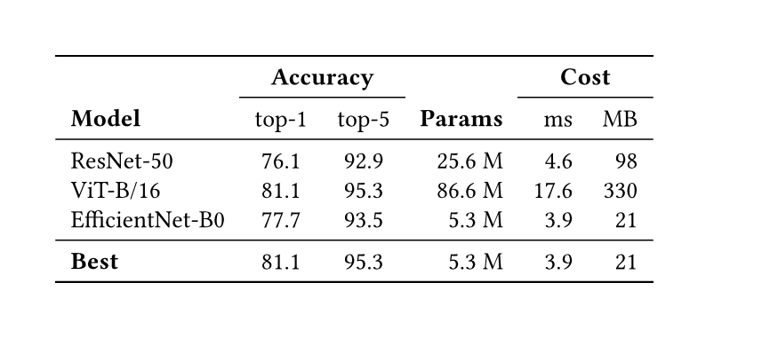
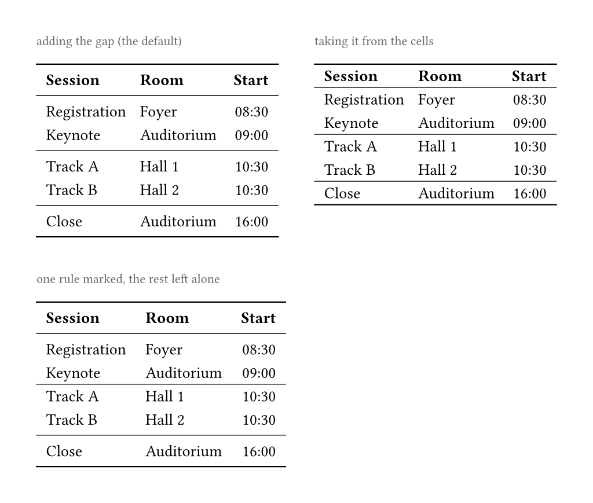

# booktyps

The [booktabs](https://ctan.org/pkg/booktabs) look for Typst tables — a heavy
rule above and below, a light one under the header and above the footer, and
proper breaking of rules where they cross. Use native Typst table syntax: `table.hline` and `table.vline` to inject more lines.


## Usage

```typst
#show table: booktabs
// the code for the image above
#table(
  columns: 3,
  align: (left, center, right),
  table.header([*Language*], [*Typed*], [*Year*]),
  [Typst], [yes], [2019],
  [TeX], [no], [1978],
  [Lout], [no], [1991],
)
```

`#show table: booktabs` is the whole setup. The rules are read off the
table's own structure:

- a [heavy](#options) rule above and below the whole table
- a [light](#optons) rule under `table.header` and above `table.footer`
- a table with neither header nor footer gets only the two heavy rules

Placing a `table.hline` adds a light rule of your own; `start`/`end` narrow
it to some columns, like booktabs' `\cmidrule`. A `table.vline` runs down the table the same way. Specify the line's stroke to specialize the strength per line.

No cell inset is applied — set your own with `set table(inset: ..)`.

Sizes are given in `em`, as booktabs gives its own, so rules keep their weight
against the text at any size. booktabs sets less air above a rule than below it
(`\aboverulesep` `0.4ex`, `\belowrulesep` `0.65ex`); our default `0.27em` is the same either side. The `booktabs-original` example sets booktabs' own asymmetric values if you want them.

## Line Crossing Behaviour

Where two rules cross, one breaks apart and continues behind again. By default the thinner rule breaks.

Here a `table.vline` and a `table.hline` cross; the thicker vline wins, so the horizontal rules give way to it, and the `table.hline` covers only the columns it spans, like booktabs' `\cmidrule`:



```typst
#show table: booktabs

#table(
  columns: 4,
  align: (left, center, center, right),
  // Thicker than the rules it meets, so the horizontal ones give way to it. The top and bottom ones don't break because the vertical one does not cross it.
  table.vline(x: 1, stroke: 1.2pt),
  table.header([*Language*], [*Typed*], [*GC*], [*Year*]),
  [Typst], [yes], [yes], [2019],
  [Rust], [yes], [no], [2015],
  // Covers only the columns it spans, like booktabs' \cmidrule.
  // would not cut the vertical one even if it was stronger
  table.hline(start: 1, end: 3),
  [TeX], [no], [no], [1978],
  [Lout], [no], [no], [1991],
  table.footer([*Total*], [], [], [4]),
)
```

You may configure line breaking behaviour via [`break-rule`](#options).

## Sideways Tables

A table laid out sideways has no header to read a rule off, so draw the rules
yourself and let the thinner one give way:

```typst
#table(
  columns: 4,
  table.vline(x: 1, stroke: 0.9pt),   // thicker: the horizontal rules break at it
  table.hline(y: 1, stroke: 0.4pt),
  [*Language*], [Typst], [TeX],  [Lout],
  [*Year*],     [2019],  [1978], [1991],
)
```

## Rules That Meet

Crossing is one thing; *meeting* is another. Where a rule only runs up to another rather than past it, nothing has to give way — whichever rule ends there
simply stops short. You can configure this `meet` behaviour also in the [`rule-inset`](#options)s.

```typst
// `meet` rides on the inset, taking a value or a dictionary of its own
#show table: booktabs.with(rule-inset: (x: 6pt, y: 3pt, meet: 0pt))
```

`meet` defaults to the ordinary inset. Setting it to `0pt` makes such rules run
into each other, which is how you close a table into a box. Crossed rules are
unaffected either way.

## Several Rules on One Row

Rules may share a boundary, which is booktabs setting two `\cmidrule`s on one
vertical alignment — a short rule under each group of a grouped header. Write
them as separate `table.hline`s on the same row and they share the one band of
air rather than each claiming their own. Where they ask for different air, the
widest wins — the band cannot be two heights at once:



## Where the Space Comes From

A rule needs space either side of it, and that has to come from somewhere.
By default it is added, so rules push the rows apart. With
`rule-steals-space: true` a rule takes it out of the inset of the cells beside
it instead, leaving the table the height it would have with no rules at all;
where the cell inset cannot cover the rule's inset, only the shortfall is added.



A single rule can be marked either way whatever the table is set to, by
labelling it `<steals-space>` or `<injects-space>`. The label has to be attached
inside a content block, since a table takes content and a bare label is not:

```typst
#table(
  columns: 2,
  [a], [b],
  [#table.hline()<steals-space>],  // the label rides on the rule
  [c], [d],
)
```

Rules sharing a row/column share the one gap, so they cannot disagree about where it comes from. We warn of this via `uniwarn`. You can disable our warnings via `#uniwarn.disable-warnings("booktyps")` after importing the uniwarn package.

## Options

`#show table: booktabs.with(..)` binds any of these.

| option | default | what it does |
|---|---|---|
| `heavy` | `0.08em` | the default rule strength above and below the table, `\toprule`/`\bottomrule` |
| `light` | `0.05em` | the default rule strength under a header, above a footer, and for a bare `table.hline`, `\midrule` |
| `vertical` | `0.04em` | the default rule strength for a bare `table.vline`; thinner than `light`, so a horizontal rule wins a crossing by default |
| `rule-inset` | `0.27em` | how far a rule is held from what it divides, and how far a rule that gives way stops short |
| `rule-steals-space` | `false` | whether a rule's gap is taken from the cells' inset beside it instead of added to the table |
| `break-rule` | `auto` | which of two crossing rules breaks |

**`rule-inset`** accepts one value for every side, a dictionary keyed by `x`/`y`
or by `top`/`bottom`/`left`/`right`, or a function `(x, y, rule) => ..` giving
each rule its own air. Note that one of `x`/`y` is always `none` because lines are fixed in one dimension. The function may return a value or a dictionary.
In general the dictionary may also carry a key `meet` with its own value or dict which overrides the normal inset in case a line just touches, but does not cross another one.

Rules generally cost space. Whether that is injected or taken from the cells is controlled by setting `rule-steals-space`.

**`break-rule`** takes `auto` (break the thinner rule, the vertical one on a
tie), `table.hline` or `table.vline` to always break that direction, or a
function `(x, y, hl, vl) => ..` returning either `table.hline` or `table.vline` to decide the special case. All four arguments
are positional: the column and row the rules meet at, then the two instantiated rules themselves.


## Examples

See the [Github Examples](https://github.com/zral0kh/booktyps/tree/v0.1.0/examples) for more use cases.
 
| file | shows |
|---|---|
| `simple.typ` | the whole setup |
| `booktabs-original.typ` | the table from the booktabs manual, with booktabs' own spacing |
| `grouped-header.typ` | several rules on one row, `\cmidrule` style |
| `crossing-rules.typ` | crossing versus merely touching |
| `complex.typ` | a thicker vertical rule winning against the horizontal ones |
| `spacing.typ` | adding the gap versus taking it from the cells |
