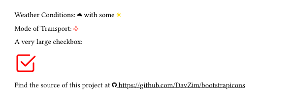

# Bootstrap Icons for Typst

The `bootstrapicons` package is a bundle of Bootstrap icons.
Bootstrap icons is a collection of icons provided by the [Bootstrap project](https://getbootstrap.com/) with over 2000 icons.

A full list of icons is provided at [https://icons.getbootstrap.com/](https://icons.getbootstrap.com/).
This typst package uses version `v1.13.1` of the Bootstrap icons.

## Usage

```typst
#import "@preview/bootstrapicons:0.0.1": bsicons
```

# Minimal Working Example

```typst
#import "@preview/bootstrapicons:0.0.1": bsicons
#show link: underline

Weather Conditions: #bsicon("cloud-fog2-fill") with some #bsicon("sun-fill", color: color.hsl(51deg, 100%, 50%))

Christmas Present: #bsicon("airplane", color: red)

If you want, you can make it large as well or use different color specifications:

#bsicon("check2-square", height: 3em, color: rgb("#ff0000"))

Find the source of this project at #bsicon("github") #link("https://github.com/davzim/bootstrapicons")
```

Which will generate this [PDF](https://github.com/davzim/bootstrapicons/examples/mwe.pdf).




# Contribution

You are welcome to open an issue if you find any error or open a pull request if you feel any functionality is missing.

# License

This package is licensed under the MIT license, the same license that the Bootstrap project uses.
