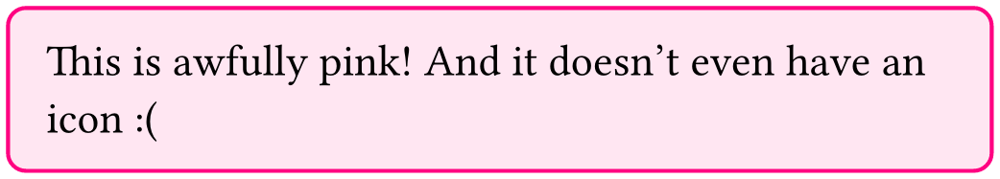

# Boxaroo: simple & coloful info boxes for Typst

Boxaroo is a collection of functions to create colorful boxes that you can use in your document to break up long text and make it more readable, or to highlight important information. It was originall part of my thesis template, but I decided to make it a separate package so that it can be used by others as well.

```ts
#import "@preview/boxaroo:0.1.0": boxaroo, binfo

#show: boxaroo
#binfo(footer: "It even has a footer")[
  This is an info box for all of your important information.
]
```


## Initialization

Boxaroo, just like many other packages, needs to be initialized, this is done with the show rule on the `boxaroo` function:

```typ
#show: boxaroo
```

Once you have done this action, boxaroo is ready to use!

## Pre-made boxes

Boxaroo comes with a few pre-made boxes that you can use right away:

```typ
#import "@preview/boxaroo:0.1.0": boxaroo, binfo, bdefinition, bquestion, bimportant, bconclusion, bnote

#binfo[Info box.]
#bdefinition[Definition box.]
#bquestion[Question box.]
#bimportant[Important box.]
#bconclusion[Conclusion box.]
#bnote[Note box.]
```


## Custom boxes

You can declare custom boxed by name using the `define-format` function:
    
```typ
#import "@preview/boxaroo:0.1.0": define-format

#define-format(
  "bubblegum",
  stroke-color: rgb(255, 0, 129)
)

#bbox(kind: "bubblegum")[
  This is awfully pink! And it doesn't even have an icon.
]
```



The following parameters are available:
- `stroke-color`: the color of the stroke
- `fill-color`: the color of the fill
- `icon`: the icon to use (any content is allowed)
- `preifx`: the prefix to use for the box

## Overriding parameters

You can also use `define-format` to override the default boxes.

## Additional arguments

The `bbox` function takes a number of additional arguments:
- `kind`: which lets you chose the kind manually
- `radiu`: the radius of the corners
- `footer`: the footer text
- `breakable`: whether the box can be broken over multiple pages
- `icon`: whether to use an icon or not