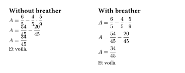
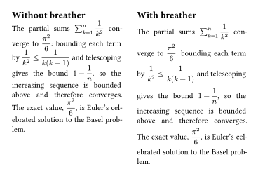
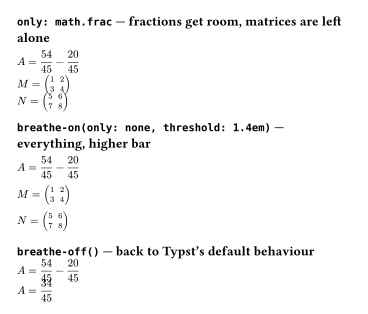

# breather

[](https://typst.app/universe/package/breather)
[](https://github.com/nathan-ed/typst-package-breather/blob/1977f9e357da5d811422ed262d04a1ba0d64264c/docs/manual.pdf)
[](LICENSE)

Give tall inline math room to breathe. One show rule fixes lines that
overlap because of display-style fractions, matrices, big operators,
nested roots — while leaving the spacing of ordinary lines untouched.

## The problem

Typst computes line spacing from the font's `cap-height` and `baseline`
text edges, not from the actual ink. Inline math that extends past those
edges — a `math.display` fraction, a matrix — collides with the
neighbouring lines:

[](gallery/before-after.typ)

The usual workarounds both hurt: raising `par(leading)` wastes space on
every line, and setting `top-edge: "bounds"` on all equations makes
ordinary lines uneven (a mere descender in `$y_p$` pushes lines apart).

## The fix

`breathe` measures every inline equation and switches it to bounds-based
edges *only when it is actually tall*. Tall lines expand exactly as
needed; every other line keeps perfectly regular leading.

```typ
#import "@preview/breather:0.1.0": breathe
#show: breathe
```

That's it — active for the whole document. It also works in justified
paragraphs where tall math wraps naturally:

[](gallery/paragraph.typ)

## Options

```typ
#show: breathe.with(threshold: 1.1em, only: none, enabled: true)
```

| Option | Default | Description |
|---|---|---|
| `threshold` | `1.1em` | Equations with ink taller than this get corrected spacing. Em values resolve against the text size at the equation. |
| `only` | `none` | Restrict the check to equations containing given elements: `only: math.frac`, `only: ("frac", "mat")`. `none` checks every inline equation. |
| `enabled` | `true` | Initial state — handy as a template flag: `breathe.with(enabled: flag)`. |

### Toggling mid-document

`breathe-on` and `breathe-off` flip the rule anywhere after `#show: breathe`:

```typ
#import "@preview/breather:0.1.0": breathe, breathe-on, breathe-off
#show: breathe

#breathe-off()                             // Typst default behaviour again
#breathe-on(threshold: 1.4em)              // back on, higher bar
#breathe-on(only: math.frac)               // only equations with fractions
#breathe-on(only: none)                    // back to checking everything
```

[](gallery/options.typ)

## Notes

- The `/` fraction shorthand desugars to `math.frac`, so `only: math.frac`
  catches `$1/2$` too.
- Spacing between the expanded line and its neighbours is still governed
  by `par(leading)` — breather only makes the line's true height known.
- Works inside grids, columns and list/task layouts (e.g. the
  [taskize](https://typst.app/universe/package/taskize) package): it fixes
  the `\`-separated lines *within* a cell, and it also stops cells with
  tall math from bleeding across the row gutter — gutter values are never
  changed, they just become the real visual gap.
- Overhead is one extra measurement per inline equation: a stress test
  with 3000 equations compiles about 25% slower; a typical worksheet
  (~200 equations) pays around 15 ms.
- This works around [typst#1028](https://github.com/typst/typst/issues/1028);
  if Typst gains native ink-aware line spacing, you can simply delete the
  two lines.

## Changelog

### [0.1.0] - 2026-07-13

#### Added
- `breathe`: document-wide show rule that measures every inline equation
  (with bounds text edges, since plain measurement under-reports the ink
  height of matrices and similar) and expands only lines whose math is
  taller than `threshold`.
- `only` filter to restrict the check to equations containing given
  elements (`math.frac`, `"mat"`, …).
- `enabled` flag for template integration.
- `breathe-on` / `breathe-off` to toggle or retune the rule mid-document.

## License

MIT
