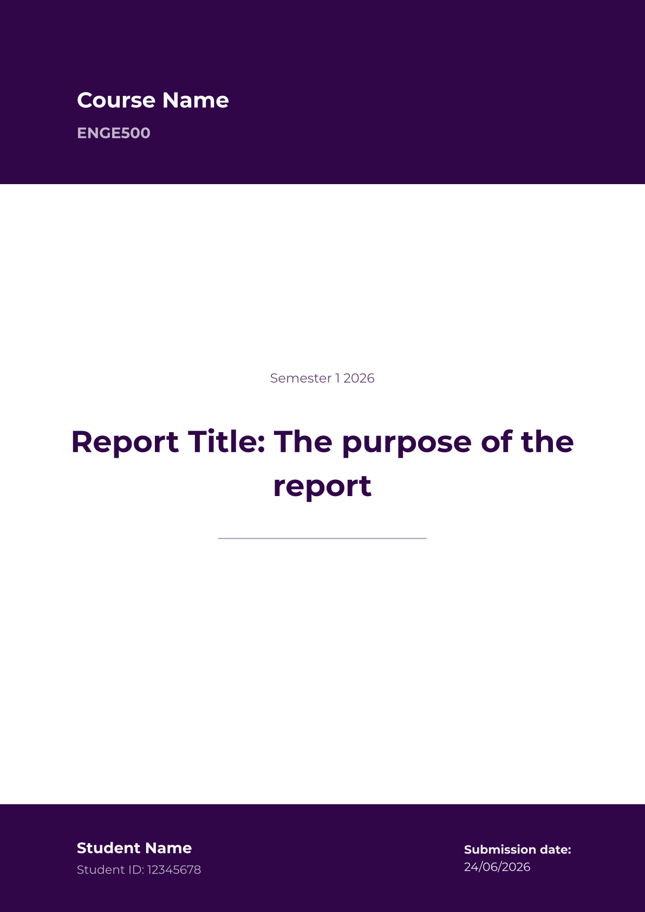
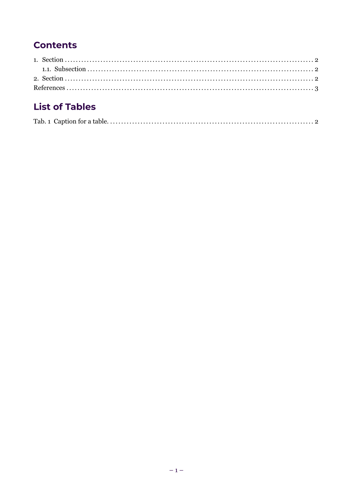

# breezy-report

A clean, colour-customisable engineering report template for Typst. Designed for university assignment submissions. The submission date is auto-populated.

## Usage

```typst
#import "@preview/breezy-report:0.1.0": *

#show: breezy.with (
  semester: "Semester 1 2026",
  courseCode: "ENGE500",
  courseName: "Engineering Mathematics I",
  title: "My Report: With an extended title",
  studentID: "12345678",
  author: "Jane Smith",
  accentColour: rgb("#300649"),
)

//Your content goes here
```

## Parameters

| Parameter | Default | Description |
|---|---|---|
| `accentColour` | `rgb("#300649")` | Primary accent colour |
| `tableHeaderTextColour` | `white` | Table header text colour |
| `bibFile` | `none` | Path to `.bib` file (if applicable) |

## Default fonts
 - **Georgia**: Body text.
 - **Montserrat**: Headings and title page. Must be installed locally - download from [Google Fonts](https://fonts.google.com/specimen/Montserrat).
 - **DejaVu Sans**. Fallback font for headings & title page is Montserrat is not installed.

## Example pages




