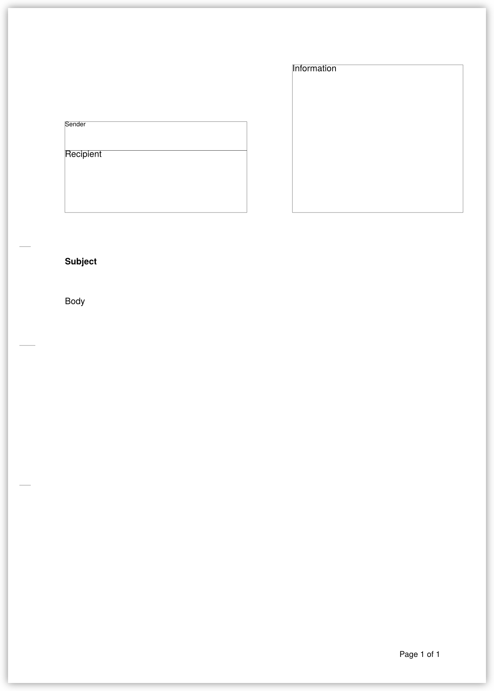

# 🩲 Briefs

Briefs is a simple [Typst](https://typst.app/) template for letters (German: Briefe).
It is inspired by [DIN 5008](https://de.wikipedia.org/wiki/DIN_5008) and targets A4 paper.
The address box fits the window of a
[DIN lang](https://de.wikipedia.org/wiki/DIN_lang) envelope.

## Example
```typst
#import "@preview/briefs:0.1.0": letter

#set text(lang: "de", font: "TeX Gyre Heros")
#show: letter.with(
  sender: (
    [Hilfsorganisation e.V.],
    [Spendengasse 12],
    [12345 Helfershausen]
  ),
  recipient: [
    Frau\
    Erika Mustermann\
    Rathausplatz 37\
    67890 Waldhausen
  ],
  location: "Helfershausen",
  subject: [*Vielen Dank für Ihre Spende*]
)

Sehr geehrte Frau Mustermann,

wir bedanken uns herzlich für Ihre großzügige Spende an unseren Verein.
Durch Ihre Unterstützung können wir weiterhin wichtige soziale Projekte
durchführen und Menschen in Not helfen.

Vielen Dank für Ihr Vertrauen und Ihre Mithilfe!

#v(0.5cm)
Mit freundlichen Grüßen

Hilfsorganisation e.V.
```


For more examples check out the folder
[`tests`](https://github.com/tndrle/briefs/tree/main/tests).

## Reference
### Document Structure
The image below shows the basic document structure. The address box contains
sender and recipient.
The information box contains additional information – the default is sender,
location and date.


### API
```typst
letter(
  sender: (),
  sender-font-size: 8pt,
  sender-separator: ", ",
  recipient: [],
  information: auto,
  information-box: (125mm, 25mm, 75mm, 65mm),
  date: auto,
  date-format: auto,
  location: none,
  location-date-separator: ", ",
  subject: none,
  folding-marks: true,
  hole-punch-mark: true,
  background: [],
  show-boxes: false,
  ..page-args,
  body
)
```

**Arguments**
* **`sender`** &emsp; `array of content` &emsp; *Default*: `()`<br><br>Sender's name and address. This address is shown in the address box with
font size `sender-font-size` and concatenated with separator
`sender-separator`. If `information` is `auto`, this address is also
shown at the top of the information box.<br><br>
* **`sender-font-size`** &emsp; `length` &emsp; *Default*: `8pt`<br><br>Font size of the sender's name and address in the address box.<br><br>
* **`sender-separator`** &emsp; `content` &emsp; *Default*: `", "`<br><br>Separator between sender's address parts in address box.<br><br>
* **`recipient`** &emsp; `content` &emsp; *Default*: `[]`<br><br>The recipient's name and address. Add line breaks manually.<br><br>
* **`information`** &emsp; `auto` | `content` &emsp; *Default*: `auto`<br><br>Content of the information box. If this is `auto`, the sender, location,
and date are shown as a default.<br><br>
* **`information-box`** &emsp; `array of length` &emsp; *Default*: `(125mm, 25mm, 75mm, 65mm)`<br><br>Absolute position and size of the information box: (x, y, width, height).<br><br>
* **`date`** &emsp; `auto` | `datetime` | `content` &emsp; *Default*: `auto`<br><br>The date (only used, if `information` is `auto`). If this is
`auto`, the current date is shown. If `auto` or a value of type `datetime`
is provided, the date will be formatted with `date-format`.<br><br>
* **`date-format`** &emsp; `auto` | `str` &emsp; *Default*: `auto`<br><br>The date format which is applied if `date` is `auto` or of type
`datetime`. If `date-format` is a string, it is directly passed to Typst's
`datetime.display()` function. If `date-format` is `auto` and `text.lang`
is `"de"`, the format `[day].[month].[year]` is used. If a different
language is set, `auto` is passed to `datetime.display()`.<br><br>
* **`location`** &emsp; `none` | `content` &emsp; *Default*: `none`<br><br>The location (only used, if `information` is `auto`).<br><br>
* **`location-date-separator`** &emsp; `content` &emsp; *Default*: `", "`<br><br>The separator between location and date<br><br>
* **`subject`** &emsp; `none` | `content` &emsp; *Default*: `none`<br><br>The subject<br><br>
* **`folding-marks`** &emsp; `bool` &emsp; *Default*: `true`<br><br>Whether folding marks are shown<br><br>
* **`hole-punch-mark`** &emsp; `bool` &emsp; *Default*: `true`<br><br>Whether a hole punch mark is shown<br><br>
* **`background`** &emsp; `content` &emsp; *Default*: `[]`<br><br>Content for the page background. The folding marks and the hole punch mark
are placed on the page's background. If you want to add additional content
to the background, provide it here.<br><br>
* **`show-boxes`** &emsp; `bool` &emsp; *Default*: `false`<br><br>Whether address box and information box are framed. This is mainly for
debugging.<br><br>
* **`page-args`** &emsp; `any` (*variadic*)<br><br>Additional arguments for Typst's `page()` function.<br>
Default arguments are:<br>
`margin: (left: 25mm, rest: 20mm)`<br>
`number-align: bottom + right`<br>
`numbering: (i, t) => text(10pt, context (localized().page-number)(i, t))`<br>
However, those values can be overwritten.<br><br>
* **`body`** &emsp; `content`<br><br>The letter content<br><br>
