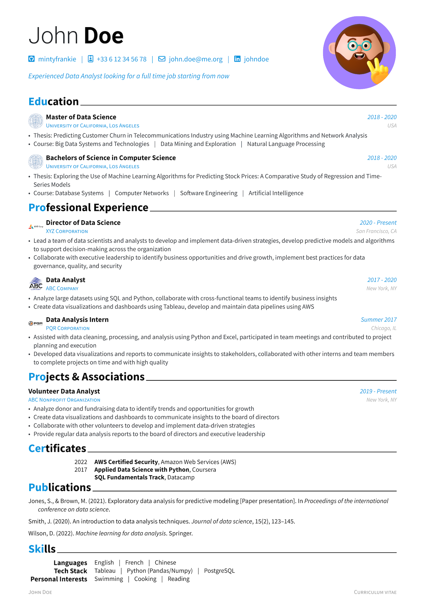

<h1 align="center">
  <br>
  
  <br>
  <br>
  Brilliant CV
  <br>
</h1>

<h4 align="center">A modern, modular, and feature-rich CV template for <a href="https://typst.app" target="_blank">Typst</a>.</h4>

<p align="center">
  <a href="https://typst.app/universe/package/brilliant-cv"></a>
  <a href="https://github.com/yunanwg/brilliant-CV/actions/workflows/test.yaml"></a>
  <a href="LICENSE"></a>
  <a href="https://github.com/yunanwg/brilliant-CV/releases"></a>
</p>

> **v4 is a breaking change.** Coming from v3? See the [Migration Guide](https://yunanwg.github.io/brilliant-CV/migration/) for the v3 fields that now panic with a migration message (`language`, `non_latin_font`, `[lang.<code>]`, `inject_ai_prompt`, …) and their v4 replacements.

## ✨ Key Features

- **Profile-based variants** — Each `profile_<name>/` is a complete, self-contained CV. Switch with `--input profile=fr` at compile time. No language whitelist; any script (CJK, Arabic, Hebrew, …) is configurable via `[layout.fonts]`.
- **AI & ATS friendly** — Keyword injection helps your CV pass automated screening systems.
- **Pixel-perfect tested** — 40+ tests run inside a Linux Docker baseline; layout regressions can't slip past CI.

## Quick Start

```bash
typst init @preview/brilliant-cv
```

Edit `profile_en/metadata.toml` and the content modules in `profile_en/*.typ` — it's the most heavily annotated profile. To add a new variant, copy the directory and tweak the fields that differ.

```bash
typst compile cv.typ                    # default profile
typst compile cv.typ --input profile=fr # switch profile at compile time
```

Full guide, component gallery, recipes, and configuration reference → **[brilliant-CV Documentation](https://yunanwg.github.io/brilliant-CV/)**.

## Gallery

| Style | Preview |
|-------|---------|
| **Standard** |  |
| **French (Red)** |  |
| **Chinese (Green)** |  |

## Contributing

Contributions are welcome! See [CONTRIBUTING.md](CONTRIBUTING.md) for guidelines.

## Sponsors

> If this template helps you land a job, consider [buying me a coffee](https://github.com/sponsors/yunanwg)! ☕️

<p align="center">
  <!-- sponsors --><a href="https://github.com/GeorgRasumov"></a>&nbsp;&nbsp;<a href="https://github.com/chaoran-chen"></a>&nbsp;&nbsp;<!-- sponsors -->
</p>

## License

[Apache 2.0](LICENSE).
