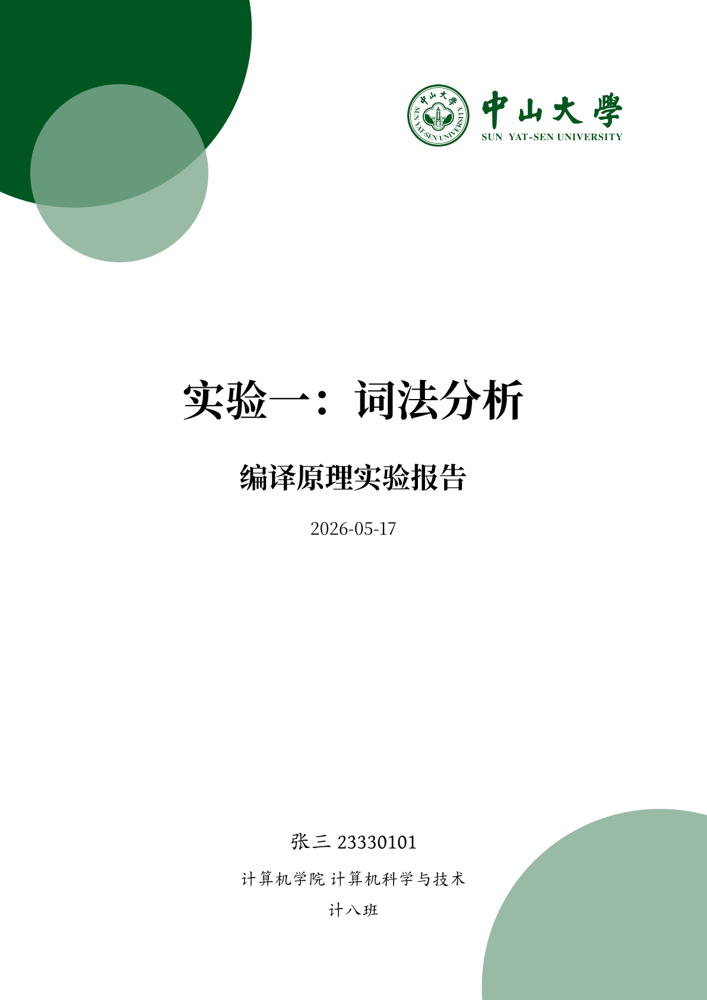

# bubble-sysu

A Typst template for reports at Sun Yat-sen University.



## Usage

Install required fonts from links below or from [release](https://github.com/yuanlx27/bubble-sysu/releases/tag/v0.1.0).

Create a new project from this template with the Typst CLI:

```sh
typst init @preview/bubble-sysu:0.1.0
```

Or import the template in an existing Typst document:

```typst
#import "@preview/bubble-sysu:0.1.0": *

#show: report.with(
  title: "实验一：词法分析",
  subtitle: "编译原理实验报告",
  student: (name: "张三", id: "23330101"),
  school: "计算机学院",
  major: "计算机科学与技术",
  class: "计八班",
)
```

## Template Parameters

The `report` template accepts the following parameters:

| Parameter | Type | Default | Description |
| --- | --- | --- | --- |
| `title` | `str` | `"标题"` | Main title shown on the cover page. |
| `subtitle` | `str` | `"副标题"` | Subtitle shown below the main title. |
| `student` | `dictionary` | `(name: "姓名", id: "学号")` | Student information displayed on the cover page. |
| `school` | `str` | `"学院"` | School name. |
| `major` | `str` | `"专业"` | Major name. |
| `class` | `str` | `"班级"` | Class name. |
| `date` | `datetime` | `datetime.today()` | Date shown on the cover page. |
| `logo` | `bool` | `true` | Whether to display the university logo. |
| `accent-color` | `color` | `rgb(0, 86, 32)` | Main decorative color used on the cover page. |
| `alpha` | `ratio` | `60%` | Opacity used when mixing the secondary decorative color. |
| `body` | `content` | — | Report body content. |

## Features

- Cover page tailored for Sun Yat-sen University reports
- Chinese heading numbering style for top-level headings
- Built-in styles for links, inline code, and code blocks
- Configurable accent color and optional university logo

## Fonts

This template uses the following fonts:

- [`ChillKai`](https://github.com/Warren2060/Chillkai)
- [`Maple Mono NFMono`](https://github.com/johnsmith0x3f/maple-mono-custom)
- [`Noto Serif CJK SC`](https://github.com/notofonts/noto-cjk)

Make sure they are installed on your system for the intended appearance.

## License

This project is licensed under the MIT License.
