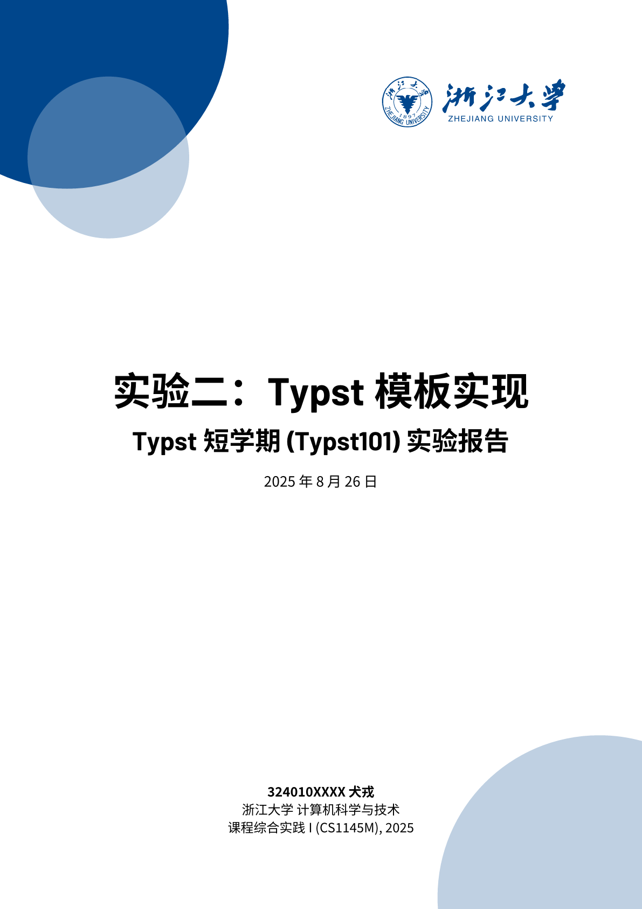
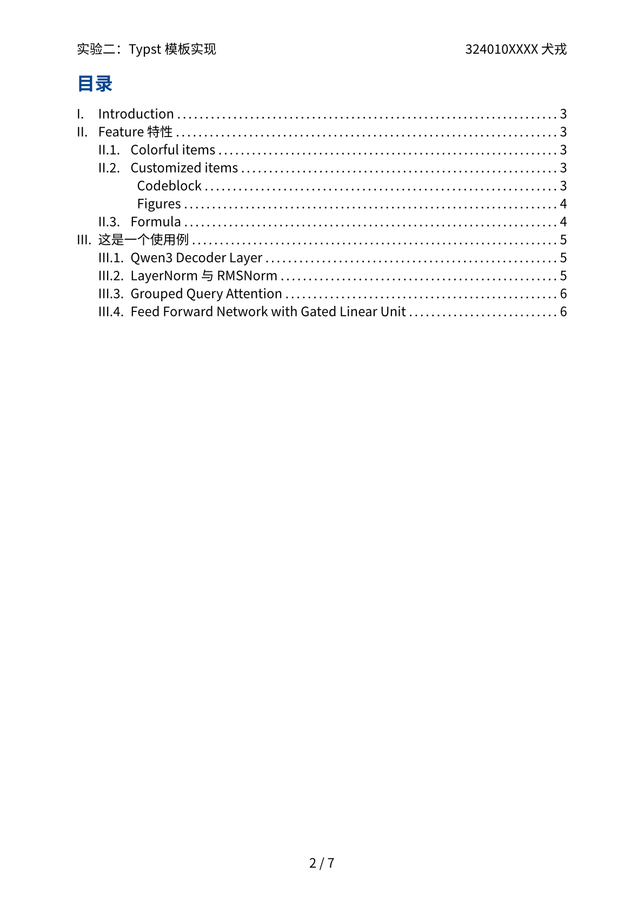
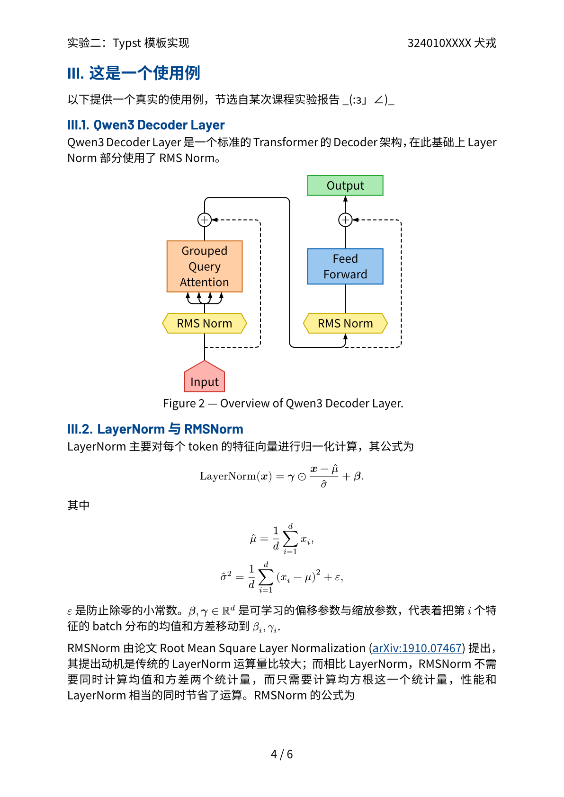

# Bubble ZJU

浙江大学风格的 Typst 模板，基于 [hzkonor/bubble-template](https://github.com/hzkonor/bubble-template) 修改开发。

## 特点

- 大气的浙大蓝与浙大 Logo，搭配上原 Bubble 的简洁彩色风格
- 支持自定义主色、作者、标题、日期、Logo 等
- 页眉自动显示标题与作者，页脚自动显示页码

适用于浙江大学各类文档、作业、报告等场景。

## 预览

| 封面                            | 目录                           | 使用例                         |
| ------------------------------- | ----------------------------- | ----------------------------- |
|  |  |  |

可见仓库中的 `template/report.typ` 示例。

## 使用

可使用 Typst Universe 源导入：

```typ
#import "@preview/bubble-zju:0.1.0": *
```

也可克隆仓库到工作目录下进行导入。

```typ
#import "bubble-zju/lib.typ"
```

字体没有内置，您可能需要安装以下字体：

```typ
#let needed-font = (
    "Barlow",
    "Source Han Sans SC",
    "JetBrainsMonoNL NF",
    "LXGW WenKai Mono Screen"
)
```

## License

MIT-0 License, consistent with [hzkonor/bubble-template](https://github.com/hzkonor/bubble-template).