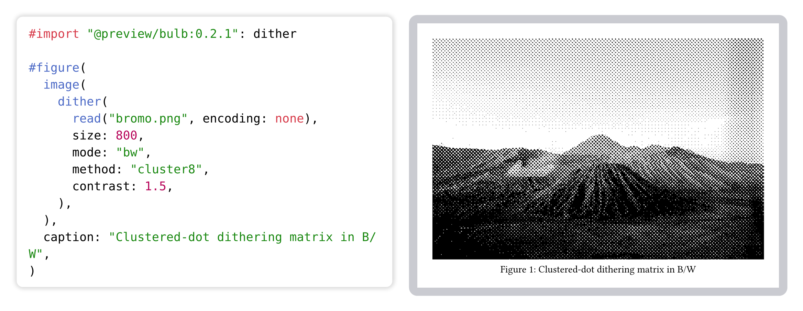
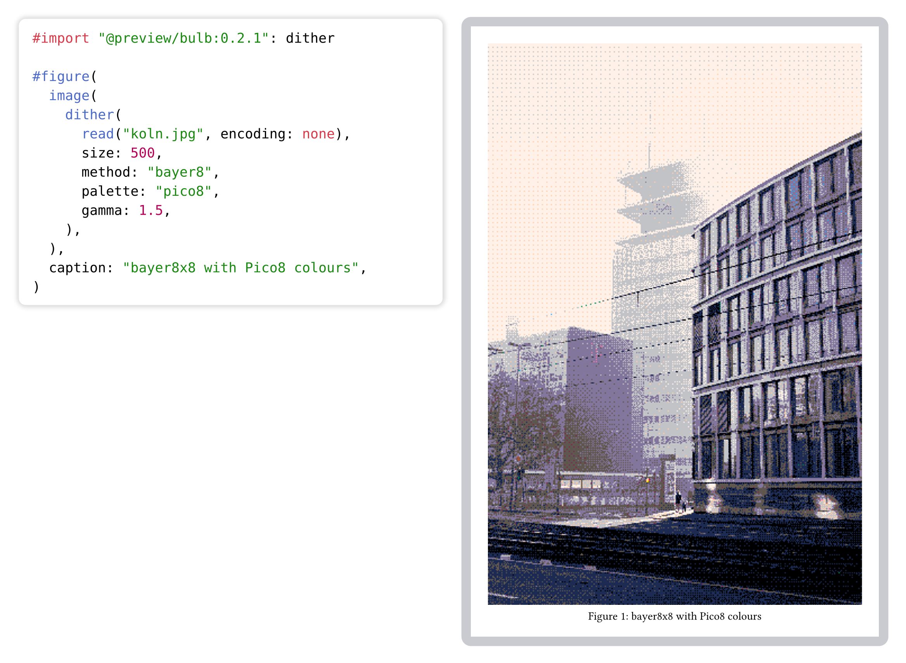
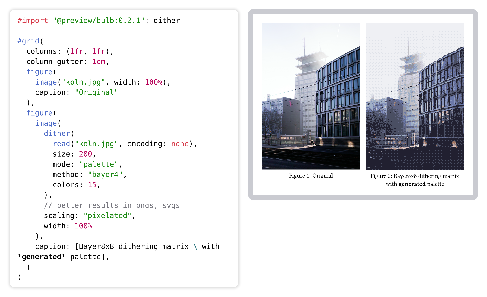
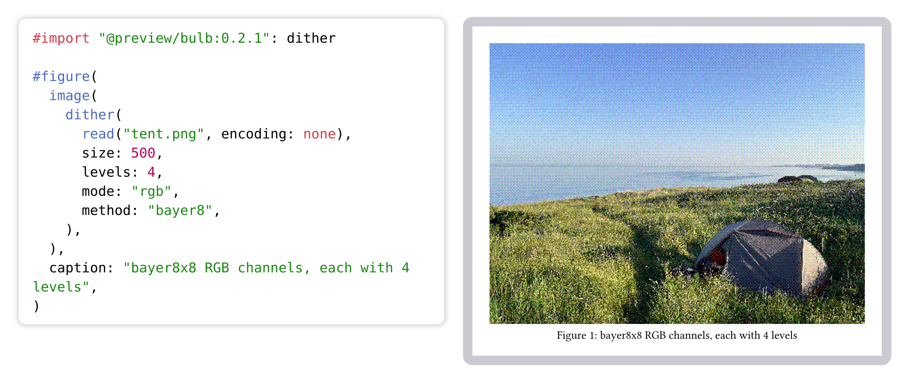
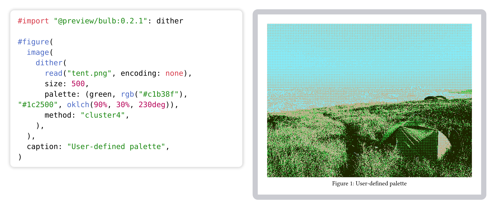

# Bulb

Bulb is a package for creating dithered images straight in [Typst](https://typst.app).

## Usage

The package exports a single function, `dither`. It takes raw image bytes and returns PNG bytes you can pass straight to `image()`.

```typst
#import "@preview/bulb:0.2.1": dither
```

Black & white:

```typst
#image(dither(
  read("photo.png", encoding: none),
  mode: "bw",
  method: "cluster8",
  size: 800,
))
```

Palette preset (mode inferred):

```typst
#image(dither(
  read("photo.png", encoding: none),
  palette: "gameboy",
))
```

Custom palette with Typst colours:

```typst
#image(dither(
  read("photo.png", encoding: none),
  palette: (black, red, rgb("#ff8800"), white),
))
```

Tonal pre-pass (gamma / contrast / brightness):

```typst
#image(dither(
  read("photo.png", encoding: none),
  gamma: 2.2,
  contrast: 1.2,
  brightness: -0.1,
))
```

Edge-preserving snap (sharper silhouettes, flats stay dithered):

```typst
#image(dither(
  read("photo.png", encoding: none),
  palette: "pico8",
  edge-threshold: 0.2,
))
```

### Parameters

| Parameter           | Default      | Description                                                                                                                            |
| ------------------- | ------------ | -------------------------------------------------------------------------------------------------------------------------------------- |
| `data` (positional) | -            | Image bytes (PNG/JPEG), via `read("...", encoding: none)`                                                                              |
| `mode`              | `auto`       | `"bw"`, `"rgb"`, or `"palette"`. `auto` infers `"palette"` if `palette` is set, else `"rgb"`                                           |
| `method`            | `"bayer8x8"` | Dither method: `"bayer2x2"`, `"bayer4x4"`, `"bayer8x8"`, `"cluster4"`, `"cluster6"`, `"cluster8"`, `"noise"`                           |
| `size`              | `none`       | Max pixel size of the longest axis. `none` keeps original size                                                                         |
| `filter`            | `"nearest"`  | Resize filter: `"nearest"`, `"triangle"`, `"catmull-rom"`, `"gaussian"`, `"lanczos3"` (nearest fastest, lanczos3 highest quality)      |
| `levels`            | `3`          | Colour levels per channel (rgb mode only)                                                                                              |
| `colors`            | `8`          | Number of palette colours (palette mode only)                                                                                          |
| `accent`            | `none`       | FPS accent colours for hybrid palette (palette mode only, defaults to `colors / 3`)                                                    |
| `palette-method`    | `"hybrid"`   | `"hybrid"`, `"fps"`, or `"kmeans"` (palette mode only)                                                                                 |
| `linear`            | `true`       | Use linear light for palette selection (palette mode only)                                                                             |
| `perceptual-cap`    | `false`      | Cap dominant colour weight (palette mode only)                                                                                         |
| `gamma`             | `1.0`        | Gamma correction applied before dithering (must be positive)                                                                           |
| `contrast`          | `1.0`        | Contrast multiplier around midgrey (`1.0` = no change)                                                                                 |
| `brightness`        | `0.0`        | Additive brightness offset in `[-1.0, 1.0]`                                                                                            |
| `edge-threshold`    | `none`       | `none` (off) or non-negative number. Snap pixels above the Sobel gradient threshold; smaller = more snapped                            |
| `palette`           | `none`       | Preset name string, or array of colours (hex strings or Typst colours, e.g. `("#000", red, rgb("#ff8800"))`). Infers `mode: "palette"` |

## Examples

Here's what it looks like in practice:

<picture>
  <source media="(prefers-color-scheme: dark)" srcset="./docs/assets/bw-dark.png">
  
</picture>

<picture>
  <source media="(prefers-color-scheme: dark)" srcset="./docs/assets/preset-dark.png">
  
</picture>

<picture>
  <source media="(prefers-color-scheme: dark)" srcset="./docs/assets/palette-dark.png">
  
</picture>

<picture>
  <source media="(prefers-color-scheme: dark)" srcset="./docs/assets/rgb-dark.png">
  
</picture>

<picture>
  <source media="(prefers-color-scheme: dark)" srcset="./docs/assets/given-palette-dark.png">
  
</picture>
