# Bulb

Bulb is a package for creating dithered images straight in [Typst](https://typst.app).

## Usage

The package exports a single function, `dither`. It takes raw image bytes and returns PNG bytes you can pass straight to `image()`.

```typst
#import "@preview/bulb:0.4.0": dither
```

Black & white:

```typst
#image(dither(
  path("photo.png"),
  colors: "bw",
  method: "cluster8",
  size: 800,
))
```

Palette preset:

```typst
#image(dither(
  path("photo.png"),
  colors: "gameboy",
))
```

Custom palette with Typst colours:

```typst
#image(dither(
  path("photo.png"),
  colors: (black, red, rgb("#ff8800"), white),
))
```

Auto-generated palette:

```typst
#image(dither(
  path("photo.png"),
  colors: 16,
))
```

Tonal pre-pass (gamma / contrast / brightness):

```typst
#image(dither(
  path("photo.png"),
  gamma: 2.2,
  contrast: 1.2,
  brightness: -0.1,
))
```

### Parameters

| Parameter           | Default      | Description                                                                                                                                                                                                                                                                    |
| ------------------- | ------------ | ------------------------------------------------------------------------------------------------------------------------------------------------------------------------------------------------------------------------------------------------------------------------------ |
| `path` (positional) | -            | `path` object that resolves to a JPEG or PNG image.                                                                                                                                                                                                                            |
| `colors`            | `"rgb"`      | Output colours. `"bw"` (black & white), `"rgb"` (uniform levels per channel, see `levels`), an integer >= 2 (generate that many colours from the image), a preset name (`"gameboy"`, `"nes"`, `"cga"`, `"pico8"`, `"mac"`, `"c64"`), or an array of >= 2 colours               |
| `method`            | `"bayer8x8"` | Dither method. Ordered: `"bayer2x2"`, `"bayer4x4"`, `"bayer8x8"`, `"cluster4"`, `"cluster6"`, `"cluster8"`. Error diffusion: `"floyd-steinberg"` (or `"floyd"`), `"atkinson"`, `"jarvis"`, `"stucki"`, `"burkes"`, `"sierra"`, `"sierra-two-row"`, `"sierra-lite"`, `"simple"` |
| `size`              | `none`       | Max pixel size of the longest axis. `none` keeps original size                                                                                                                                                                                                                 |
| `filter`            | `"nearest"`  | Resize filter: `"nearest"`, `"triangle"`, `"catmull-rom"`, `"gaussian"`, `"lanczos3"` (nearest fastest, lanczos3 highest quality)                                                                                                                                              |
| `levels`            | `3`          | Colour levels per channel (`colors: "rgb"` only)                                                                                                                                                                                                                               |
| `hull-weight`       | `50.0`       | Balance between convex hull coverage and low average error when generating a palette (`colors: <int>` only). See [Hull weight](#hull-weight)                                                                                                                                   |
| `transparent`       | `true`       | Dither the alpha channel to fully on or off (images with an alpha channel only)                                                                                                                                                                                                |
| `gamma`             | `1.0`        | Gamma correction applied before dithering (must be positive)                                                                                                                                                                                                                   |
| `contrast`          | `1.0`        | Contrast multiplier around midgrey (`1.0` = no change)                                                                                                                                                                                                                         |
| `brightness`        | `0.0`        | Additive brightness offset in `[-1.0, 1.0]`                                                                                                                                                                                                                                    |

### Hull weight

When you set `colors` to an integer, bulb generates a palette from the image, and `hull-weight` controls which colours it picks.

A dithered image can only use the colours in its palette, but by placing different palette colours next to each other your eye blends them into new ones. Red and yellow pixels look orange from a distance, black and white look grey. This means dithering can represent any colour inside the [convex hull](https://en.wikipedia.org/wiki/Convex_hull) of the palette, but nothing outside of it. If the palette has no bright yellow, the output will never contain bright yellow either.

As an example, these are all the colours in a photo of a flower offering on grey stones:

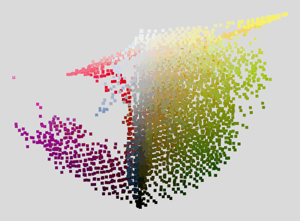

Most pixels are greys and browns from the stones, in the middle of the cloud. The flowers only take up a small part of the image, but their pinks, purples, yellows and greens are at the edges.

A high `hull-weight` puts more importance on covering the hull of the image colours. The palette will probably contain more bright colours from the edges of the cloud, which could otherwise never be represented through dithering. The downside is that large, plain areas have to be mixed from colours that are far apart, which makes them noisier.

A low `hull-weight` puts more importance on a low average error per pixel. The palette then focuses on the bland, larger regions of the image, so those come out with less noise. The downside is that the palette contains fewer vivid colours, so small colourful details look duller.

These are the palettes for both cases, on their own and on top of the image colours:

|                    | `hull-weight: 500`                                                                             | `hull-weight: 0`                                                                               |
| ------------------ | ---------------------------------------------------------------------------------------------- | ---------------------------------------------------------------------------------------------- |
| Palette            | 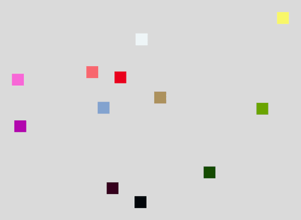                   | 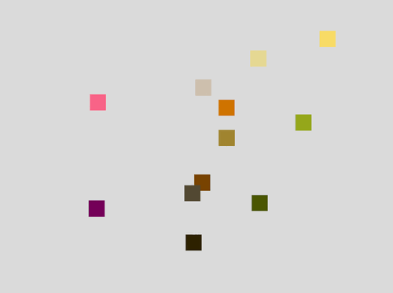                   |
| Palette over image | 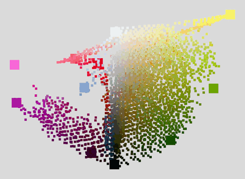 | 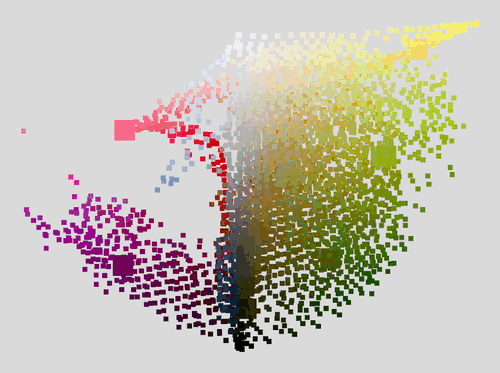 |

With `hull-weight: 500` the palette spreads out to the edges of the cloud and includes a bright yellow, a hot pink, a purple and a light green. The flowers keep their colour in the output, but the stones are made up of many different speckles:

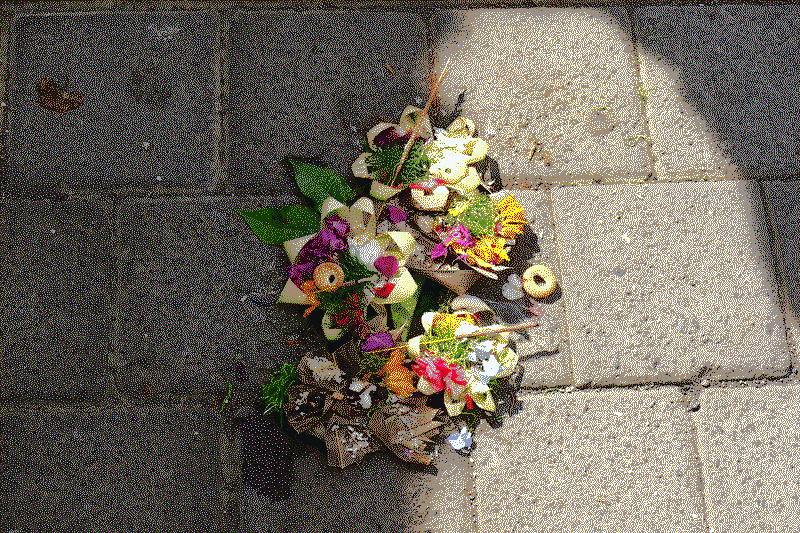

With `hull-weight: 0` most of the palette ends up in the middle of the cloud, as browns and beiges. The stones are a lot smoother, but the flowers are duller and the whole image looks a bit warmer:

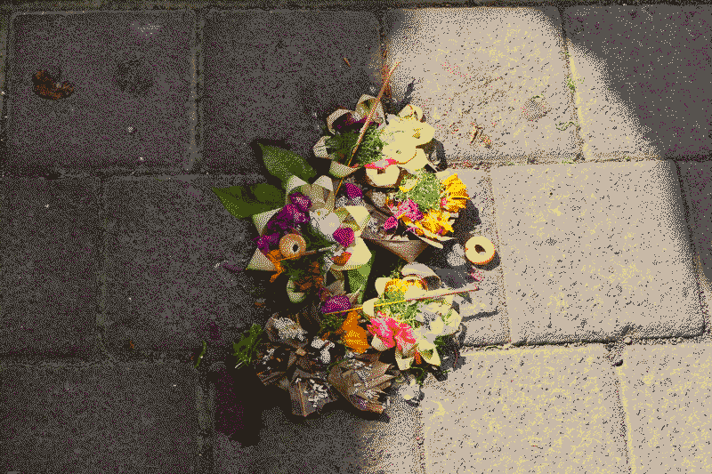

The default of `50` sits in between. You can increase it if small colourful details look dull, or decrease it if flat areas look too noisy.

## Examples

Here's what it looks like in practice:

<picture>
  <source media="(prefers-color-scheme: dark)" srcset="./docs/assets/bw-dark.png">
  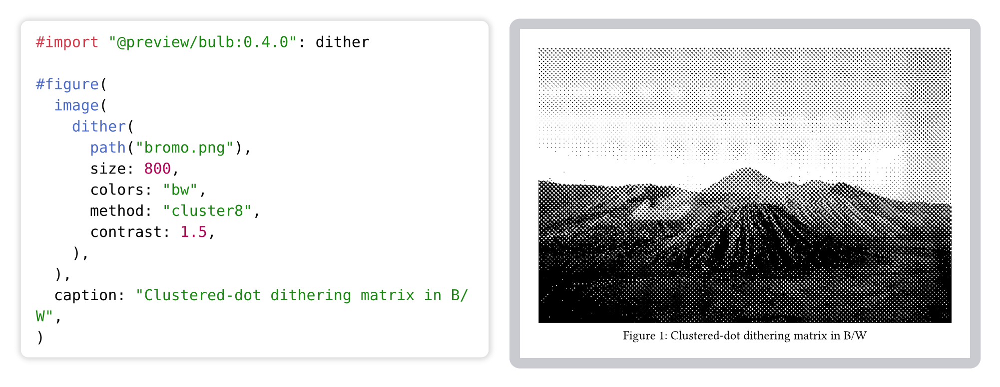
</picture>

<picture>
  <source media="(prefers-color-scheme: dark)" srcset="./docs/assets/preset-dark.png">
  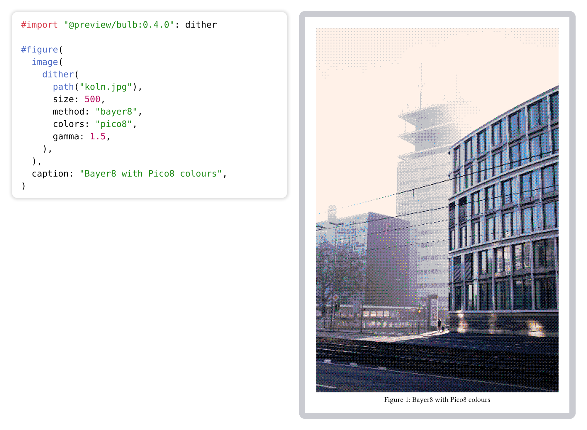
</picture>

<picture>
  <source media="(prefers-color-scheme: dark)" srcset="./docs/assets/palette-dark.png">
  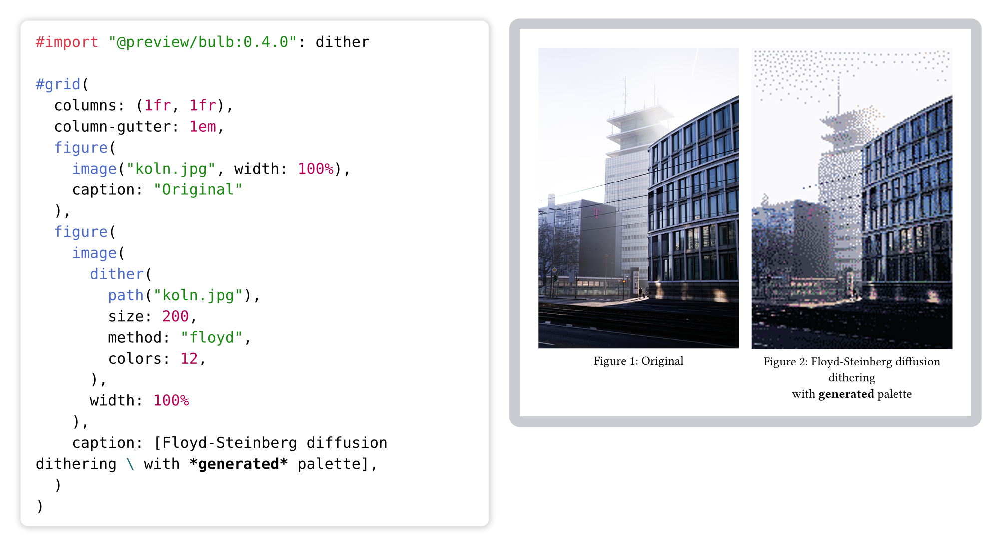
</picture>

<picture>
  <source media="(prefers-color-scheme: dark)" srcset="./docs/assets/rgb-dark.png">
  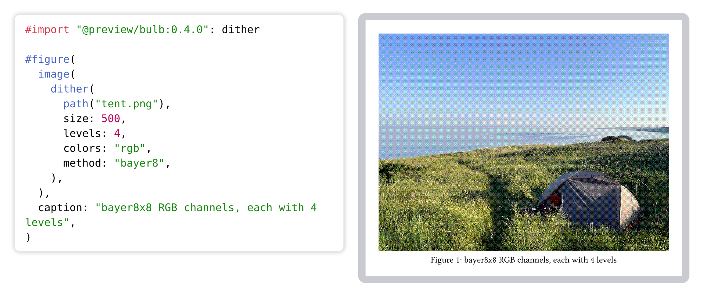
</picture>

<picture>
  <source media="(prefers-color-scheme: dark)" srcset="./docs/assets/given-palette-dark.png">
  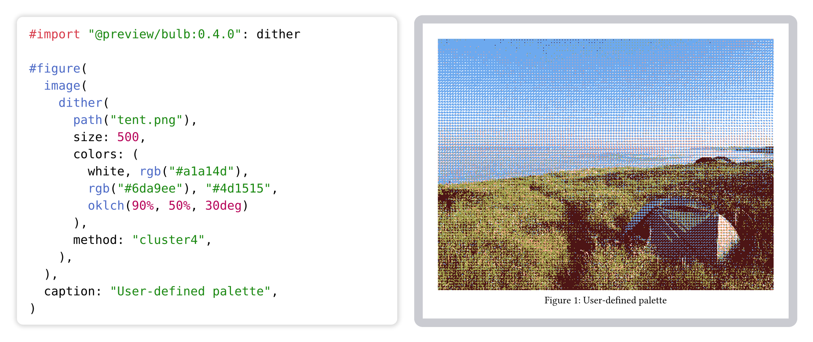
</picture>

<picture>
  <source media="(prefers-color-scheme: dark)" srcset="./docs/assets/hull-dark.png">
  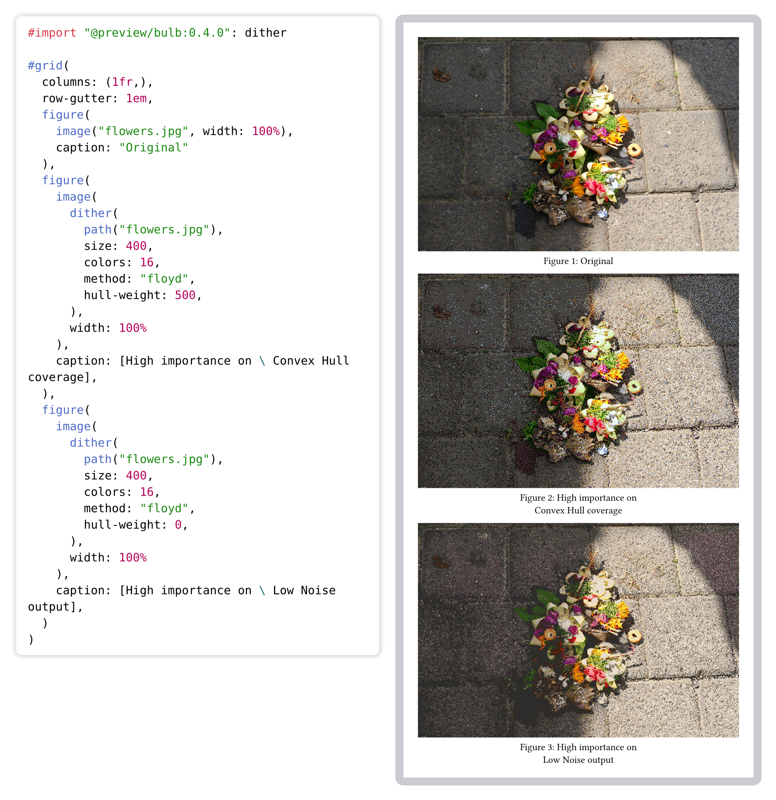
</picture>
