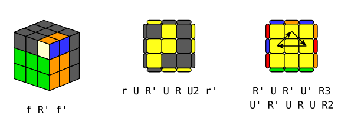

# Burik — A Typst Library for easy Rubik's Cube tutorials edition

**Burik** is a Typst library specifically designed to facilitate the creation of tutorials for **3x3 Rubik's Cube** solving.

Burik was first designed to make life easier for tutorial creators, as it allows algorithms manipulation in strings and algorithms visualization with parametrizable drawing functions from different point of view.

There is also an interest for the tutorial's user as there is no possible mismatch between the written algorithm and the displayed image.

## Installation

To use this package, simply add the following code to your document:

`#import "@preview/burik:0.1.0"`

You can check the example file for more details.


## Use Example

````typ
#import "@preview/burik:0.1.0"

#f2l("f R' f'")
#oll("r U R' U R U2 r'")
#pll("R' U R' U' R3 U' R' U R U R2")
````

<p align="center">
  
</p>

## How it works ?

When you pass an algorithm to Burik, it inverts it and executes it on a solved cube. As a result, you obtain the configuration in which executing the non-inverted algorithm is useful.

## Moves

Moves used to encode an algorithm on the Rubik's Cube are the standard ones (visit [J Perm](https://jperm.net/3x3/moves) for +) :

- `F, B, R, L, U, D` for the 6 classical moves
- `f, b, r, l, u, d` for the 6 wide moves
- `E, S, M` for the 3 slice moves
- `x, y, z` for the 3 cube rotations
  
In each case, you can use  `', 2, 3, ` to indicate the number of turns.

## Algorithms

For Burik, an algorithm is a string of moves separated by a space. For instance `"R U R' U R U2 R' U"` can be interpreted as an algorithm.

Algorithms come with tool functions that can be used to create new algorithms or for easier manipulation :

- `conc(A, B)` returns `C` such that `C = A + B`

- `invert(A)` returns `A'` such that `A + A' = " "`
  
- `enclose(A, B)` returns `C` such that `C = B + A + B'` (or `C + B = B + A`)

- `simplify(A)` returns `A'` such that `A = A'` and that `A'`̀  has no useless moves

## Colors

There are seven parametrizable colors in RGB hexadecimal code in `cubes.typ`

- white for stickers from the `U` face
- yellow for stickers from the `D` face
- red for stickers from the `R` face
- orange for stickers from the `L` face
- green for stickers from the `F` face
- blue for stickers from the `B` face
- black for every non-colorized stickers
  
## Cubes

Cubes are dictionnaries with 6 keys `u, d, f, b, r, l` for the six faces, and each value is an array of 9 colors.

There are 3 predefined cubes in `cubes.typ` and they all have white on top and green in front :

- `pll_cube` is a fully solved cube

- `oll_cube` has solved white face, two first layers and yellow face (black stickers on the last layer permutation)

- `f2l_cube` has solved white face and two first layers. The last layer  and the yellow face is in black.

There is no assertion that the cubes that you may create from scrath using the same method are solvable, so you must be careful when doing so. I would recommend using the predefined cubes as much as possible.

## Drawing

There are 3 drawing functions :

- `draw_pattern` for drawing the 6 faces of the cube as the pattern of a cube (useful for debugging or scramble checking)

- `draw_last_layer` for drawing the last layer with reduced stickers for the side pieces (useful for OLL, PLL and every last layer algorithm)
  
- `draw_3d_cube` for drawing the cube in perpective with a view on faces `F, U, R` (useful for F2L)

And there also 3 illustrating functions :

- `pll` to illustrate PLL algorithms, by default this is in the last face point of view, with yellow face on top, green in front, and starting with the `pll_cube` as the target configuration. You can choose to display black arrows on the yellow face to illustrate ongoing permutations.
  
- `oll` to illustrate OLL algorithms, by default this is in the last face point of view, with yellow face on top, green in front, and starting with the `oll_cube` as the target configuration.
  
- `f2l` to illustrate F2L algorithms, by default this is in the 3D view, with yellow face on top, green in front, and starting with the `f2l_cube` as the target configuration.

## License

This project is licensed under the MIT License. You can find the full text in the `LICENSE` file included in this repository.

## Future Work

There are no current versions that include other cube shapes than 3x3 (like 2x2, 4x4, 5x5, ...) or other puzzle shapes (like megaminx, skewb, ...).
