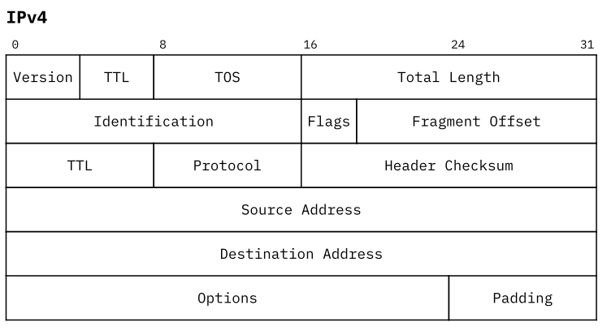

# typst-bytefield 

A simple way to create network protocol headers in typst.

Using [tablex](https://github.com/PgBiel/typst-tablex) under the hood.

## Example



```typst  
bytefield(
  bits(4)[Version], bits(4)[TTL], bytes(1)[TOS], bytes(2)[Total Length],
  bytes(2)[Identification], bits(3)[Flags], bits(13)[Fragment Offset],
  bytes(1)[TTL], bytes(1)[Protocol], bytes(2)[Header Checksum],
  bytes(4)[Source Address],
  bytes(4)[Destination Address],
  bytes(3)[Options], bytes(1)[Padding]
)
```

## Usage

To use this library through the Typst package manager (for Typst v0.6.0+), import bytefield with `#import "@preview/bytefield:0.0.2": *` at the top of your file.

The package contains some of the most common network protocol headers: `ipv4`, `ipv6`, `icmp`, `icmpv6`, `dns`, `tcp`, `udp`.


## Features

At the moment very limited features. Feel free to extend if you like.

- Select the number of bits in one row. The default value is 32. `bytefield(bits: 32)`
- Specify the shown bit numbers in the header through the `header` argument. Example: `bytefield(header: (0,8,16,31))` 
- Select the height of the rows. Default is **2.5em**. Example: `bytefield(rowheight: 20pt)`  
- Adding fields with a predefined length of bits or bytes. 
- Fields with a length greater than a row will automatically wrap. 
  - If a field-length is the multiple of a row-length it will automatically render with a higher rowheight. Example see *Ipv6*. 
- Fill up the remaining space of a row with the `padding` field.
- Coloring fields through the `fill` argument. For example: `bits(32, fill: red.lighten(30%))[Test]` 


## Changelog

### v0.0.2

Added support for reversed bitheader order with `msb_first:true`.
Quick way to show all headerbits with `bitheader: "all"`.
Updated `flagtext` center alignment.


### v0.0.1

Initial Release

Added `bytefield`, as main function to create an new bytefield diagram. 
Added `bit`, `bits`, `byte`, `bytes`, `padding`, as high level API for adding fields to a bytefield. 
Added `flagtext` as a utility function to create rotate text for short flag descriptions.
Added `ipv4`, `ipv6`, `icmp`, `icmpv6`, `dns`, `tcp`, `udp` as predefined diagrams.
