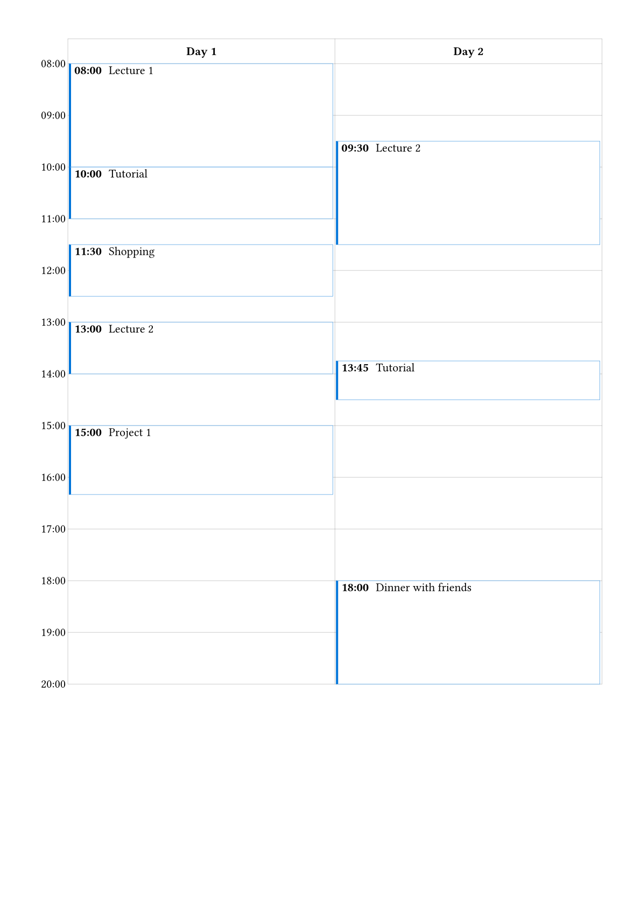

# Calendar

A Typst package to create calendar with events.

Example:

## Usage

`calendar(events, hour-range, minute-height, template, stroke)`

Parameters:

- `events`: An array of events. Each item is a 4-element array:
  - Index of day. Start from 0.
  - Float-style start time.
  - Float-style end time.
  - Event body. Can be anything. Passed to the template.body to show more details.
- `hour-range`: Then range of hours, affacting the range of the calendar. Default: `(8, 20)`.
- `minute-height`: Height of per minute. Each minute occupys a row. This number is to control the height of each row. Default: `0.8pt`.
- `template`: Templates for headers, times, or events. It takes a dictionary of the following entries: `header`, `time`, and `event`. Default: `(:)`.
- `stroke`: A stroke style to control the style of the default stroke, or a function taking two parameters `(x, y)` to control the stroke. The first row is the dates, and the first column is the times. Default: `none`.

> Float-style time means a number representing 24-hour time. The integer part represents the hour. The fractional part represents the minute.

## Limitations

- Page breaking may be incorrect.
- Items will overlap when they happens at the same time.
