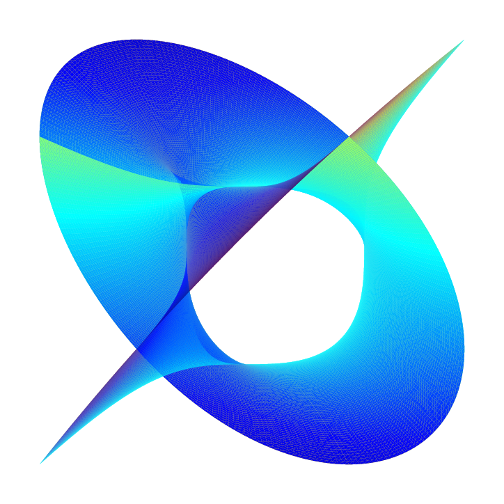
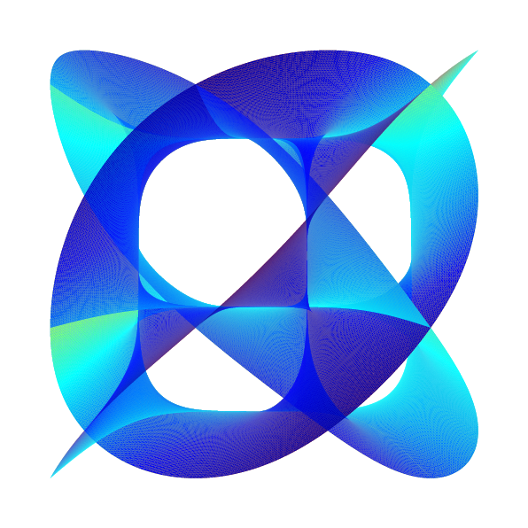
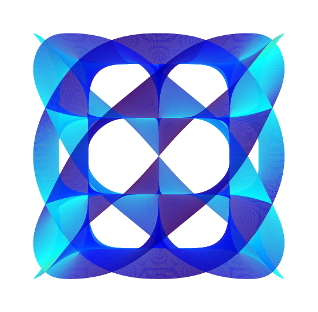

# CaleTZ

**CaleTZ** is a Typst package for visualizing **Calabi-Yau manifolds** using **CeTZ** 3D drawing primitives.

It generates high-quality, parameterizable 3D surfaces representing slices of Calabi-Yau spaces. This package is ideal for physics and mathematics visualizations, allowing you to explore these complex geometries directly within your Typst documents.

<p align="center">
  
  
  
</p>

## Mathematical Background

CaleTZ visualizes a 3D projection of a complex 1-dimensional sub-manifold (an algebraic curve) related to the **Fermat Quintic** Calabi-Yau threefold.

The surface is defined by the locus of points satisfying the Fermat equation in $\mathbb{C}^2$:

```math
z_1^n - z_2^n = 1
```

To visualize this 4-dimensional object ($z_1, z_2 \in \mathbb{C}$) in 3D Euclidean space, we use a parameterization based on hyperbolic functions and perform a dimensional reduction.

### Parameterization

Let $w = a + ib$ be a complex parameter. We define the coordinates using the hyperbolic identity $\cosh^2 w - \sinh^2 w = 1$:

```math
\begin{aligned}
z_1 &= \left( \cosh(a + ib) \right)^{2/n} \cdot e^{2\pi i k_1 / n} \\
z_2 &= \left( \sinh(a + ib) \right)^{2/n} \cdot e^{2\pi i k_2 / n}
\end{aligned}
```

where:
- $n$ is the degree of the manifold (typically $n=5$ for the quintic).
- $k_1, k_2 \in \{0, 1, \dots, n-1\}$ determine the Riemann sheet branches.
- $a \in [0, \pi/2]$ and $b \in [-\pi/2, \pi/2]$ are the domain parameters.

### 4D to 3D Projection

Since we cannot view 4 dimensions directly, we project the coordinates into $\mathbb{R}^3$. The visualization uses the standard mapping:

```math
\begin{pmatrix} x \\ y \\ z \end{pmatrix} = 
\begin{pmatrix} 
\mathrm{Re}(z_1) \\ 
\mathrm{Re}(z_2) \\ 
\cos(\alpha)\mathrm{Im}(z_1) + \sin(\alpha)\mathrm{Im}(z_2) 
\end{pmatrix}
```

Here, $\alpha$ is a mixing angle that determines how the imaginary components are projected onto the vertical $z$-axis, revealing the hidden dimensions of the manifold.

## Usage Example

```typ
#import "@local/caletz:0.1.0": calabi-yau

#set page(width: auto, height: auto, margin: 1cm)

// Render a Calabi-Yau projection with degree 3
#calabi-yau(
  power: 3,
  angle: 0.4,
  subdivisions: 20,
  scale-factor: 4.0
)
```

### Parameters

| Parameter | Type | Default | Description |
| :--- | :--- | :--- | :--- |
| `power` | `int` | `3` | The degree $n$ of the Fermat equation. $n=5$ corresponds to the quintic threefold relevant to string theory. |
| `angle` | `float` | `0.0` | The projection angle $\alpha$ (in radians). Controls the blending of imaginary components into the Z-axis. |
| `subdivisions` | `int` | `15` | The mesh density. Higher values produce smoother surfaces but increase compilation time. |
| `colormap` | `string` | `"jet"` | Color scheme. Options: `"jet"`, `"viridis"`, `"plasma"`, `"cool"`, `"hot"`. |
| `scale-factor` | `float` | `3.0` | Scaling multiplier for the final mesh size inside the canvas. |
| `rotation` | `angle array` | `(0deg, 0deg, 0deg)` | Initial camera rotation $(x, y, z)$. |
| `width` | `length` | `400pt` | The width of the drawing canvas. |
| `height` | `length` | `400pt` | The height of the drawing canvas. |

> [\!TIP]
> **Performance Note:** Generating these meshes involves complex number arithmetic for every vertex. For `subdivisions` \> 30, compilation might take a few seconds.

## License

This project is distributed under the MIT License. See [LICENSE](https://www.google.com/search?q=LICENSE) for details.