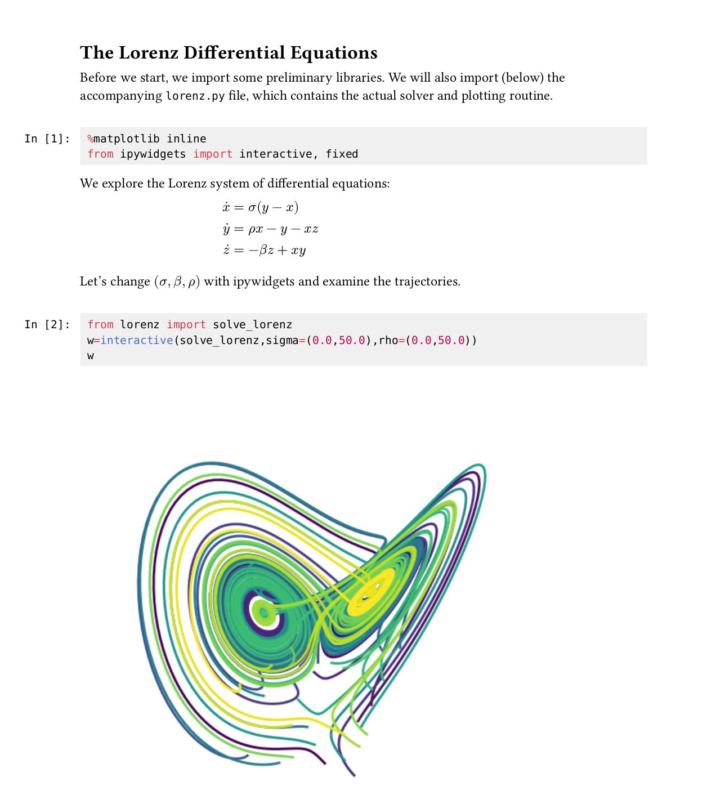

# Callisto

A Typst package for reading from Jupyter notebooks. It currently addresses the following use cases:

- Extracting specific cell sources and cell outputs, for example to include a plot in a Typst document.

- Rendering a notebook in Typst (embedding selected cells or the whole notebook).



## Usage example

```typst
#import "@preview/callisto:0.1.0"

// Render whole notebook
#callisto.render(nb: json("notebooks/julia.ipynb"))

// Render all code cells named/tagged with "plot", showing only the cell output
#callisto.render("plot", nb: json("notebooks/julia.ipynb"), cell-type: "code", input: false)

// Let's get functions preconfigured to use this notebook
#let (render, result, source, Cell, In, Out) = callisto.config(
   nb: json("notebooks/julia.ipynb"),
)

// Render only the first 3 cells
#render(range(3))

// Get the result of cell with label "plot2"
#result("plot2")

// Force using the PNG version of this output
#result("plot2", format: "image/png")

// Change the width of an image read from the notebook
#{
   set image(width: 100%)
   result("plot2")
}

// Another way to do the same thing
#image(result("plot2").source, width: 100%)

// Get the source of that cell as a raw block, then get the text of it
#source("plot2").text

// Render the cell with execution number 4 (count can also be set by config())
#Cell(4, count: "execution")

// Render separately the input and output of cell named/tagged "abc"
#In("abc")
#Out("abc")
```

The manual call to `json(...)` is currently required to avoid issues with relative file paths between the user root and the package root. This should be solved once Typst gets a `path` type.

For more examples see the test files, in particular [api.typ](tests/api.typ) and [render.typ](tests/render.typ).


## API

The API is centered on the following main functions:

- `render`: takes a cell specification and returns content for the selected cells, rendered using the selected template.

- `sources`: takes a cell specification and returns raw blocks with the cell sources. The raw block can be used as as content. Alternatively, the source text and source language can be accessed as fields.

- `outputs`: takes a cell specification and returns cell outputs of the desired type (result, displays, errors, streams).


For convenience, many additional functions are derived from these functions by preconfiguring some of their parameters. For example, `render` has `Cell`, `In` and `Out` as preconfigured aliases to render a single cell, either in entirety or just the input or output. And `outputs` has aliases such as `result` and `displays` to get a single cell's result, or an array of display outputs for the selected cells. Most aliases have a singular and a plural form, e.g. `result` and `results`: the singular form will return a single value (which can often be used directly as content), while a plural form always returns an array. By default the singular form also checks that there is a single value to return: for example `result("figure1")` will raise an error if the call matches more than one cell.

All the functions can be further preconfigured by calling `config`, which returns a dict of preconfigured functions. This is most commonly used to set the notebook for all functions, but can also be used for any parameter such as the rendering template or the preferred image formats.

Note that preconfigured arguments can always be overridden when a function is called. For example `#let (Cell, In, Out) = config(nb: "file.ipynb", count: "execution")` followed with `#Cell(0, nb: "another-file.ipynb")` will use the "global" `count` setting with the `another-file.ipynb` notebook.

Another important, lower-level function is `cells` (and its `cell` alias): it ca be used to retrieve raw cell dicts reflecting the notebook JSON structure, with minimal processing applied:

- A cell ID is generated if missing (this field is mandatory since nbformat 4.5).

- An `index` field is added with the cell index in the notebook, starting at 0.

- The cell source is normalized to be a simple string (nbformat also allows an array of strings).

- For code cells, a metadata header is processed and removed if present: if the first source lines are of the form `#| key: value`, they are treated as metadata. The key-values pairs are added to the `cell.metadata` dictionary, and the header lines are removed from the cell source.


### Main functions

-  `config`: accepts all the parameters of the other main functions, and returns a dict with all main and alias functions preconfigured accordingly. Also returns a `template` function for the whole document, to be used together with `render(template: "plain")`.

-  `cells([spec], nb: none, count: "index", name-path: auto, cell-type: "all", keep: "all")`

   Retrieves cells from a notebook. Each cell is returned as a dict. This is a low-level function to be used for further processing.

   The optional `spec` argument is used to select cells: if omitted, all cells are selected. Possible values:

   -  An integer: by default this refers to the cell index in the notebook, but `count: "execution"` can be used to have this refer to the execution count.
   -  A string: by default this can be either a cell label, ID, or tag. A cell label refers to a `label` field in the cell metadata. This field can be defined by adding a special header at the top of the cell source:

      ```
      #| label: xyz
      ...
      ```

      The `name-path` parameter of the `cells` function can be used to change how the string is matched to cells.

   -  A function which is passed a cell dict and must return `true` for desired cells, `false` otherwise.

   -  A literal cell (a dictionary as returned by another `cells` call).

   `count` can be `"index"` or `"execution"`, to select if a cell number refers to its position in the notebook (zero-based) or to its execution count.

   `name-path` can be a string or an array of strings, or `auto` for the default paths: `("metadata.label", "id", "metadata.tags")`. Each string in the array specifies a path in the cell dict. The strings will be tried in order to check if a particular cell should be selected. A string of the form `x.y` refers to path `y` in path `x` of the cell.

   `cell-type` can be `"markdown"`, `"raw"`, `"code"`, an array of these values, or `"all"`.

   `keep` can be a cell index, an array of cell indices, `"all"`, or `"unique"` to raise an error if the call doesn't match exactly one cell. This filter is applied after all the others described above.

-  `sources(..cell-args, result: "value", lang: auto, raw-lang: none)`

   Retrieves the source from selected cells. The `cell-args` are the same as for the `cells` function.

   `result`: how the function should return its result: `"value"` to return a list of values that can be inserted, or `"dict"` to return a dictionary that contains a `"value"` field as well as metadata.

   `lang`: the language to set on the returned raw blocks for code cells. By default this is inferred from the notebook metadata.

   `raw-lang`: the language to set on the returned raw blocks for raw cells.

-  `outputs(..cell-args, output-type: "all", format: default-formats, handlers: auto, ignore-wrong-format: false, stream: "all", result: "value")`

   Retrieves outputs from selected cells. The `cell-args` are the same as for the `cells` function.

   `output-type` can be `"display_data"`, `"execute_result"`, `"stream"`, `"error"`, an array of these values, or `"all"`.

   `format` is used to select an output format for a given output (Jupyter notebooks can store the same output in several formats to let the reader choose a format). This should be a format MIME string, or an array of such strings. The array order sets the preference: the first match is used. Only formats that have a corresponding handler are valid (see `handlers`). The default value is `("image/svg+xml", "image/png", "text/markdown", "text/latex", "text/plain")`.

   `handlers` is a dictionary mapping MIME strings to handler functions. Each handler function should accept a data string and return the value that should be included in the Typst document. These handlers expand/override the default dict of handlers.

   `ignore-wrong-format`: by default an error is raised if a selected output has no format matching the list of desired formats (see `format`). Set to `true` to skip the output silently.

   `stream`: for stream outputs, this selects the type of streams that should be returned. Can be `"stdout"`, `"stderr"` or `"all"`.

   `result`: how the function should return its result: `"value"` to return a list of values that can be inserted, or `"dict"` to return a dictionary that contains a `"value"` field as well as metadata.

- `render(..cell-args, ..input-args, ..output-args, input: true, output: true, template: "notebook")`

   Renders selected cells in the Typst document.

   `cell-args` can be passed to select cells as described for the `cells` function.

   `input-args` can be passed to affect the rendering of cell inputs, as described in the `sources` function.

   `output-args` can be passed to select outputs as described for the `outputs` function.

   `input` specifies if cell inputs should be rendered.

   `output` specifies if cell outputs should be rendered.

   `template` can be one of the built-in template names: `"notebook"` or `"plain"`, or a function that can handle all cell types, or a dict with keys among `raw`, `markdown`, `code`, `input` and `output`, or the value `none`. When a function is passed, it should accept a literal cell (a dict) as positional argument for the cell to render, a `handlers` keyword argument for the configured handlers, `input` and `output` keyword arguments (booleans) that specify if the input and/or output of code cells should be rendered and `input-args` and `output-args` keyword arguments (dicts) which the function can forward to other functions such as `outputs` and `sources` respectively. When a dict is passed, each value can be a function, or a built-in template name to use that template for that type of cell or cell component; For code cells the `code` template is used if specified, and this template should honor the `input` and `output` keyword arguments. Otherwise the `input` and/or `output` templates are called (depending on the values of these keyword arguments). The `input` and `output` templates also receive the `input` and `output` keyword arguments and can use this information for example to produce smaller spacing between input and output when both components are rendered.

### Alias functions

The package also provides many functions that are mostly aliases of the main functions but with some parameters preconfigured:

`displays`, `results`, `stream-items`, `errors`: same as `outputs` but preconfigured to select only one type of output.

`streams` is similar to `stream-items`, but merges all selected streams that belong to the same cell, and always returns an item (possibly with an empty string as value) for each selected code cell.

`cell`: same as `cells` but always returns a single cell (not an array). By default it also checks that there is only one cell to return by calling `cells` with `keep: "unique"` but this can be changed by setting `keep` to another value.

`source`, `output`, `display`, `result`, `stream-item`, `error`, `stream`: same as the "plural form" but always return a single item. By default these functions also check that there is only one item to return. This can be changed by setting the `item` keyword argument to an integer (the default value is `"unique"`).

`Cell`: same as `render` but preconfigured with `keep: "unique"` to render a single cell and raise an error if not exactly one cell was selected.

`In` and `Out:` same as `Cell` but preconfigured to render only the cell input and output respectively.

## Markdown and LaTeX rendering configuration

By default Markdown and LaTeX are rendered using [cmarker](https://github.com/SabrinaJewson/cmarker.typ) and [mitex](https://github.com/mitex-rs/mitex). These cannot (yet) render everything.

The Markdown and LaTeX processing can be configured by changing the handlers for `text/markdown` and `text/latex`. For example to get working rendering of image files references in Markdown, the following can be used:

   ```typ
   #import "@preview/cmarker:0.1.3"
   #import "@preview/mitex:0.2.5": mitex

   #callisto.render(
     nb: "notebook.ipynb",
     handlers: (
       "text/markdown": cmarker.render.with(
           math: mitex,
           scope: (image: (path, alt: none) => image(path, alt: alt)),
       ),
     ),
   )
   ```

(This should become unnecessary once Typst adds a `path` type for file paths.)
   

## Current features and roadmap

- [x] Easy reading of cell source and outputs from notebooks

- [x] Render notebooks in Typst

   - [x] Markdown
   - [x] results (basic types)
   - [x] displays (basic types)
   - [x] stdout and stderr
   - [x] errors

- Supported output types

   - [x] text/plain
   - [x] image/png
   - [x] image/jpeg
   - [x] image/svg+xml
   - [x] text/markdown
   - [x] text/latex
   - [ ] text/html

- [ ] Export, e.g. for round-tripping similar to prequery
