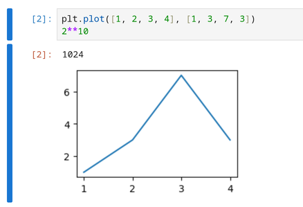

# Tutorial

Let's see how we can use Callisto to render a Jupyter notebook, or to extract the source and result of some computations. We will use the notebook [`example.ipynb`](example.ipynb). To compile the Typst examples yourself, you can download it and put it next to your Typst file.

## Configuration

We start by importing the latest version of the package:

```typst
#import "@preview/callisto:0.2.3"
```

We can now call functions such as `callisto.render(nb: json("example.ipynb"))`, but it is more convenient to configure them to work with a particular notebook:

```typst
#let (render, Cell, In, Out) = callisto.config(nb: json("example.ipynb"))
```

The `config` call returns Callisto functions preconfigured with our settings. For a list of all functions (and all their parameters) that can be configured with `config`, see the [function reference](Reference.md).

Here we only set the notebook, and from all the returned functions we only assign `render`, `Cell`, `In` and `Out`. Now let's use them!

## Rendering

We can render the whole notebook:

```typst
#render()
```

This *renders* the notebook; the cells are inserted in the Typst document:

-  Markdown cells are converted to formatted Typst content,

-  the source of each code cell is inserted as a Typst raw block,

-  the output of each code cell is inserted as a Typst image or text.

### Using templates

By default the cells are rendered with the `"notebook"` template, which adds some styling to get a notebook look. We can choose the `"plain"` template to get elements without styling:

```typst
#render(template: "plain")
```

We could also have applied this setting globally in the `config` call with `callisto.config(nb: json("example.ipynb"), template: "plain")`. This would affect all `render` calls.

Different templates can be specified for the different cell types: `"markdown"`, `"code"` and `"raw"`. And instead of a name, a template can also be specified as a function that accepts a cell as argument (as well as keyword arguments for various settings, see the [reference](Reference.md#Templates)).

For example, we might want to write Typst math in our Jupyter notebook, since the syntax is nicer than LaTeX. One way to do that is to write Typst formulas in raw cells, and use a template that renders raw cells by evaluating their source as Typst markup:

```typst
#render(
  template: (
    code: "notebook",
    markdown: "notebook",
    raw: (cell, ..args) => eval(cell.source, mode: "markup"),
  ),
)
```

Note: Markdown and LaTeX are rendered using [cmarker](https://typst.app/universe/package/cmarker/) and [mitex](https://typst.app/universe/package/mitex/) (awesome packages, though they don't support everything yet). It is possible to configure these packages or replace them with something else by setting custom handlers for `"text/markdown"` and `"text/latex"` (see the `handlers` keyword argument in the [reference](Reference.md)).

### Rendering specific cells

Instead of working with the whole notebook, we can refer to a single cell using its index (that is its position in the notebook):

```typst
This is the first cell, shown in a red box:
#block(stroke: red)[
   #render(0)
]

This is the second cell:
#render(1)
```

We can also select cells by "label": Code cells can start with a **header** that defines metadata, and this can be used to specify a cell label. A header line is a line of the form `#| key: value`. Consider for example this cell source:

```python
#| label: plot3
#| type: lines
plt.plot([1, 2, 3, 4], [1, 4, 9, 16])
plt.show()
plt.plot([1, 2, 3, 4], [1, 3, 7, 3]);
```

When Callisto reads the notebook, it will remove the two header lines and set `label = "plot3"` and `type = "lines"` in the cell metadata.

We can render this particular cell using its label:

```typst
#render("plot3")
```

We can also select cells by *tags*. Tags are not very visible in the Jupyter interface, but in the example notebook all the cells that make plots have the `plots` tag, so we can do

```typst
// Render all cells with `plot` tag
#render("plots")
```

(By default, when cells are specified with a string Callisto will look for a match in the `metadata.label`, `id` and `metadata.tags` fields, in that order. This can be changed with the `name-path` keyword argument, see the [reference](Reference.md).)

We can also specify multiple cells by position:

```typst
// Render the first 4 cells
#render(range(4))
```

Note: All the `render` calls above render cells from `example.ipynb`, but we can work with other notebooks at anytime, either by calling `config` again, or by overriding the configuration when we call a function, as in `#render(0, nb: json("other-notebook.ipynb"))`.

### Rendering a cell input or output

The functions `In` and `Out` can be used to render just the input or output of a particular code cell, while `Cell` will render both. We can now render the input and and output of `plot3` separately:

```typst
The following code:
#In("plot3")
produces the following figure:
#Out("plot3")
```

or together:

```typst
#Cell("plot3")
```

What's the difference then between `#render("plot3")` and `#Cell("plot3")`? The `Cell` call does an additional check: it raises an error if it finds more than one cell (or no cell) matching `"plot3"`.

Note: the functions `Cell`, `In` and `Out` are implemented as aliases of the `render` function. For example `In` is just the `render` function preconfigured with arguments `output: false` and `keep: "unique"`. See the [reference](Reference.md) for a description of all function arguments and all aliases.

## Item extraction

Let's say we want to extract some part of the notebook, like the source of one cell, or its output, to insert them at a specific place in our Typst document. We will need other Callisto functions for that. Let's configure them:


```typst
#let (source, display, result, output, outputs) = callisto.config(
   nb: json("example.ipynb"),
)
```

We can now get the source of the first cell:

```typst
#source(0)
```

That's a Markdown cell so we get the Markdown source as raw block (with `lang` set to `"markdown"`). Let's get the source of a code cell:

```typst
#source("plot1")
```

This gives a raw block with `lang` set to `"python"` since it's a notebook with a Python kernel. We could override this by calling `#source("plot1", lang: ...)` or setting `lang` directly in the `config` call.

Now let's get the result of this code cell:

```typst
// Doesn't work!
#result("plot1")
```

This doesn't work, because this cell has no result! In Jupyter, a code cell has a result only if the last line returns a value. Here the last line is `plt.show()`, which returns nothing. The cell still shows a plot, but it's a **display object** rather than a result. Here the display object is created and updated by the various `plt` commands (and the `plt.show()` is useless in this case). The same cell can display many objects, but normally has only one result or none at all.

We can get this display object with the `display` function:

```typst
#display("plot1")
```

The `plot2` cell has has both a display object and a result. We can get each of them:

```typst
#display("plot2")
#result("plot2")
```

If the distinction between display and result is confusing, the Jupyter interface can help us. A cell without result looks like this:


There is an execution count `[1]` next the the source, but nothing next to the output.

A cell with result looks like this:



The execution count `[2]` in red next to the value `1024` is a visual hint that `1024` is the cell result.

Now the `plot3` cell has two displays, and no result. What happens if we call `display` on it?

```typst
#display("plot3")
```

We get an error:

```
error: panicked with: "expected 1 item, found 2"
```

By default the `display` function expects only one item and complains if more (or zero) are found. Here the cell produces two displays. We can choose one:

```typst
#display("plot3", item: 0) // first display
#display("plot3", item: 1) // second display
```

What if we don't really care if a cell shows a plot as a display or as a result? The `output` function can return all kind of cell outputs:

```typst
#output("some-code") // returns the cell result
#output("plot1")     // returns the cell display
```

The `plot2` cell has both a display and a result. To use `output` with that cell we would need to specify `item: 0` or `item: 1`. We can also call the `outputs` function instead:

```typst
#outputs("plot2")
```

This returns an array of outputs. To insert each output in the document we would have to write `#outputs("plot2").join()`.

Note: most "singular" functions like `source` and `display` have a plural counterpart (`sources`, `displays`) that return an array of values and don't complain if they find zero or many items.

Now let's try something more complicated: we want to get the last display or result produced by a cell. We can configure our own function to do just that:

```typst
#let my-output = output.with(
  output-type: ("display_data", "execute_result"),
  item: -1
)
```

Here we filter on the output type: we don't want to get errors or stream items (messages written to `stdout` or `stderr`).

Let's try it on the `plot2` cell:

```typst
#my-output("plot2")
```

Excellent. Maybe we also want to customize the looks of a plot. Show it centered, and resized to 75% of the text width. When Callisto returns a plot, it's in the form of a Typst `image` element, so we can change the width with a set rule:

```typst
#[
  #set image(width: 75%)
  #align(center, output("plot1"))
]
```

Here we wrap the code in a `#[...]` block to limit the scope of the set rule, so that it doesn't affect other things in the document.

Another way to change the width would be to extract the image data from the `image` element, and use it to make a new `image` ourselves:

```typst
#let img-data = output("plot1").source
#let img = image(img-data, width: 75%)
#align(center, img)
```

Finally we might want to include a plot in a particular format. In a Jupyter notebook, the same cell output is often stored in multiple formats, to let the viewer choose their preferred one. For example a table can be stored as HTML which looks great for viewers that support it, but another copy is stored as plain text for other viewers.

In Callisto we can request a particular format using the `format` argument:

```typst
// Get the PNG version of this plot
#output("plot1", format: "image/png")
```

This will only work if the cell stores a PNG version of this item. We can also ask for PNG if available, and fall back to SVG otherwise:

```typst
// Get PNG if available, or SVG as fallback
#output("plot1", format: ("image/png", "image/svg+xml"))
```

When `format` is `auto`, a default order of preference is used: `("image/svg+xml", "image/png", "text/markdown", "text/latex", "text/plain")`. We can also use the special value `auto` as an element of the array; The default list will then be inserted at that position:

```typst
// Get PNG if available, otherwise use default order
#output("plot1", format: ("image/png", auto))
```

Note: we can specify any format we want with the `format` keyword, but there must be a matching handler function to process values of that format. We can register our own handlers with the `handlers` keyword, see the [reference](Reference.md).

## Using a cell's execution count

Instead of selecting code cells by label, we can use the *execution count*: as we know, when a cell is executed, Jupyter gives it a count like `[1]` or `[2]`. For example the `"plot1"` cell has execution count 2, and we can use it to identify the cell:

```typst
// Get "plot1" by execution count
#output(2, count: "execution")
```

If we want to do this a lot, we should make this behavior the default:

```typst
#let (render, result) = callisto.config(
   nb: json("example.ipynb"),
   count: "execution",
)
// Now 2 refers to the execution count
#render(2)
```

Note that the same cell will get a different count if it's executed again, and cells can be executed manually in any order so the order of execution counts might not reflect the position of cells in the document. And the execution count is defined only for code cells. For all these reasons, by default Callisto uses the cell index rather than its execution count.
