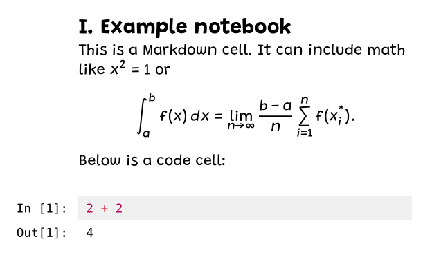
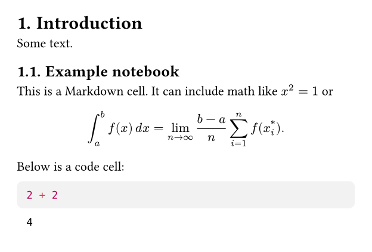
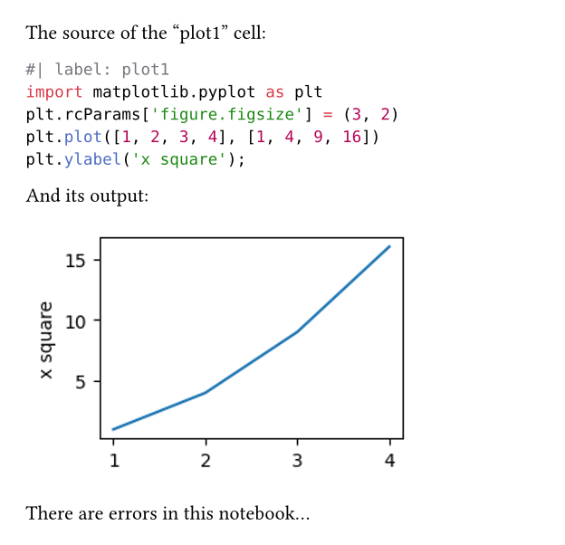
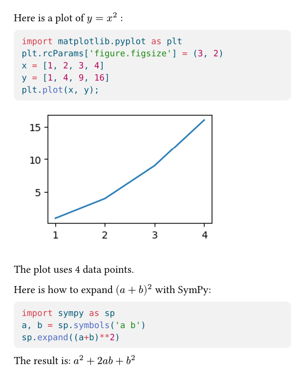

# Callisto

A Typst package for reading and exporting Jupyter notebooks. It covers various use cases:

-  Rendering: Convert a notebook to PDF using Typst styles.
-  Extraction: Use the outputs of notebook cells in your document.
-  Execution: Execute code from Typst raw blocks and include the results in the document.

## Render Notebooks with Style

Render a full notebook:

<table>
  <tr>
  <td width="50%">

  ```typst
  #import "@preview/callisto:0.3.0"

  #set text(font: "Pennstander")
  #show math.equation: set text(
   font: "Pennstander Math",
  )
  #set heading(numbering: "I.")

  #callisto.render(
    nb: path("notebook.ipynb"),
    (0, 1), // first two cells
  )
  ```

  </td>
  <td width="50%">
  
  </td>
  </tr>
</table>

Or include the notebook as a section of a larger document:

<table>
  <tr>
  <td width="50%">

  ```typst
  #import "@preview/callisto:0.3.0"

  #set heading(numbering: "1.")

  = Introduction
  Some text.
  
  #callisto.render(
    nb: path("notebook.ipynb"),
    theme: "neat",
    cmarker: (h1-level: 2), // subsection
    (0, 1),
  )
  ```

  </td>
  <td width="50%">
  
  </td>
  </tr>
</table>

## Extract Cell Code and Outputs

For each kind of item there's a function to extract it:

<table>
  <tr>
  <td width="50%">

  ```typst
  #import "@preview/callisto:0.3.0"

  #let (source, output, errors) = callisto.config(
    nb: path("example.ipynb"),
  )

  The source of the "plot1" cell:
  #source("plot1", keep-cell-header: true)

  And its output:
  #output("plot1")

  #if errors().len() > 0 [
    There are errors in this notebook...
  ]
  ```

  </td>
  <td width="50%">
  
  </td>
  </tr>
</table>

## Execute Raw Blocks from Typst

Export code blocks to a Jupyter notebook and render the results:

<table>
  <tr>
  <td width="50%">

  ``````typst
  #import "@preview/callisto:0.3.0"

  #let (output, execute, evaluate,
      stage-notebook) = callisto.config(
    nb: path("export.ipynb"),
    kernel: "python3",
    theme: "neat",
  )
  #show raw.where(lang: "py-x"): it => {
    set text(1em/0.8)
    execute(it)
  }
  #stage-notebook()

  Here is a plot of $y = x^2$ :

  ```py-x
  import matplotlib.pyplot as plt
  plt.rcParams['figure.figsize'] = (3, 2)
  x = [1, 2, 3, 4]
  y = [1, 4, 9, 16]
  plt.plot(x, y);
  ```

  The plot uses #evaluate(`len(x)`) data points.

  Here is how to expand $(a+b)^2$ with SymPy:

  ```py-x
  #| output: false
  import sympy as sp
  a, b = sp.symbols('a b')
  sp.expand((a+b)**2)
  ```<sympy-calc>

  The result is: #output(<sympy-calc>)
  ``````

  </td>
  <td width="50%">
  
  </td>
  </tr>
</table>

The export is done with `typst eval`, the execution with `jupyter-nbconvert` (see Execution tutorial below).

You can share the exported notebook together with your Typst file, it's all one needs to recompile the document.


## Tutorials

The following tutorials are meant to be read in order:

1. [Rendering tutorial](https://github.com/sijow/callisto/blob/v0.3.0/docs/tutorial-render.md)
1. [Extraction tutorial](https://github.com/sijow/callisto/blob/v0.3.0/docs/tutorial-extract.md)
1. [Export and execution tutorial](https://github.com/sijow/callisto/blob/v0.3.0/docs/tutorial-export.md)

## Reference Manual

See the [reference manual](docs/callisto-manual.pdf) for all functions, available settings and additional examples.

## See Also

Here are some alternatives for the "execution" use case:

- [Quarto](https://quarto.org/): An amazing system for producing PDF, HTML and more from Markdown sources that include executable code blocks. Can use Typst as PDF backend.

- [Calepin](https://vincentarelbundock.github.io/calepin/index.html): A tool that works like a mini Quarto, where you write input files in Typst instead of Markdown.

- [Jlyfish](https://github.com/andreasKroepelin/TypstJlyfish.jl): Typst and Julia packages that work together to execute Julia code blocks from Typst documents.

- [Prequery](https://typst-community.github.io/prequery/) A more generic approach to getting data out of a Typst document and back in after some processing. Can be used for executing code blocks.

## Special Thanks

Two amazing packages made this possible: [cmarker](https://github.com/SabrinaJewson/cmarker.typ) and [MiTeX](https://github.com/mitex-rs/mitex).
