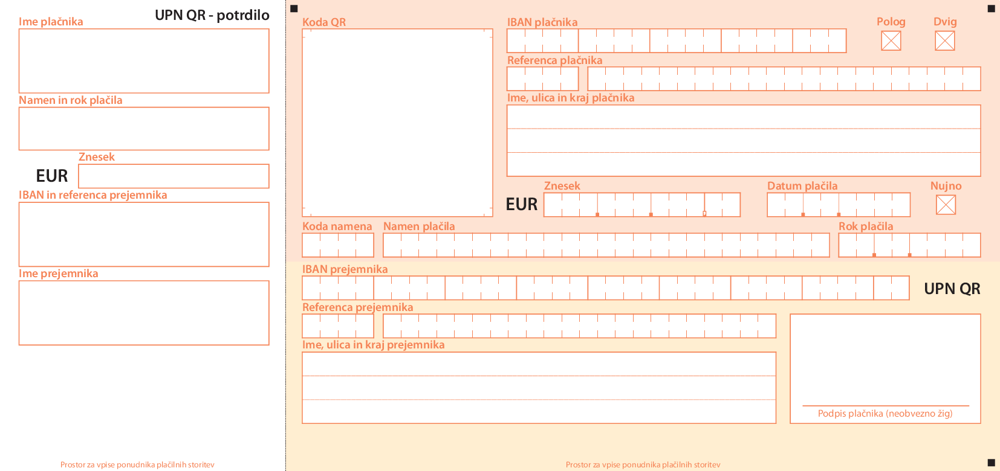

# Cekinar · UPN QR



All narrative and code from here on are in Slovenian, because the vast majority of UPN QR users and all online examples encountered so far are Slovenian. Despite this, a UPN QR version using English field markings is available in accordance with the translated standard.

When using the English translation, beware that the currency, decimal separators, and date formatting all remain unaltered Slovenian.

Pronunciation is _/tsek**i**n/_.

## Primeri

Nekaj primerov je vidnih v [GIF](./upn-qr.gif) oziroma v [PDF](./primeri/primeri.pdf).

Privzeti primer z vsemi možnimi in hkrati privzetimi argumenti se nahaja tudi v [`./upn-qr/upn-qr.typ`](./upn-qr/upn-qr.typ):
```typ
#import "@preview/cekinar:0.1.0": *

// Argumenti, ki so samo nizi, so prazni na način `""`, medtem ko je to drugod `none`/`bool`
#show: cekinar.with(
	znesek: none,         // Znesek (`none`, `int`, `float`, `decimal`)
	datum: none,          // Datum plačila (`none`, `datetime`)
	rok: none,            // Rok plačila (`none`, `datetime`)
	nujno: false,         // Stopnja nujnosti (`bool`)
	polog: false,         // Označitev pologa (`bool`)
	dvig: false,          // Označitev dviga (`bool`)
	namen: (              // Namen plačila:
		koda: "",           // -> Koda namena (`str`)
		opis: "",           // -> Obrazložitev (`str`)
	),
	plačnik: (            // Plačnik, desno zgoraj na roza podlagi:
		ime: "",            // -> Ime plačnika (`str`)
		ulica: "",          // -> Ulica plačnika (`str`)
		kraj: "",           // -> Kraj plačnika (`str`)
		iban: "",           // -> IBAN plačnika (`str`)
		referenca: "",      // -> Referenca plačnika (`str`)
		podpis: none,       // -> Podpis plačnika (`none`, `content`)
	),
	prejemnik: (          // Prejemnik, desno spodaj na rumeni podlagi:
		ime: "",            // -> Ime prejemnika (`str`)
		ulica: "",          // -> Ulica prejemnika (`str`)
		kraj: "",           // -> Kraj prejemnika (`str`)
		iban: "",           // -> IBAN prejemnika (`str`)
		referenca: "",      // -> Referenca prejemnika (`str`)
	),
	logotip: (            // Oznaka trgovine oziroma tiskarja, desno spodaj na rumeni podlagi:
		logo: none,         // -> Logotip trgovine oziroma tiskarja (`none`, `content`)
		naziv: "",          // -> Naziv trgovine oziroma tiskarja (`str`)
	),
	možnosti: (           // Preklapljanje koristnih funkcionalnosti:
		qr: false,          // -> Koda QR (`bool`)
		ročno: false,       // -> Ročno ali strojno izpolnjevanje (`bool`, `dictionary`)
		jezik: "sl",        // -> Jezik predtiskanega besedila ("en", "sl")
		nalog: "",          // -> Vrsta naloga (druge možne vrednosti so naštete v Pomembno)
		kamuflaža: "",      // -> Dodaten A4, tretjino pokrit s kamuflažo ("", "redko", "sreda", "gosto")
		vodni-žig: "",      // -> Vodni žig (`str`)
		postavitev: "A4/1", // -> Postavitev UPN QR ("", "A4/1", "A4/3")
		prozorno: false,    // -> Prozornost strani in predela potrdila (`bool`)
	),
)
```

Sprememba vrednosti v slovarju `možnosti` lahko vpliva na skladnost s standardom.

## Pomembno

Pisave:
* Privzeto sta glavna pisava in pisava za strojno izpolnjevanje enaki standardni Myriad Pro in Courier New:
	* `myriad-pro-regular.otf` in `myriad-pro-semibold.otf`:
		* Povezave ni, ker licenca Adobe ni dopustna
	* `courier-new-bold.ttf`:
		* Povezave ni, ker licenca Monotype ni dopustna
	* Pisavi _Le Asterix_ in _Le Obelix_ v standardu ponazarjata ročno izpolnjevanje:
		* V paketu sploh nista uporabljeni, predvsem ker:
			* Licenca ni dopustna
			* Je par pisav preveč
			* Vsebnost šumnikov ni razvidna
* Ko pa katerakoli izmed privzetih pisav ni najdena, se uporabi nadomestna:
	* Hind [`hind-regular.ttf` in `hind-regular.ttf`](https://online-fonts.com/fonts/hind):
		* Glavna pisava, nadomestna za Myriad Pro
		* Licenca SIL OFL 1.1
	* [`courier-prime-bold.ttf`](https://online-fonts.com/fonts/courier-prime):
		* Strojno izpolnjevanje, nadomestno za Courier New
		* Licenca SIL OFL 1.1
* Za ponazoritev ročnega izpolnjevanja se vselej uporabi nadomestna pisava:
	* [`indie-flower-regular.ttf`](https://online-fonts.com/fonts/indie-flower):
		* Ročno izpolnjevanje
		* Licenca SIL OFL 1.1

<!-- Datoteka, pol manjša velikosti `indie-flower-regular.ttf`, je na https://www.fontsquirrel.com/fonts/indie-flower -->

**Povzeto**, za pravilno uporabo paketa so pričakovane posebej naložene pisave:
* Strojno izpolnjevanje (prvo ali drugo):
	* Tri originalne pisave _Myriad Pro Regular_, _Myriad Pro Semibold_ in _Courier New Bold_
	* Tri nadomestne pisave _Hind XYZ_, _Hind XYZ_, in _Courier Prime XYZ_
* Ročno izpolnjevanje pričakuje pisavo _Indie Flower_

Neupoštevanje standarda v primeru pisave, ko je:
* Nenameščena:
	* Typst Universe še nima mehanizma za upravljanje pisav:
		* Uporabnik jih mora zagotoviti sam, posebej
* S kupno licenco:
	* Vse pisave v UPN QR jo imajo:
		* Ne morejo biti vključene v paket:
			* V repozitoriju so zato nadomestne pisave:
				* Prenos njihovih datotek poteka posebej
* Njena vdelava prepovedana:
	* V Typstu je še ni možno izklopiti
	* Javljena napaka pri izvozu PDF/A:
		* Z danimi pisavami se to ne zgodi

Ročno izpolnjevanje se ne odraža v kodi QR. Vanjo je strogo vključeno strojno izpolnjeno.

Vsaka izmed štirih vrst vpeljanih nalogov ima izjemo, ki ni upoštevana, zato v teh primerih raje uporabite privzeti nalog brez omejitev `""`. Izjeme, po nalogih:
* `"plačilo-obveznosti"`: vpis reference je obvezen v primeru plačila obveznih dajatev in drugih javnofinančnih prihodkov (JFP), na primer dohodnin, DDV, prispevkov, glob, prekrškov in upravnih taks
* `"registriran-izdajatelj"`: vpis **imena**, **priimka**, **ulice** in **kraja plačnika** ter **zneska** je neobvezen za registrirane izdajatelje UPN QR, na primer humanitarne dejavnosti
* `"polog-gotovine"`: podpis in žig plačnika sta obvezna v odvisnosti od internih zahtev posameznega izdajatelja oziroma banke
* `"dvig-gotovine"`: podpis in žig plačnika sta obvezna v odvisnosti od internih zahtev posameznega izdajatelja oziroma banke

Koda QR je vedno prikazana za nalog `"registriran-izdajatelj"`.

Izpolnjevanje _Rok plačila_ in _Namen plačila_ mora biti enake vrste. Razlog za to odločitev je z vejico združen skupen izpis v predelu potrdila. V slovarju `možnosti.ročno` sta zaradi ohranitve doslednosti z drugimi vnosi njuna ključa vseeno ločena `možnosti.ročno.rok` in `možnosti.ročno.namen.opis`, namesto `možnosti.ročno.rok-opis-namena`.

Presledki se ne upoštevajo v dolžinah IBAN in referenc.

Šumniki in podobni znaki v dolžinah zavzemajo več kot eno mesto, razen izjemoma za ročno izpolnjevanje vpisnega polja _Namen plačila_. Iz standarda namreč ni dovolj razvidno, na katero dolžino se nanašajo znaki.

## Funkcionalnosti

Kronološko:
* **Cekinar v0.?.0** (prvotno za Typst v?.??.?):
	* [ ] Izpolnitev vseh _TODO-komentarjev_
	* [ ] Prikaz napak raje z opozorili
	* [ ] UPN QR kot svoj element v Typstu
	* [ ] Vdelani vnosi PDF preko obrazcev
	* [ ] Prenos pisav kot del paketa
	* [ ] Možnost izklopa vdelave pisave pri izvozu PDF
* **Cekinar v0.1.0** (prvotno za Typst v0.15.1):
	* [x] Upoštevanje standarda:
		* [x] Dimenzije
		* [x] Pisava:
			* [x] Datoteke vseh originalnih in nadomestnih pisav
		* [x] Barve:
			* [x] Odtenki vseh barv Pantone in nadomestnih CMYK
		* [x] QR
	* [x] Izpolnjevanje:
		* [x] Strojno
		* [x] Ročno s samodejno poravnavo znakov v celice
	* [x] Neodvisnost paketa
	* [x] Omogočen izvoz PDF/UA-1
	* [x] Dodatne nastavitve

S tem paketom proizveden UPN QR se v primerjavi z naključnim po vsej verjetnosti razlikuje:
* Logotip trgovine oziroma tiskarne v desnem spodnjem kotu
* Odtenek barv ozadja:
	* Navadno opazno v zelo stisnjenih rastrskih formatih
* Prevod v angleščino, v kolikor je izbran:
	* Drugod še nevideno
* Domnevna predhodna izvedba:
	* Vsebuje več polj, kot je _Izjava_
	* Položaji polj, oznak za skeniranje in oznak _UPN QR_ so spremenjeni
	* Besedila nad vpisnimi polji so spremenjena
* Velikost pisav izpolnjevanja v vpisnih poljih predela potrdila:
	* _Ime plačnika_ in _Ime prejemnika_, strojno in ročno izpolnjevanje:
		* Dodeljena je nekoliko nestandardna najmanjša pisava, saj ju najdaljša kombinacija nizov pri uporabljeni standardni velikosti pisave vertikalno prelije za enkratnik velikosti pripadajočega vpisnega polja
		* V potrdilu se pojavi hierarhija, kjer je izmed vseh treh uporabljenih velikosti pisav najbolj opazen znesek na sredini
	* _Znesek_, strojno izpolnjevanje:
		* Paket jo vpelje na podlagi standarda
* V standardu neopredeljeni deli:
	* Ločnice celic v mrežah:
		* V angleškem se na slikah celo pojavijo črtkane
	* Ločnica za mikroperforacijo:
		* Njena prisotnost na slikah je nedosledna:
			* Kadar je prisotna, lahko kot na _Sliki 2_ preseže meji UPN QR
			* Najverjetneje zgolj tiskarju predstavlja mikroperforacijo
	* Obrobe:
		* Poiskano v samih primerih UPN QR, kar zadeva debelino, gre za par različnih:
			* Razvidni sta 0,221 pt in 0,443 pt, a primerjano s sicer definiranimi debelinami črt v standardu ju je smiselno zaokrožiti na 0,25 pt in 0,5 pt
		* UPN QR jo ima na slikah standarda vedno tanko in temne barve:
			* Najverjetneje zgolj tiskarju predstavlja robove
		* Vpisna polja jo imajo na slikah vsa iste debeline in barve
		* Koda QR jo ima na _Sliki 2_, vendar ni jasno, kam spada
	* Ločila:
		* Pika med celicama mreže
		* Vejica med celicama mreže:
			* Ni označljivo, zato ne pripada nobeni vdelani pisavi:
				* Najbolj se približa pogosti pisavi Helvetica Neue Black
		* Paket jih vpelje na podlagi naključnega primerka

Paket lahko opozarja na (zaenkrat javlja napako za):
* Neizpolnjena vpisna polja:
	* Ob vklopu so za neobvezna javljena opozorila (zaenkrat ne), za obvezna pa napake:
		* Pri tem se privzame, da bo vse izpolnjeno v Typstu, celo podpis, ki pa je vedno neobvezen
		* Upošteva se vzajemno izključujočnost binarnih polj _Polog_ in _Dvig_
* Neskladnosti s standardom:
	* Neustrezna pisava:
		* Odstopanje datotek pisav od pričakovanih

Paket samodejno, brez možnosti izklopa, opozarja na (zaenkrat javlja napako za) pravilnost:
* Formatiranja:
	* IBAN:
		* Velike tiskane črke
	* Referenc:
		* Velike tiskane črke
		* Vezaja v referenci SI (vedno javi **napako**)
	* Zneska
	* Datuma plačila
	* Roka plačila
	* Kode namena:
		* Velike tiskane črke
* Vnašanja:
	* Kode namena
	* IBAN
	* Referenc

Paket ne:
* Spreminja vnosov uporabnika, razen morebitnih presledkov, novih vrstic, formata črk in formata zneska
* Preverja pravilnosti transakcije:
	* Ujemanje podatkov
	* _Verification of Payee_ (VoP)
* Preverja [zapisov okrajšav kot stalnih dodatkov ob imenih gospodarskih subjektov](https://fran.si/iskanje?FilteredDictionaryIds=151&View=1&Query=d.+o.+o.)

Paket:
* Prepreči prelive izven dodeljenih vpisnih polj:
	* Izjema so izredno dolgi nizi brez presledkov
* Ni namenjen izvozu HTML
* Naj bo uporabljen na lastno odgovornost:
	* Zlasti ni zagotovil glede ustreznosti tiska, zato kot tiskar sami zagotovite ustrezne robove, barve in mikroperforacije
	* Odsvetovano je razpošiljanje izvozov PDF in SVG, ki ju je preprosteje potvoriti v primerjavi s tiskom ali izvozom PNG

## Viri

Sorodni Typst paketi:
* [Slovenski UPN QR](https://typst.app/universe/package/olaii-upn-qr)
* [Avstrijski UPN](https://discord.com/channels/1054443721975922748/1463462628142878814)

Standard ZBS:
* [PDF v slovenščini](https://www.zbs-giz.si/si/standards)
* [PDF v angleščini](https://www.zbs-giz.si/en/standards)

UPN QR v drugih paketih:
* [NPM](https://www.npmjs.com/package/upnqr) za ozadje uporabi sliko
* [Python](https://pypi.org/project/upnqr/) naredi edino kodo QR

UPN QR v novicah:
* [Uporabna stran](https://www.blog.uporabnastran.si/2017/01/16/qr-koda-na-upn-placilnih-nalogih-poloznicah-od-aprila-2017-naprej-obvezna-upn-qr-obrazec/)
* [Bass](https://www.bass.si/upn-qr/)

## Drugo

Nejasnosti, donacije ali morebitne spremembe naborov SEPA-IBAN, referenc SI in kod namena sporočite v predalniku [Issues](https://codeberg.org/hpcfzl/cekinar/issues). Še posebej morebiten vpogled [o neznanih barvah Pantone](./cekinar/moduli/stil.typ).

Priporočila:
* Paket lahko uporabite v kombinaciji s [_page bleed_](https://typst.app/docs/reference/layout/page/#parameters-bleed)
* Če vas v ogledovalniku PDF moti sicer neobstoječa bela mreža na kodi QR, uporabite implementacijo iz paketa [`zebra`](https://typst.app/universe/package/zebra/#optimized-path)

## Licenca

Obstoječi paketi ali _templati_ kod QR na [Typst Universe](https://typst.app/universe/package/rustycure) imajo celo licence GPL, zato je licenca [`EUPL-1.2`](./LICENCE.md) temu in jeziku primerna. Uporablja jo na primer paket [`ibanator`](https://typst.app/universe/package/ibanator).