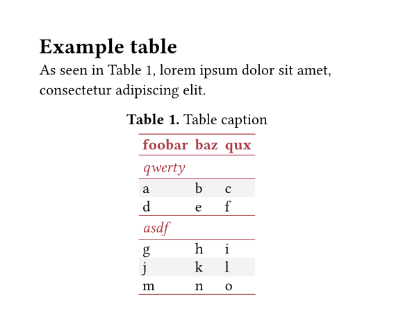

# Cell Press tables

Styles for tables as used in Cell Press articles.

## Usage

See [example/example.typ](https://github.com/mewmew/cellpress-unofficial/blob/master/example/example.typ).

## Requires Typst v0.14

Since this package relies on table subheaders ([typst/typst#6168](https://github.com/typst/typst/pull/6168)), it requires Typst v0.14+ (or a development version).
