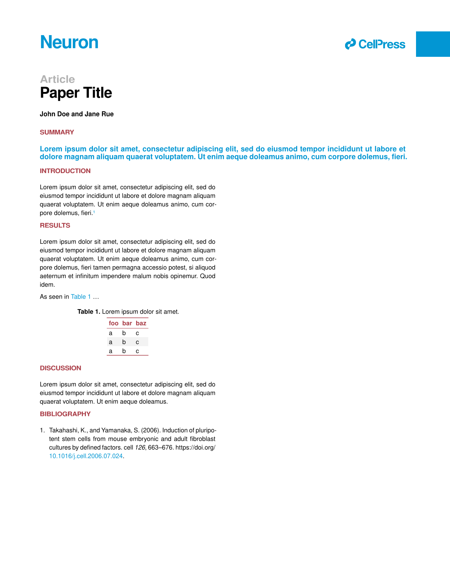

# Unofficial Cell Press template

An unofficial template for Cell Press research articles.

## Example

See [template/report.typ](template/report.typ).

## Requires Typst v0.14

Since this package relies on table subheaders ([typst/typst#6168](https://github.com/typst/typst/pull/6168)), it requires Typst v0.14+ (or a development version).

## Logo

The copyright of the [logo](inc/cell_press_logo.pdf) is held by Elsevier Inc.
