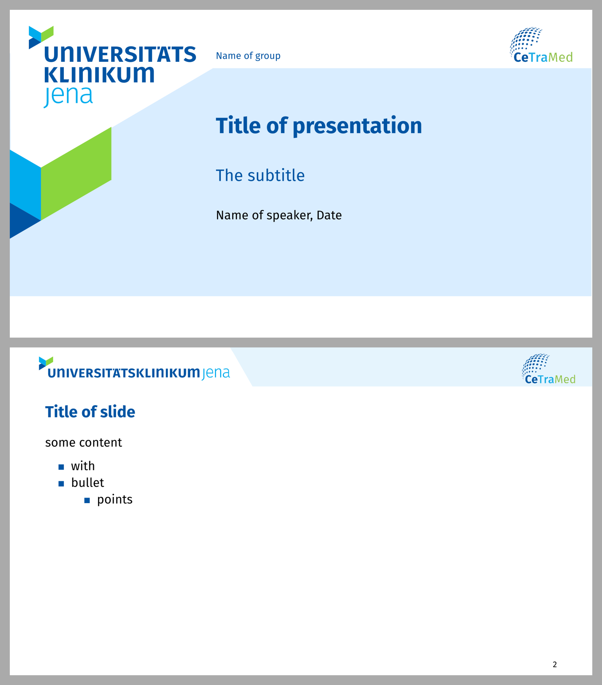

# CeTraMed slides template for Polylux

A template for creating presentation slides with Typst and
[Polylux](https://github.com/polylux-typ/polylux/), following the branding of
the CeTraMed at University Hospital Jena.

Use via
```sh
typst init @preview/cetramed-polylux your-new-talk
```

A `slides.typ` file will be created for you and contains the basic scaffold for
your slides.

This template uses the fonts
[Fira Sans](https://bboxtype.com/typefaces/FiraSans) and
[Fira Math](https://github.com/firamath/firamath/releases).
Make sure you have them installed.




