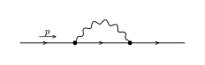
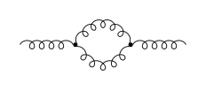
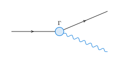
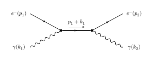
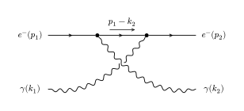

# CeTZ Feynman Lite

Draw Feynman diagrams with customizable propagators, vertices and momentum arrows
inside a CeTZ canvas.

**Release candidate 0.1.0. Not yet published on Typst Universe.**
Requires Typst 0.15.0 or newer and CeTZ 0.5.2. The library itself needs no Python.

## Quick start



The versioned import below works after installing the local release candidate,
or after publication. From a source checkout, replace it with `"lib.typ"`
when the document is at the repository root.

```typst
#import "@preview/cetz:0.5.2"
#import "@preview/cetz-feynman-lite:0.1.0": feynman
#set page(width: auto, height: auto, margin: 8mm)

#cetz.canvas(length: 10mm, {
  feynman(
    ("i", "a", (particle: "fermion", momentum: (label: $p$,))),
    ("a", "b", (particle: "fermion")),
    ("b", "o", (particle: "fermion")),
    ("a", "b", (particle: "photon",
      route: (side: "above", level: 1))),
    incoming: ("i",), outgoing: ("o",),
    layout: (main-lines: (("i", "a", "b", "o"),)),
  )
})
```

## Examples

### Gluon loop



Curly propagators with two independently routed internal edges.

```typst
#import "@preview/cetz:0.5.2"
#import "@preview/cetz-feynman-lite:0.1.0": feynman
#set page(width: auto, height: auto, margin: 8mm)

#cetz.canvas(length: 10mm, {
  feynman(
    ("i", "a", (particle: "gluon")),
    ("a", "b", (particle: "gluon",
      route: (side: "above", level: 1))),
    ("a", "b", (particle: "gluon",
      route: (side: "below", level: 1))),
    ("b", "o", (particle: "gluon")),
    incoming: ("i",), outgoing: ("o",),
    layout: (main-lines: (("i", "a", "b", "o"),)),
  )
})
```

### A custom interaction vertex



Set a marker, fill and label without specifying vertex coordinates.

```typst
#import "@preview/cetz:0.5.2"
#import "@preview/cetz-feynman-lite:0.1.0": feynman
#set page(width: auto, height: auto, margin: 8mm)

#cetz.canvas(length: 12mm, {
  feynman(
    ("i", "v", (particle: "fermion")),
    ("v", "o", (particle: "fermion")),
    ("v", "g", (particle: "photon", style: (paint: blue))),
    vertices: (
      (id: "i", role: "incoming"),
      (id: "v", marker: "blob", size: 0.25,
        fill: blue.lighten(85%), stroke: 1pt + blue,
        label: $Gamma$, label-offset: (0, 0.5)),
      (id: "o", role: "outgoing"),
      (id: "g", role: "outgoing"),
    ),
  )
})
```

### Compton scattering: s channel



Incoming particles are on the left, outgoing particles on the right. The internal electron carries momentum `p₁ + k₁`.

```typst
#import "@preview/cetz:0.5.2"
#import "@preview/cetz-feynman-lite:0.1.0": feynman
#set page(width: auto, height: auto, margin: 8mm)

#cetz.canvas(length: 10mm, {
  feynman(
    ("i", "a", (particle: "fermion")),
    ("j", "a", (particle: "photon")),
    ("a", "b", (particle: "fermion",
      momentum: (label: $p_1 + k_1$, label-offset: 0.35,
        span: 0.5))),
    ("b", "o", (particle: "fermion")),
    ("b", "g", (particle: "photon")),
    vertices: (
      (id: "i", role: "incoming",
        label: $e^-(p_1)$,
        label-offset: (-0.8, 0)),
      (id: "j", role: "incoming",
        label: $gamma(k_1)$,
        label-offset: (-0.8, 0)),
      (id: "a"), (id: "b"),
      (id: "o", role: "outgoing",
        label: $e^-(p_2)$,
        label-offset: (0.8, 0)),
      (id: "g", role: "outgoing",
        label: $gamma(k_2)$,
        label-offset: (0.8, 0)),
    ),
    layout: (main-lines: (("a", "b"),),
      incoming-order: ("i", "j"),
      outgoing-order: ("o", "g")),
  )
})
```

### Compton scattering: u channel



The internal electron carries momentum `p₁ − k₂`. The photon crossing is not a vertex; `crossing-gap` marks it with a gap.

```typst
#import "@preview/cetz:0.5.2"
#import "@preview/cetz-feynman-lite:0.1.0": feynman
#set page(width: auto, height: auto, margin: 8mm)

#cetz.canvas(length: 10mm, {
  feynman(
    ("i", "a", (particle: "fermion")),
    ("j", "b", (particle: "photon",
      route: (side: "below", level: 1))),
    ("a", "b", (particle: "fermion",
      momentum: (label: $p_1 - k_2$, label-offset: 0.35,
      span: 0.5))),
    ("b", "o", (particle: "fermion")),
    ("a", "g", (particle: "photon",
      route: (side: "below", level: 1))),
    vertices: (
      (id: "i", role: "incoming",
        label: $e^-(p_1)$, label-offset: (-0.8,
        0)),
      (id: "j", role: "incoming",
        label: $gamma(k_1)$, label-offset: (-0.8,
        0)),
      (id: "a"),
      (id: "b"),
      (id: "o", role: "outgoing",
        label: $e^-(p_2)$, label-offset: (0.8,
        0)),
      (id: "g", role: "outgoing",
        label: $gamma(k_2)$, label-offset: (0.8,
        0)),
    ),
    layout: (main-lines: (("i", "a", "b", "o"),),
      incoming-order: ("i", "j"),
      outgoing-order: ("o", "g")),
    crossing-gap: 0.12,
  )
})
```

The two Compton diagrams give the s- and u-channel tree-level contributions.
The examples illustrate drawing conventions; amplitudes are not evaluated.
[Browse the example sources](docs/readme-examples/README.md).

## Documentation

- [User guide source](docs/quickstart.typ): code and diagrams side by side, followed by the API reference.
- [API chapter source](docs/api-reference.typ): vertex, edge, style, momentum and layout fields.
- [Compton s-channel example](docs/snippets/compton.typ).
- [Compton u-channel example](docs/snippets/compton-u.typ).

- [PDF user guide and API reference](docs/manual.pdf).

## Public API

| Definition | Purpose |
|---|---|
| `feynman(..args, crossing-gap: 0)` | Return drawing elements for a CeTZ canvas. |
| `diagram-data(..connections, vertices: (), edges: (), incoming: (), outgoing: (), registry: styles, layout: (:))` | Normalize and lay out a graph; return vertices, edges, positions and routes. |
| `draw-diagram(result, crossing-gap: 0)` | Draw previously prepared graph data. |
| `render(result, unit: 9mm, crossing-gap: 0)` | Render graph data in a standalone canvas. |
| `styles` | Built-in scalar, fermion, photon, gluon, ghost and double presets. |
| `register-style(registry, name, definition)` | Return a registry with a new named preset. |

Edges accept local style overrides, labels, independent momentum arrows, bends,
Bézier control points and self-loop options. Vertices accept markers, size, fill,
stroke and labels; coordinates are optional. Layout supports main lines, external
ordering and external spacing.

Coordinates and offsets use canvas units. Line widths use Typst lengths.
Arrow direction and momentum direction are independent.

## Limits

Layout is deterministic and rule-based. It does not guarantee label avoidance
or optimal placement for arbitrary graphs. Crossing gaps currently apply only to
arrowless wave/wave intersections. The library does not compute amplitudes,
generate all diagrams of a theory, or validate physical conservation laws.

## Local development

Run `./scripts/check.ps1` for regression checks, then
`python scripts/release.py` (Python 3.11+) to create and validate a submission.
The generated path is recorded in `output/latest-release.txt`.


## License

[MIT](LICENSE). See [CHANGELOG](CHANGELOG.md) for release notes.
