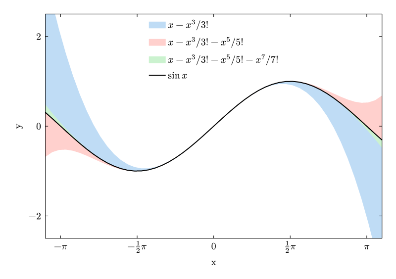
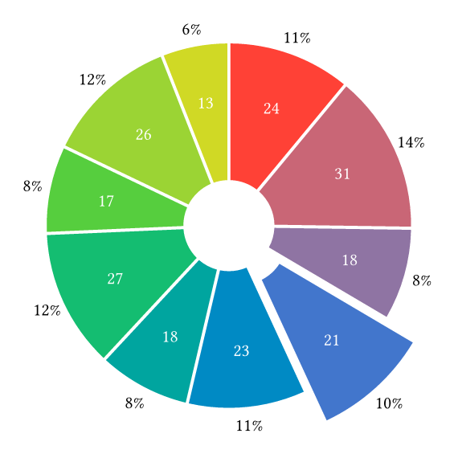
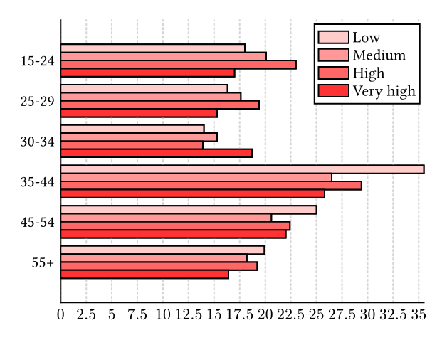
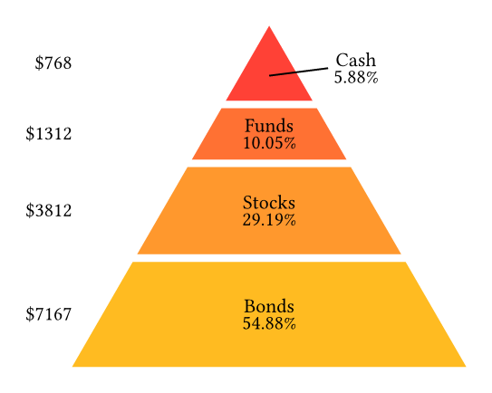
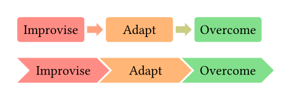
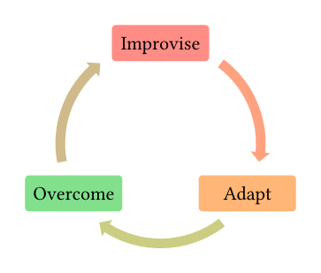

# CeTZ-Plot

CeTZ-Plot is a library that adds plots and charts to [CeTZ](https://github.com/cetz-package/cetz), a library for drawing with [Typst](https://typst.app).

CeTZ-Plot requires CeTZ version ≥ 0.4.0!

## Examples
<!-- img width is set so the table gets evenly spaced by GitHubs css -->
<table>
<tr>
  <td>
    <a href="gallery/line.typ">
      
    </a>
  </td>
  <td>
    <a href="gallery/piechart.typ">
      
    </a>
  </td>
  <td>
    <a href="gallery/barchart.typ">
      
    </a>
  </td>
</tr><tr>
  <td>Plot</td>
  <td>Pie Chart</td>
  <td>Clustered Barchart</td>
</tr>
<tr>
  <td>
    <a href="gallery/pyramid.typ">
      
    </a>
  </td>
  <td colspan="2">
    <a href="gallery/process.typ">
      
    </a>
  </td>
</tr><tr>
  <td>Pyramid</td>
  <td colspan="2">Process</td>
</tr>
<tr>
  <td>
    <a href="gallery/circular.typ">
      
    </a>
  </td>
</tr><tr>
  <td>Cycle</td>
</tr>
</table>

*Click on the example image to jump to the code.*


## Usage

For information, see the [manual](./manual.pdf).

To use this package, simply add the following code to your document:
```
#import "@preview/cetz:0.4.0"
#import "@preview/cetz-plot:0.1.2": plot, chart

#cetz.canvas({
  // Your plot/chart code goes here
})
```

## Installing

To install the CeTZ-Plot package under [your local typst package dir](https://github.com/typst/packages?tab=readme-ov-file#local-packages) you can use the `install` script from the repository.

### Just

This project uses [just](https://github.com/casey/just), a handy command runner.

You can run all commands without having `just` installed, just have a look into the `justfile`.
To install `just` on your system, use your systems package manager. On Windows, [Cargo](https://doc.rust-lang.org/cargo/) (`cargo install just`), [Chocolatey](https://chocolatey.org/) (`choco install just`) and [some other sources](https://just.systems/man/en/chapter_4.html) can be used. You need to run it from a `sh` compatible shell on Windows (e.g git-bash).

## Testing

This package comes with some unit tests under the `tests` directory.
To run all tests you can run the `just test` target. You need to have
[`tytanic`](https://github.com/tingerrr/tytanic/) in your `PATH`: `cargo install tytanic --git https://github.com/tingerrr/tytanic`.
