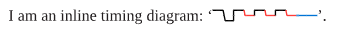
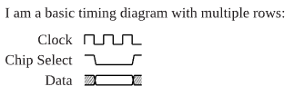

# cetz-timing

A Typst Package for Timing Diagrams.

Currently under development, see 'TODO'. 

* The `texttiming` API is done. 
* The `timingtable` API is very experimental and will change.

## Usage Examples

### Inline

```typst
#import "cetz-timing.typ": texttiming

I am an inline timing diagram: '#texttiming("HL3{CX}2Z"}'.
```

Output:




### Diagram

```typst
#import "cetz-timing.typ": timingtable

I am a basic timing diagram with multiple rows:

#timingtable(
  [Clock], [6{C}],
  [Chip Select], [H4LH],
  [Data], [U4DU],
)
```

Output:



## TODO

- Add data labels: `D[MISO]`. `content` in braces.
- Add CeTZ anchors for diagram.
- Add optional CeTZ anchors for individual signals: `D<miso>`, `D<miso>[MISO]`.
- Make anchors available so users can do custom arrows and annotations -> leave drawing CeTZ `canvas` to the user?
- Apply color to `U` pattern.
- Add option to omit first column of timing table.
- Add integration to `cetz-plot`
- [_Optional_] Understand difference between timingtable and timing plot in tikz-timing and port it if suitable
- [_Optional_] Add caption to timing table.
- [_Optional_] Add table header to timing table.
- [_Optional_] Add tick marks.
- [_Optional_] Add grouping of table rows.
- [_Optional_] Add highlighting of row groups and ticks.
- [_Optional_] Correct `strok` argument.
- [_Optional_] Resolve `mantys` warnings.
- [_Optional_] Allow non-integer lengths for logic levels.
