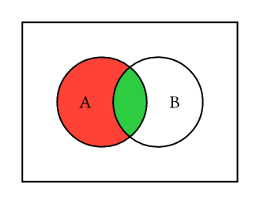
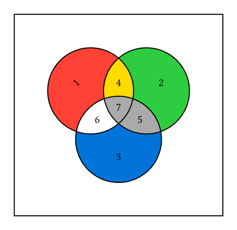

# CeTZ Venn

A [CeTZ](https://github.com/cetz-package/cetz) library for drawing simple two- or three-set Venn diagrams.

## Examples
<!-- img width is set so the table gets evenly spaced by GitHubs css -->
<table><tr>
  <td>
    <a href="gallery/venn2.typ">
      
    </a>
  </td>
  <td>
    <a href="gallery/venn3.typ">
      
    </a>
  </td>
</tr><tr>
  <td>Two set Venn diagram</td>
  <td>Three set Venn diagram</td>
</tr></table>

*Click on the example image to jump to the code.*

## Usage

This package requires CeTZ version >= 0.3.4!

For information, see the [manual (stable)](https://github.com/cetz-package/cetz-venn/blob/stable/manual.pdf?raw=true).

To use this package, simply add the following code to your document:

```
#import "@preview/cetz:0.4.0"
#import "@preview/cetz-venn:0.1.4"

#cetz.canvas({
  cetz-venn.venn2()
})
```
