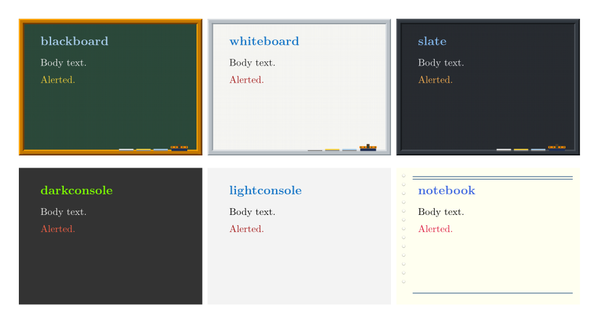

# chalkdeck

Classroom-styled slides for Typst. The backdrops are **drawn, not
photographed**: a blackboard with its wooden frame and chalk tray, a punched
notebook page, graph paper — or nothing at all. Every colour is a palette
key, so the same woodwork gives a green board, a whiteboard, a navy one or
an oak frame.

Right-to-left is a first-class case, not an afterthought.



More, including the recolourings, the backdrops and every paper size:
[gallery/themes.pdf](gallery/themes.pdf).

```typ
#import "@preview/chalkdeck:0.1.0": *

#show: chalkdeck.with(
  theme: "blackboard",
  title: [My talk],
  author: [Me],
)

#slide(title: [First slide])[
  #slide-list([one], [two], [three])

  #slide-block(kind: [Theorem], title: [Gauss])[
    $ integral_(-oo)^oo e^(-x^2) dif x = sqrt(pi). $
  ]
]
```

## What it gives you

| function | what it is |
|---|---|
| `chalkdeck(..)` | the `show` rule: page, palette, backdrop, title slide |
| `slide(body, title:)` | one slide, with the numbered footline |
| `slide-section(name)` | a numbered divider; its name rides in the footline |
| `slide-block(body, kind:, title:)` | a titled block, ruled down its leading edge |
| `slide-list(..)` | `kind: "itemize"` or `"enumerate"` |
| `slide-columns(..)` | any number of equal columns |
| `slide-alert(body)` | the palette's `alert` colour |
| `slide-palette()` | the palette in force, for your own furniture |

## Themes

Seven ship. `blackboard`, `darkconsole`, `lightconsole` and `notebook` are the
palettes of Kazuki Maeda's [`kmbeamer`](https://github.com/kmaed/kmbeamer),
colour for colour; `whiteboard` and `slate` reuse the same woodwork in other
tints.

```typ
#show: chalkdeck.with(theme: "slate")
```

## Recolouring

A palette is a plain dictionary of six keys — `bg fg structure alert title
muted` — plus four the board backdrop uses: `board frame-lit frame-dim
plate`.

**`palette:` merges into the theme's**, so the common wish costs one key:

```typ
// the same blackboard, but navy
#show: chalkdeck.with(theme: "blackboard",
  palette: (board: rgb("#12314F"), bg: rgb("#12314F")))

// pale wood instead of varnished pine
#show: chalkdeck.with(theme: "blackboard",
  palette: (frame-lit: rgb("#E8C39E"), frame-dim: rgb("#8A5A3B"),
            plate: rgb("#C89464")))
```

Spelling out ten keys to change one is no kind of customisation, which is
why merging is the default rather than an option.

### `print` — the one for paper

The board themes flood every page with a dark field: fine on a projector,
ruinous on a laser printer. `print` has no backdrop at all, sets black on
white, and picks a blue and a red dark enough to stay legible once a
monochrome printer has turned them into greys. Nothing else changes.

```typ
#show: chalkdeck.with(theme: "print", ratio: "a4")
```

## The clock

`clock:` puts a small figure in the top corner — right under `ltr`, left
under `rtl` — after powerdot's `clock` option.

```typ
#show: chalkdeck.with(clock: 20)                       // minutes
#show: chalkdeck.with(clock: duration(minutes: 45))
#show: chalkdeck.with(clock: (total: 45, mode: "remaining"))
#show: chalkdeck.with(clock: (n, total) => [#n of #total])
#slide(clock: none)[ .. ]        // off, or overridden, per slide
```

`mode:` is `"elapsed"` (the default), `"remaining"` or `"both"`.

By default it **paces the talk** rather than reading the wall: it prints the
time you should be *at* when you reach each slide. Typst has no access to the
time of day — `datetime.today()` gives the date, but `.hour()` is `none` — so
a clock computed at compile time is the only kind Typst alone can draw. This
one needs no viewer support and works on paper.

### A really ticking clock

powerdot's clock is not typeset text at all: it is a PDF **form field** whose
value Acrobat JavaScript rewrites every second (`app.setInterval`). That is a
property of the PDF, not of the typesetter, so it can be added from outside —
and `tools/pdfclock.py` does exactly that:

```typ
#show: chalkdeck.with(clock: (live: true))   // leaves an invisible marker
```

```sh
python3 tools/pdfclock.py deck.pdf -o deck-live.pdf
python3 tools/pdfclock.py deck.pdf --format "h:MM tt"   # 12-hour am/pm
python3 tools/pdfclock.py deck.pdf --countdown 45       # 45 min remaining
```

The script finds each `#CLK#` marker, covers it with a read-only `/Widget`
named `chalkclock.N`, and attaches a document-level `app.setInterval` script
— the same three pieces powerdot assembles. `--countdown` goes further than
powerdot and counts down from the moment the deck is opened.

The ink is chosen by **sampling the backdrop** behind the corner, so the
clock is light on a slate and dark on paper; `--colour RRGGBB` overrides it.

#### Which viewers actually run it

The clock needs two pieces of Acrobat JavaScript: `app.setInterval` and
`util.printd`. Checked against the readers' own source rather than assumed:

| viewer | ticks? | |
|---|---|---|
| Adobe Acrobat / Reader | yes | the reference implementation |
| Firefox (built-in PDF.js) | yes | `app.setInterval` and `util.printd` are both in `src/scripting_api/`; scripting on by default since Fx 88 (`pdfjs.enableScripting`) |
| Chrome / Edge (PDFium) | partly | PDFium has a JS engine and AcroForm support; timers are the shaky part — test your deck before relying on it |
| Foxit Reader | mostly | wide but incomplete JS object model |
| Okular, Evince, Zathura, Apple Preview, SumatraPDF, most mobile readers | no | no Acrobat JS engine at all |

Where it does not run, the field simply shows the `--freeze` value — the deck
is never broken, only static. `--countdown` uses plain arithmetic instead of
`util.printd`, so it is the more portable of the two.

Needs `pymupdf` to build (`pip install pymupdf`); the resulting PDF needs
nothing.

## Backdrops

`backdrop:` takes `"board"`, `"notebook"`, `"grid"`, `"plain"`, `none`, or a
function `(w, h, palette) => content`. A theme names its own default, so
mixing is free:

```typ
#show: chalkdeck.with(theme: "slate", backdrop: "grid")

// your own
#show: chalkdeck.with(backdrop: (w, h, p) => {
  place(top + left, rect(width: w * 1cm, height: h * 1cm, fill: p.bg))
})
```

`grid: false` drops the board's 1 mm ruling, `tray: false` the eraser and
chalks.

## Paper sizes

`ratio:` takes a name from `chalk-papers`, or a size of your own:

| name | cm | |
|---|---|---|
| `"4-3"` | 12.8 × 9.6 | upstream's own canvas, the default |
| `"16-9"` | 16 × 9 | |
| `"16-10"` | 15.36 × 9.6 | |
| `"3-2"` | 14.4 × 9.6 | |
| `"5-4"` | 12 × 9.6 | |
| `"1-1"` | 9.6 × 9.6 | square |
| `"a4"` `"a5"` `"b5"` `"letter"` | 29.7 × 21, … | real sheets, landscape |

```typ
#show: chalkdeck.with(ratio: "a4")            // a printable handout
#show: chalkdeck.with(ratio: (20cm, 12cm))    // your own
#show: chalkdeck.with(ratio: (width: 20cm, height: 12cm))
```

`:` and `x` are accepted in a name, so `"16:10"` and `"16x10"` both work. An
unknown name is an **error**, not a silent fallback — `ratio: "16-10"` used
to come out 4:3, and a deck that quietly ignores what it was asked for is
worse than one that refuses.

Everything scales with the sheet: the woodwork, the notebook's rules and
punched column, the margins that have to clear them, and the type. A margin
quoted in centimetres only clears the frame at one size — on A4 the wood
grows to 9.3 mm and a fixed 9 mm margin would put the text under it. `size:`
is `auto` and works out to 11 pt on the screen shapes, scaling **up** only,
so an A4 handout is not 11 pt lost on a big page; pass a length to override.

The **text margin follows the backdrop, not the theme**: the board eats 4 mm
of woodwork on every side, the notebook a punched column down one, a flat
backdrop nothing at all.

`backdrop-notebook` scales its whole sheet with the page — every number in
`nb-metrics` is quoted for a 9.6 cm sheet and multiplied by `h / 9.6` — so
the header rules clear the first line of text at slide size and at thumbnail
size alike. The margin is computed from the same table, and the punched
column follows the leading edge, so an `rtl` deck is punched on the right.

## Right-to-left

The frame title, the bullets, the rule beside a block and the two halves of
the footline all read `text.dir`. Set the deck's direction once:

```typ
#show: chalkdeck.with(lang: "ar", dir: rtl, font: ("Tajawal",))
```

The notebook backdrop mirrors with it: holes on the right, wide margin on the
right, ruling starting past them.

…or wrap the exception, since direction belongs to the text and not to the
deck:

```typ
#slide(title: [Mixed])[
  Latin here.
  #text(lang: "ar", dir: rtl)[ثم العربية]
]
```

Numbers and formulae stay left-to-right inside right-to-left prose — the
slide counter included. `examples/arabic.typ` is a full Arabic deck and
`examples/bilingual.typ` mixes the two; both are part of the test suite.

## Credits

The blackboard backdrop is converted **coordinate for coordinate** from the
TikZ source of the `kmbeamer` Blackboard theme by Kazuki Maeda (MIT), not
measured off a screenshot, and `chalk-colours` is its `kmbeamer_color.sty`
verbatim. Converting beats measuring whenever the source exists.

MIT licence. 

FERGOUS Abdelhak
