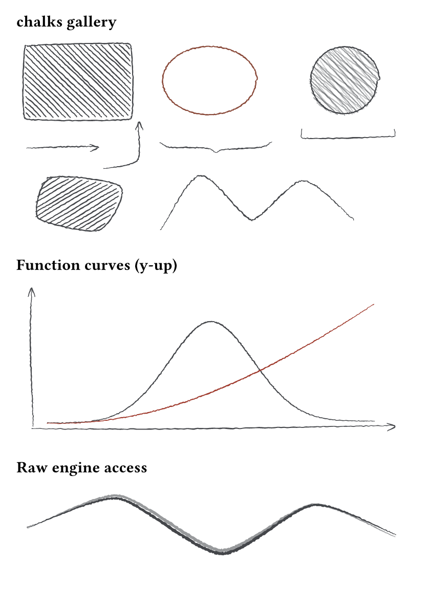
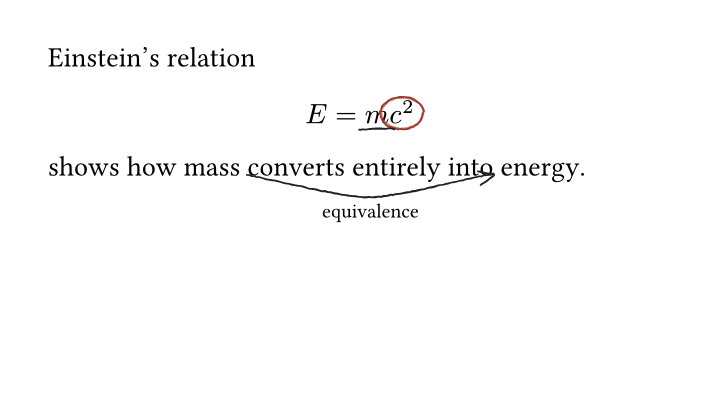

# chalks

Hand-drawn pencil/chalk-style figures and annotations for Typst. Shapes are
built as point lists in pure Typst, then a Rust → WASM engine (`chalks-engine`)
perturbs them into sketchy, variable-width filled outlines — jitter, bowing,
taper, multi-pass strokes, and two reliable fill patterns.

## Gallery

| | | |
|---|---|---|
|  |  |  |
| All primitives and fill patterns | Pin and annotate math content | Chalk theme on dark backgrounds |

## Quick start

```typst
#import "@preview/chalks:0.1.1" as chalks

#chalks.sketch(200pt, 100pt,
  chalks.rect((10, 10), (90, 60), fill: "hachure"),
  chalks.circle((150, 40), 30, fill: "shade"),
  chalks.arrow((100, 40), (120, 40)),
)
```

The module import avoids shadowing Typst's built-in `line`, `rect`, and
`ellipse` functions. Import individual chalks functions explicitly when a
flat local API is more convenient.

`sketch(width, height, ..elements)` lays out primitives (`line`, `arrow`,
`rect`, `ellipse`, `circle`, `polygon`, `region`, `brace`, `bracket`, `path`,
`fn-curve`) in a plain coordinate space and returns ordinary content —
embeddable anywhere, no CeTZ dependency. Pass `origin: "bottom-left"` for
y-up, math-convention plots. `arrow` bends through `via:` waypoints for
curved arrows, keeping the head aligned with the direction of arrival.

Annotate content by name — a pin marks a spot, `annotate` draws a mark
anchored to it, called after the pin(s) in flow order on the same page:

```typst
#import "@preview/chalks:0.1.1": annotate, pin

The key #pin("idea")[idea] deserves a ring.
#annotate(circle: "idea")
```

`annotate` also takes `underline:`, `box:`, and `arrow: (from, to)`.

Curve an arrow around nearby content with `bend` and add an optional label:

```typst
#pin("start")[$x$] becomes #pin("end")[$x^2$].
#annotate(arrow: ("start", "end"), bend: 16pt, label: [square])
```

`bend` is a length, including `em`. Positive values bend below a left-to-right
arrow; negative values bend above it. The default `0pt` stays straight. Labels
sit outside the bend with `pad` clearance, or below a straight left-to-right
arrow. Both `bend` and `label` require `arrow:`. Annotations do not reserve
space, so leave room for the curve and label in your layout.

Pin names are local to each page and may be reused on later pages. Duplicate
names on the same page are errors. Page margins support absolute lengths,
`em`, and percentages. Annotation `pad`, `dx`, and `dy`, and sketch dimensions
accept `em` lengths on Typst 0.14 and 0.15.

`annotate` places its mark in page coordinates, so call it — like the `pin`s
it references — directly in top-level page flow, not nested inside a
`grid`/`stack`/`table` cell; those containers give `place()` their own local
frame, which throws off `annotate`'s page-relative math (the mark can render
clipped away or offset from its pin).

## Style keys

Every shape/stroke/fill call accepts style overrides as named arguments
(`roughness: 1.5`, `fill: "shade"`, `seed: 42`, …); unset keys fall back to
the active theme, then to these defaults:

| Key          | Applies to    | Meaning                                                         | Default |
|--------------|---------------|------------------------------------------------------------------|---------|
| `smoothness` | stroke + fill | 0 = sharp polyline corners, 1 = fully flowing curve             | 0.7     |
| `roughness`  | stroke + fill | amplitude of jitter/bowing relative to size                     | 1.0     |
| `width`      | stroke + fill | nominal stroke width (pt)                                       | 1.2     |
| `taper`      | stroke        | pressure variation 0-1 (0 = uniform, 1 = strong taper at ends)   | 0.5     |
| `passes`     | stroke        | number of overlapping strokes (1 = single, 2 = sketchy double)   | 1       |
| `pattern`    | fill          | `hachure` \| `shade`                                              | hachure |
| `angle`      | fill          | hachure/shade direction (deg)                                    | 45      |
| `spacing`    | fill          | gap between doodle lines (pt)                                    | 4       |
| `color`      | stroke + fill | fill/stroke color                                                 | `#44464a` |
| `opacity`    | stroke + fill | overall opacity                                                   | 100%    |

Seeds are derived deterministically from input geometry by default, so
unchanged figures never re-roll between compiles.

For `path`, `width` is the full nominal stroke thickness (so a desired
half-width/radius of 3 pt means `width: 6`), while `smoothness` controls how
roundly the curve passes through its points. Chalks does not currently provide
a fixed-radius corner-rounding parameter.

## Themes

Document-wide presets, set with `#chalks-theme(<preset>)`:

- `pencil` — the default look (graphite gray, textured, tapered); the empty
  overlay.
- `ink` — darker, single-pass, crisper.
- `chalk` — light-on-dark, wider, softer; for dark backgrounds/slides.

## Raw engine access

`raw-stroke(points, closed:, style:, seed:)` and
`raw-fill(boundaries, style:, seed:)` call the engine directly on explicit
point lists / boundary rings, bypassing the shape builders.

The engine rejects non-finite numbers and excessive work with an error.
Coordinates must be within ±1,000,000 pt, widths and spacing must be positive
and at most 1,000,000 pt, and roughness must be in [0, 100]. A request accepts
at most 4096 input points across all boundaries. Strokes allow 1–32 passes,
with at most 4096 points times passes. Each fill layer allows at most 10,000
scanlines, 10,000,000 edge checks, and 2048 hatch segments. If a fill reaches
these limits, increase `spacing` or simplify its boundaries.

## Rebuilding the engine

`plugin/chalks_engine.wasm` is a prebuilt artifact. Rebuild it with the
pinned Rust toolchain (see `rust-toolchain.toml` at the repo root) via:

```sh
make plugin
```

run from the repo root (or `make plugin` inside `chalks/`, which delegates
to the same recipe). Builds are byte-reproducible per platform, but rustc
emits functions in a host-dependent order, so the committed artifact is
always the x86_64 Linux build (what CI verifies); regenerate it from any
host with `make plugin-linux` (requires Docker).

## Development

From the repo root (needed so `@preview/chalks:0.1.1` resolves for examples):

```sh
make test      # rebuild plugin, compile tests + manual, run error-message assertions
make examples  # compile chalks/examples/*.typ via @preview/chalks:0.1.1
```

See the [manual source](manual.typ) or [compiled PDF](manual.pdf) for a rendered
walkthrough of the API (every snippet shown is compiled, not just illustrative).
Complete figures are available as [the primitive gallery](examples/gallery.typ),
[an annotated equation](examples/annotated-equation.typ), and
[a chalkboard theme example](examples/chalkboard.typ).
