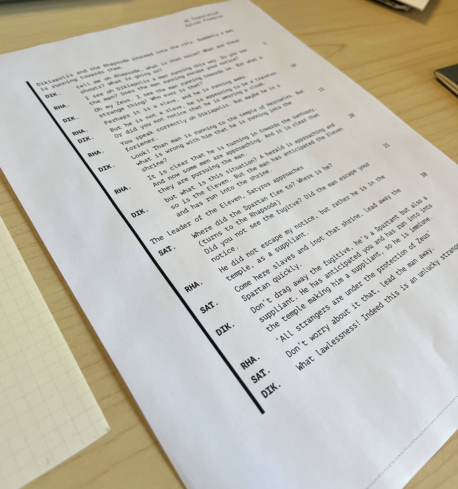

# Chatter
Typst Dialogue template designed for print. `Chatter` Aims to be an ergonomic
abstraction to the `typst` terms list function so that you can focus on
writing. For the best experience use variables for your characters: 

### Use 
This will all be created for you with with `typst init`. 
```typ
#import "@preview/chatter:0.1.0" : *; 

#let H = "Howard Moon"
#let T = "Tony Harrison"

#log()[
    #say(H)[But It's a jazz Funk classic]
    #say(T)[This is an outrage]
    ...
]
```

> [!TIP]
> Vim macros and custom snippets can make this even faster if you have the
> expertise so set them up. 



# Install
You can copy and paste over the template, or: 
```sh
typst init @preview/chatter:0.1.0
```
