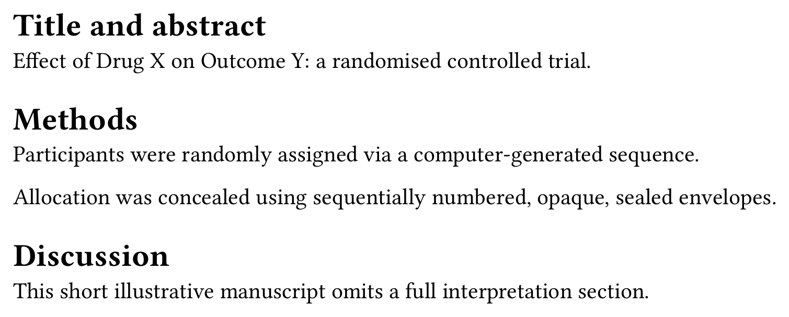
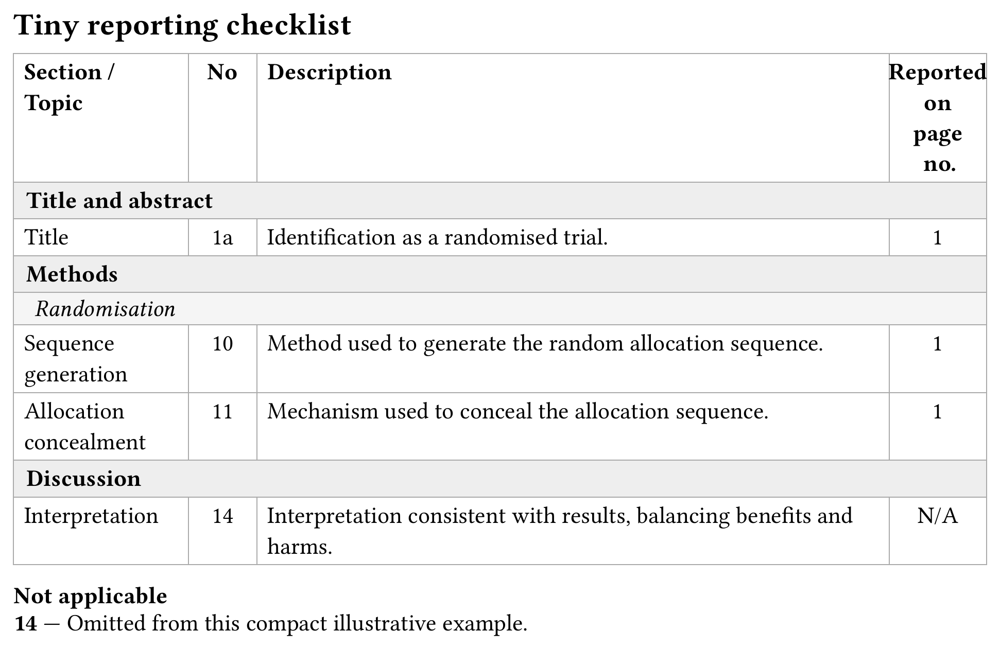

<p align="center">
  
</p>

# Checkitoff

**Checkitoff** fills in a reporting-guideline checklist — CONSORT, PRISMA, SPIRIT, STARD, STROBE — automatically. Mark where each item is answered in your manuscript; one compile produces the clean manuscript plus a completed grid citing the *real* page each item landed on.

<table align="center">
<tr>
<td align="center"></td>
<td align="center">→</td>
<td align="center"></td>
</tr>
</table>

## The problem

A completed reporting-guideline grid is, today, filled in by hand — and it's wrong the moment a paragraph moves a page. Written once at submission, re-checked (or not) at every revision, it drifts from the manuscript it's supposed to describe.

This works with real page numbers because Typst's experimental **bundle export** lets a single compile produce several documents that share one introspection space: the grid can `query()` the manuscript and know its *actual*, final page — because they're composed together in the same pass, not two unrelated files that happen to sit next to each other.

## Key features

- **Mark once, get both documents.** `check(id, body)` anchors `body` to item `id` of whichever checklist is active — zero visual footprint in the real manuscript, and the item's real page shows up in the grid automatically.
- **A point-marker form for text rendered by something else.** `check(id)` — no body — registers an item's coverage without rendering anything, for the one case `check(id, body)` can't cover cleanly: a passage a revision-tracking package (like `@preview/palimpsest`) already renders.
- **`na(id, reason: ...)`.** Declares an item not applicable, with a justification — turns "item never mentioned" from an oversight into a documented, deliberate choice.
- **Seven checklists, built in.** CONSORT 2025, PRISMA 2020, SPIRIT 2025, STARD 2015, and STROBE (cohort / case-control / cross-sectional) — each transcribed from its official source, including the real column widths, section colors, and citation notice, so the grid looks like the real thing by default.
- **A drafting overlay.** `--input preview=true` lightly highlights every `check()`'d span, tagged with its item id — a drafting aid only, never present in the real, submitted `manuscript.pdf`.
- **Quote the real wording.** `excerpt-of(id, quotes: true)` re-emits the exact text checked under an item — for a supplementary compliance appendix some journals want, with the wording quoted next to each item.
- **Diagnostics.** An item never covered, a blank `check()`, an id that matches nothing, a conflicting `check()`+`na()` — flagged visibly in the grid, or turned into a hard compile error with `strict: true` so nothing slips through right before submission.
- **Bring your own checklist.** A checklist is plain data (`name`, `full-name`, `items`, plus optional `style`/`headers`/`citation`) — a house checklist or an emerging guideline not built in yet uses exactly the same mechanism.

## Installation

Import the package, plus `contexture` — the small, package-agnostic dependency that actually assembles the bundle compile (checkitoff itself never calls Typst's own `document(...)`):

```typ
#import "@preview/checkitoff:0.1.0": *
#import "@preview/contexture:0.1.0": bundle
```

Requires **Typst 0.15** or later, specifically its `--features bundle` export (still experimental — Typst prints a warning about this on every compile, which is expected).

## Quick start

`check()`/`na()` work directly in a single ordinary file, no bundle involved:

```typ
#import "@preview/checkitoff:0.1.0": *

The primary outcome was #check("6a")[change in disease activity score
from baseline to week 12], assessed by a rater blinded to group
assignment.
```

A real project wires the manuscript and a checklist together through `contexture.bundle`:

```typ
#import "@preview/checkitoff:0.1.0": *
#import "@preview/contexture:0.1.0": bundle

#show: bundle.with(
  template: my-journal-template,
  documents: (checklist(checklist: checklists.consort),),
)

#include "manuscript.typ"
```

```sh
typst compile --features bundle --format bundle main.typ
```

produces `manuscript.pdf` — exactly what you submit, no trace of any `check()` call — and `checklist.pdf`, the completed grid, citing the real page numbers `manuscript.pdf` was just laid out with, in this same compile.

## Built-in checklists

| `checklists.` key | Guideline | Items | Notes |
|---|---|---|---|
| `consort` | CONSORT 2025 (randomised trials) | 42 | Landscape A4; one mid-level group, "Randomisation" (17a–21d). |
| `prisma` | PRISMA 2020 (systematic reviews) | 42 | Landscape US Letter; no mid-level groups. |
| `spirit` | SPIRIT 2025 (trial protocols) | 53 | Landscape US Letter. |
| `stard` | STARD 2015 (diagnostic accuracy studies) | 34 | Portrait A4. |
| `strobe.cohort` | STROBE (cohort studies) | 22 | Portrait A4. |
| `strobe.case_control` | STROBE (case-control studies) | 22 | Portrait A4. |
| `strobe.cross_sectional` | STROBE (cross-sectional studies) | 22 | Portrait A4. |

Every entry is transcribed from its official source document, including its citation and license notice — reproduced verbatim in the "citation" block at the bottom of `checklist.pdf` — and its real column widths and section colors, read directly from the source file rather than guessed.

## Documentation

- [The checkitoff guide](https://eusebe.github.io/typst-contexture-site/checkitoff/) — the full user guide, progressive from a first checklist through diagnostics, styling, wiring a real project, and combining checkitoff with `@preview/palimpsest` in the same compile — every result shown is a real compiled screenshot, not a simulation.

## Part of the `contexture` ecosystem

Built on [`@preview/contexture`](https://eusebe.github.io/typst-contexture-site/contexture/), the small shared engine behind every multi-document compile in this ecosystem. Combines cleanly with:

- [`@preview/palimpsest`](https://eusebe.github.io/typst-contexture-site/palimpsest/) — manuscript revisions and a reviewer response letter that cites the real pages.
- [`@preview/colophon`](https://eusebe.github.io/typst-contexture-site/colophon/) — a companion audit of the composed manuscript (word counts, reading time, a figure/table inventory) — no `check()`/`na()` needed.

## License

MIT
