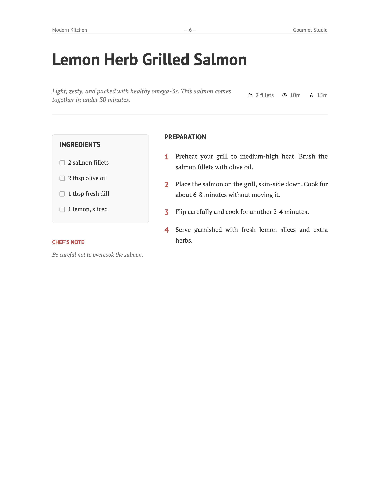

# Chef Cookbook

>A clear and minimal Typst template for creating recipe collections and cookbooks ([example pdf](example.pdf)).




## Usage

You can use this template in the Typst web app by clicking "Start from template" on the dashboard and searching for `chef-cookbook`.

Alternatively, you can use the CLI:

```bash
typst init @preview/chef-cookbook
```

## Configuration

The template exports two main functions: `cookbook` and `recipe`.

### `cookbook`

This is the main show rule that sets up the document structure, cover page, and table of contents.

```typ
#import "@preview/chef-cookbook:0.1.0": *

#show: cookbook.with(
  title: "My Recipes",
  author: "Your Name",
  date: datetime.today(),        // Optional: Defaults to today
  paper: "a4",                   // Optional: Defaults to "a4"
  accent-color: rgb("#D9534F"),  // Optional: Defaults to a warm red
  cover-image: none,             // Optional: Image content for the cover
)
```

### `recipe`

Use this function to add a recipe to your cookbook.

```typ
#recipe(
  "Recipe Name",
  description: [Short description of the dish.],
  servings: "4 servings",
  prep-time: "20m",
  cook-time: "40m",
  ingredients: (
    (amount: "200g", name: "Flour"),
    (amount: "2", name: "Eggs"),
    "Salt",
    "Pepper",
  ),
  instructions: [
    1. First step...
    2. Second step...
  ],
  notes: "Optional chef's notes.",
  image: image("path/to/dish.jpg"), // Optional
)
```

## Ingredients Format

Ingredients can be specified as a list containing either:

- **Strings**: Simple text (e.g., "Salt").
- **Dictionaries**: Structured data with `amount` and `name` keys (e.g., `(amount: "1 cup", name: "Milk")`).

## License

MIT
