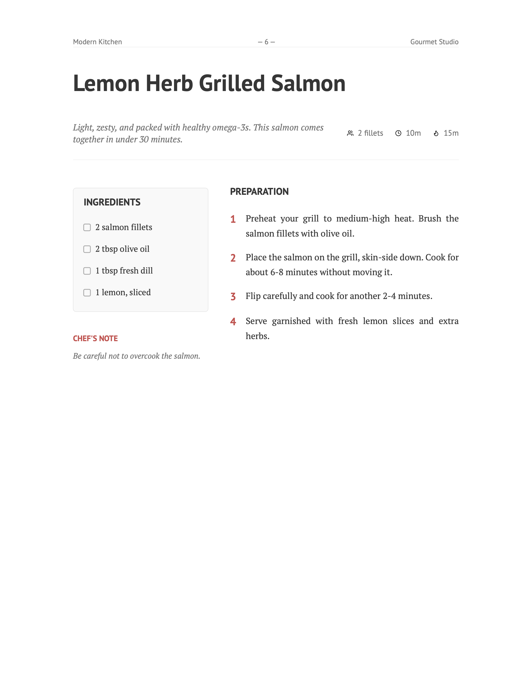

# Chef Cookbook

> A clear and minimal Typst template for creating recipe collections and cookbooks ([example pdf](./examples/example.pdf)).



## Usage

You can use this template in the Typst web app by clicking "Start from template" on the dashboard and searching for `chef-cookbook`.

Alternatively, you can use the CLI:

```bash
typst init @preview/chef-cookbook
```

## Configuration

The template exports two main functions: `cookbook` and `recipe`.

### `cookbook`

This is the main show rule that sets up the document structure, cover page, and table of contents.

```typ
#import "@preview/chef-cookbook:0.3.0": *

#show: cookbook.with(
  title: "My Recipes",
  author: "Your Name",
  date: datetime.today(),        // Optional: Defaults to today
  paper: "a4",                   // Optional: Defaults to "a4"
  accent-color: rgb("#D9534F"),  // Optional: Defaults to a warm red
  cover-image: none,             // Optional: Image content for the cover
)
```

### `recipe`

Use this function to add a recipe to your cookbook.

```typ
#recipe(
  "Recipe Name",
  description: [Short description of the dish.],
  cuisine: "Italian",                // Optional: displayed with a globe icon
  tags: ("pasta", "quick", "easy"),  // Optional: rendered as pill badges
  servings: "4 servings",
  prep-time: "20m",
  cook-time: "40m",
  ingredients: (
    (amount: "200g", name: "Flour"),
    (amount: "2", name: "Eggs"),
    "Salt",
    "Pepper",
  ),
  utensils: (
    "Large mixing bowl",
    "Whisk",
    "Baking sheet",
  ),
  instructions: [
    + First step...
    + Second step...
  ],
  notes: "Optional chef's notes.",
  image: image("path/to/dish.jpg"), // Optional
)
```

## Ingredients Format

Ingredients can be specified as a list containing either:

- **Strings**: Simple text (e.g., "Salt").
- **Dictionaries**: Structured data with `amount` and `name` keys (e.g., `(amount: "1 cup", name: "Milk")`).

## Utensils Format

Utensils are specified as a list of strings. They are rendered in the recipe sidebar with a utensil icon and accent-colored left border.

```typ
utensils: (
  "Large pot",
  "Wooden spoon",
  "Blender",
)
```

## Notes

The `notes` parameter on `recipe()` renders a styled callout box in the sidebar below the ingredients, with a lightbulb icon and accent-colored left border.

## Cuisine & Tags

Recipes can optionally include metadata for cuisine type and tags:

- **`cuisine`** (string): Displayed in the recipe header next to a globe icon. Use it to indicate the origin or style of the dish (e.g., `"Italian"`, `"Japanese"`).
- **`tags`** (list of strings): Rendered as small pill badges below the recipe header, next to a tag icon. Useful for categorising recipes by dietary info, meal type, etc.

```typ
#recipe(
  "Pasta Primavera",
  cuisine: "Italian",
  tags: ("vegetarian", "pasta", "quick"),
  // ... other params
)
```

Both parameters are optional and recipes without them render exactly as before.

## Named Sections

To divide preparation steps into named groups, pass a dictionary to `instructions` instead of plain content. Each key becomes a section heading:

```typ
instructions: (
  "For the dough": [
    + Mix flour and eggs...
    + Knead for 10 minutes...
  ],
  "For the sauce": [
    + Heat olive oil...
    + Add garlic...
  ],
)
```

Each section renders as an accent-colored uppercase label with a decorative underline, visually separating groups of steps within the preparation column. Plain content is still supported for recipes without sections.

## Internationalization (i18n)

The cookbook supports multiple languages out of the box, including English, German, Polish, French, Spanish, and Italian. It automatically adapts to the language set via Typst's native `text` rules.

### Basic Usage

To set the language for the entire cookbook, pass the `lang` parameter to the setup function:

```typst
#show: cookbook.with(
  title: "Meine Rezepte",
  lang: "de", // Switches headings to German
)

```

To change the language for a specific recipe, use set text rule:

```typst
#{
  set text(lang: "de")
  recipe(
    "Gegrillter Lachs mit Zitronen-Dill-Marinade",
    // ... other parameters
  )
}
```

### Custom Dictionaries

If a language is missing or you wish to override specific terms (e.g., using "Components" instead of "Ingredients"), use the `custom-dicts` parameter:

```typst
#show: cookbook.with(
  custom-dicts: (
    "en": (ingredients: "COMPONENTS"),
    "pl": (chefs-note: "PORADA"),
    "cz": (
      chapter: "Kapitola",
      collection: "Sbírka od ",
      contents: "Obsah",
      ingredients: "INGREDIENCE",
      utensils: "NÁČINÍ",
      chefs-note: "POZNÁMKA ŠÉFKUCHAŘE",
      note: "POZNÁMKA",
      preparations: "PŘÍPRAVA",
    ),
  )
)

```

## Development

For development guide, see [`docs/CONTRIBUTING.md`](docs/CONTRIBUTING.md)

## License

MIT
