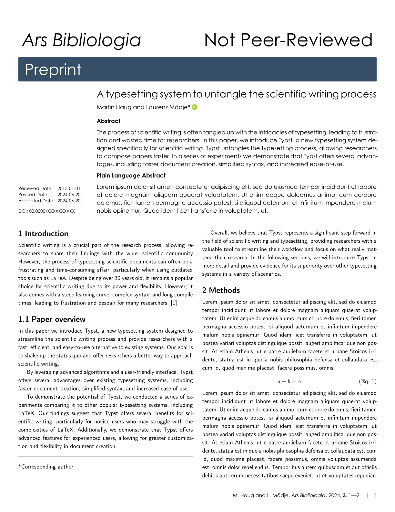
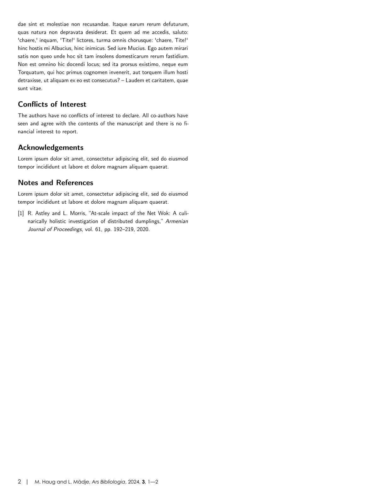

# chemicoms-paper
This is a Typst template for a two-column paper in a style similar to that of the Royal Society of Chemistry.

## Usage
You can use this template in the Typst web app by clicking "Start from template" on the dashboard and searching for the `chimicoms-paper`.

Alternatively, you can use the CLI to kick this project off using the command
```
typst init @preview/chemicoms-paper
```

## Configuration
This template exports the `template` function with the following named arguments:

- `title` (optional, content)
- `subtitle` (optional, content)
- `short-title` (optional, string)
- `author(s)` (optional, (array or singular) dictionary or string)
  - `name` (required, string, inferred)
  - `url` (optional, string)
  - `phone` (optional, string)
  - `fax` (optional, string)
  - `orcid` (optional, string)
  - `note` (optional, string)
  - `email` (optional, string)
  - `corresponding` (optional, boolean, default true if email set)
  - `equal-contributor` (optional, boolean)
  - `deceased` (optional, boolean)
  - `roles` (optional, (array or singular) string)
  - `affiliation(s)` (optional, (array or singular) dictionary or strng)
    - either: (string) or (number)
- `abstract(s)` (optional, (array or singular) dictionary or content)
  - `title` (default: "Abstract")
  - `content` (required, content, inferred)
- `open-access` (optional, boolean)
- `venue` (optional, content)
- `doi` (optional, string)
- `keywords` (optional, array of strings)
- `dates` (optional, (array or singular) dictionary or date)
  - `type` (optional, content)
  - `date` (required, date or string, inferred)

The functions also accepts a single, positional argument for the body of the paper.

## Media

<p align="center">
  
&nbsp; &nbsp; &nbsp; &nbsp;
  
</p>