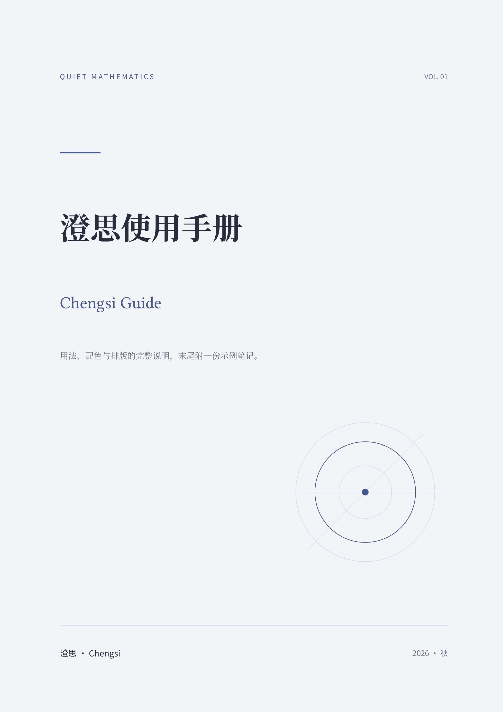

# 澄思 · Chengsi

Chinese and English mathematics notes with three color themes, theorem environments, chapter epigraphs, figures with captions, lettered appendices, syntax-highlighted code, and bibliographies. No third-party package dependencies.

适合长期书写的中英文数学笔记模板。提供封面、目录、定理与证明、章首题辞、图片与题注、按 A/B/C 编号的附录、代码高亮及参考文献；青绿、靛蓝、暖赭棕三种配色共享同一套版式。



## 快速开始

要求 Typst 0.15.0 或更新版本。运行：

```sh
typst init @preview/chengsi:0.1.2 my-notes
cd my-notes
typst compile main.typ
```

项目初始化后，修改 `config.typ` 的标题、作者及字体，在 `main.typ` 中写正文，并在 `references.bib` 中管理文献。

```typst
#import "@preview/chengsi:0.1.2": notes, environments
#let config = (title: "数学笔记", author: "你的名字", cover: false, toc: false)
#let env = environments(config: config)
#show: notes.with(config: config)

= 实数
#(env.theorem)(title: [平方非负])[
  对任意 $x in RR$，有 $x^2 >= 0$。
]
```

## 示例与文件结构

- [完整示例源码](template/main.typ)、[示例配置](template/config.typ)、[文献库](template/references.bib)。初始化项目即得到这份完整示例。
- [示例图片](template/assets/plot_1.png)：附录中作为插图示例使用的图片，随模板一起初始化。
- [示例 PDF](docs/example.pdf)：与当前模板源文件同步生成。
- `lib.typ`：公开入口，导出 `notes`、`environments`、`defaults`、`themes`。
- `template.typ`、`themes.typ`、`styles/`：版式实现及配色资源。

`notes(config: (:), body)` 应用整体版式；`environments(config: (:))` 返回下文列出的数学环境和辅助函数。两者应使用同一个配置字典。`defaults` 为默认配置字典，`themes` 为以 `teal`、`indigo`、`sepia` 为键的配色字典。

## 配色主题

只需修改 `config.typ` 中的一行，然后重新编译：

```typst
theme: "indigo",
```

| 主题名 | 配色 | 强调色 |
| --- | --- | --- |
| `"teal"` | 原版青绿，暖白封面 | `#22645E` |
| `"indigo"` | 冷调靛蓝，浅蓝灰封面 | `#45578B` |
| `"sepia"` | 暖调赭棕，米色封面 | `#855C35` |

主题仅改变颜色：封面、正文及次要文字、标题、题辞、定理底色、细线、链接、引用、代码背景及语法高亮。字体、字号、间距、编号和分页规则完全相同。默认仍是原版 `teal`。

配色定义在 `themes.typ`；`styles/quiet.tmTheme`、`styles/indigo.tmTheme`、`styles/sepia.tmTheme` 分别是三套代码配色。迁移模板时请一起复制。`code-theme: auto` 自动跟随所选主题，`none` 仍可关闭高亮。

显式填写的颜色会覆盖主题，比如 `theme: "indigo", accent: rgb("334477")`。不需要自定义时保留配置末尾的颜色项为注释，避免它们覆盖所选配色。`link-color` 与 `citation-color` 保持 `auto` 时跟随强调色；手动指定的代码主题也优先于配色主题。

## 字体

| 用途 | 默认字体 | 选择理由 |
| --- | --- | --- |
| 英文正文 | Libertinus Serif | 字面开阔，有书籍感，带真正的斜体 |
| 中文正文 | Noto Serif SC | 宋体结构，适合长篇中文阅读 |
| 标题 | Noto Sans SC | 与正文形成清晰层次 |
| 数学公式 | New Computer Modern Math | 独立的 OpenType 数学字体，支持复杂公式 |
| 代码 | DejaVu Sans Mono | 清晰的等宽字符 |

默认字体均为开源字体，项目不分发字体文件。Typst 网页编辑器可使用这些字体；本地 CLI 内置 Libertinus、New Computer Modern 和 DejaVu 字体，中文另需安装 [Noto Serif SC](https://fonts.google.com/noto/specimen/Noto+Serif+SC) 与 [Noto Sans SC](https://fonts.google.com/noto/specimen/Noto+Sans+SC)。可以使用 `typst compile --font-path /path/to/fonts main.typ` 指定字体目录。请检查编译警告，缺失字体会影响排版。各字体字段均可在 `config.typ` 中替换，公式字体需支持 OpenType MATH。

## 常用配置

所有配置都放在 `config` 字典中，未填写项使用 `template.typ` 顶部的默认值。未知字段会报错，避免拼写错误悄悄失效。

| 配置 | 作用 |
| --- | --- |
| `title`, `subtitle`, `description` | 封面主标题、副标题和引言 |
| `author`, `institution`, `date`, `edition` | 作者、机构、日期和卷次，日期为手动填写的文本 |
| `lang: "zh" / "en" / "bilingual"` | 自动生成的目录及环境名称；不会翻译正文 |
| `cover`, `toc` | 独立开关封面与目录 |
| `toc-depth: 2`, `toc-title: auto` | 目录深度和自定义标题 |
| `chapter-break: true` | 一级标题从新页开始；短笔记可关闭 |
| `heading-numbering: "1.1"` | 标题编号格式；`none` 关闭 |
| `equation-numbering: "(1)"` | 行间公式编号格式；`none` 关闭 |
| `theorem-numbering: "1"` | 定义、定理、引理、命题、推论、练习的共用编号格式；`none` 关闭 |
| `example-numbering: "1"` | 例题的独立编号格式；`none` 关闭 |
| `paper: "a4"`, `margin` | 纸张与页边距 |
| `font-size: 10.5pt`, `leading: 0.8em` | 正文字号与额外行间距 |
| `paragraph-spacing: 1.2em` | 正文段落之间的间距；与段内行间距 `leading` 分别控制 |
| `heading-before: 2em`, `heading-after: 1.2em` | 二级及更深层标题前后的间距 |
| `chapter-label-size: 11pt` | 章首“章节 / CHAPTER”标识字号 |
| `chapter-title-size: 23pt` | 一级章标题字号 |
| `section-title-size: 13pt` | 二级节标题字号 |
| `subsection-title-size: 11pt` | 三级及更深层标题字号 |
| `accent`, `tint`, `rule`, `cover-paper` | 强调色、环境浅底色、细线色、封面底色 |
| `ink`, `muted` | 正文色与次要文字色 |
| `headers`, `page-numbers`, `running-title` | 页眉、页码与页眉短标题 |

封面不显示页码，目录使用罗马数字，正文从 1 开始。页眉显示当前页所属章节；长标题可用简短的章节名称并设置 `running-title`，以免挤占页眉。

定义、定理、引理、命题、推论和练习共用一个**全文连续**的编号序列（定义 1、定理 2、练习 3……）；例题使用独立序列（例 1、例 2……），公式也有独立的全文连续编号。这些序列均不按章重置。关闭编号后不要继续对相应对象使用 `@label`。从 0.1.0 升级时，例题不再占用定理序列，后续环境的编号会相应变化。

表中列出的是包默认值。初始化项目附带的 `config.typ` 使用更宽松的排版：`paragraph-spacing: 1.5em`、`heading-after: 1.5em`、`chapter-label-size: 15pt`、`chapter-title-size: 25pt`、`section-title-size: 15pt`。可直接修改这些值；一级章标题下方的间距由 `chapter-after` 控制，不受 `heading-after` 影响。

简洁随堂笔记配置：

```typst
cover: false,
toc: false,
chapter-break: false,
lang: "zh",
```

黑白打印配置：

```typst
accent: rgb("333333"),
tint: rgb("F7F7F7"),
rule: rgb("D8D8D8"),
cover-paper: white,
```

## 代码：Python、Julia、MATLAB、Mathematica 等

直接使用带语言标记的代码围栏即可。代码块采用浅灰底、细分隔线、语言标识和 DejaVu Sans Mono 等宽字，中文注释使用中文字体后备。关键字、字符串、数值与注释用克制的青、棕、紫、灰色区分。样式只负责展示，不会运行代码。

````typst
```python
import numpy as np
A = np.array([[2, 1], [1, 2]])
print(np.linalg.eigvalsh(A))
```

```julia
using LinearAlgebra
A = [2 1; 1 2]
println(eigvals(Symmetric(A)))
```

```matlab
A = [2 1; 1 2];
disp(eig(A));
```
````

三种语言使用 `python`、`julia`、`matlab` 标记，已在本机编译验证。也可使用 Typst 原生支持的其他语言，例如 `bash`、`json`、`rust`、`typ`。无标记代码块仍有样式，但不做语言高亮。行内代码用单反引号，例如 `` `np.array` ``，显示为浅底标签，字号与正文一致（可用 `code-inline-size` 调整）。

代码块的语言栏还支持 `mathematica`、`wolfram` 和 `wl` 标记：`mathematica` 显示为 Mathematica，`wolfram` 与 `wl` 显示为 Wolfram Language。语言栏名称由模板设置，语法高亮是否可用取决于 Typst 对相应语言标记的支持。

需要文件名或行号时，用 `env.code` 包裹一个代码块：

````typst
#(env.code)(title: [projection.jl], numbers: true)[
```julia
using LinearAlgebra
u = [1.0, 1.0]
println(dot(u, u))
```
]
````

也可先绑定 `#let code = env.code`，之后使用 `#code(...)`。`title` 是代码块右上角的标题，`numbers` 控制该代码块是否显示行号。行号由原始代码行生成，不会插入源代码；多行字符串和注释保留连续的语法高亮状态。较长代码可自然跨页，行号不会因翻页而重置。代码页头只在开头显示。

外部文件可用 `#raw(read("scripts/demo.py"), lang: "python", block: true)` 插入，也可放进 `env.code` 包装中。长行会按可用宽度排版，建议自己在合理位置断行，特别是长字符串和长路径。

在 `config.typ` 中调整：

| 配置 | 默认值与用途 |
| --- | --- |
| `font-code` | `"DejaVu Sans Mono"`，代码字体 |
| `code-size` | `9pt`，代码块字号 |
| `code-inline-size` | `1em`，行内代码字号；`1em` 表示与正文同号 |
| `code-leading` | `0.55em`，代码行间距 |
| `code-fill` | `rgb("F4F6F5")`，代码背景色 |
| `code-header` | `true`，语言栏；显式传入标题时仍显示标题栏 |
| `code-line-numbers` | `false`，全局行号开关 |
| `code-tab-size` | `4`，制表符宽度 |
| `code-theme` | `auto` 使用项目主题，`none` 关闭高亮 |

自定义颜色可编辑 `styles/quiet.tmTheme`。也可在配置里传入 `code-theme: read("my-theme.tmTheme", encoding: none)`。语法高亮与语言支持基于 [Typst 的 raw 接口](https://typst.app/docs/reference/text/raw/)，无额外 Python/Julia/MATLAB 排版依赖。

## 参考文献与超链接

正文默认使用数字引用 `[1]`，点击可跳转到文末条目。参考文献独立成页，使用较小字号、悬挂编号及舒展的行距，并以不编号的标题进入目录。外部网址和 DOI 使用深青色细下划线；目录、定理及文献的内部跳转不加下划线。

使用现成的 `references.bib`，在正文中引用，在文末添加文献表：

```typst
进一步阅读可参见 @axler2024。
关于内积空间，参见 #cite(<axler2024>, supplement: [第 6 章])。
多篇文献可以连续引用：@axler2024 @strang2010。

// 文末只放一次，不必另写“= 参考文献”。
#bibliography("references.bib")
```

`main.typ` 末尾已调用文献表。正文中的引用 key 必须与 `.bib` 中的条目对应，也不要与定理等对象的 `<label>` 重名。

默认只列出实际引用的条目。列出整个资料库用 `#bibliography("references.bib", full: true)`；希望收录某一条但不显示文内编号，可用 `#cite(<analects>, form: none)`，示例中的章首题辞来源使用了这种方式。

添加自己的文献可沿用以下结构，也可以从文献管理软件导出 BibLaTeX `.bib` 文件：

```bibtex
@book{axler2024,
  author = {Axler, Sheldon},
  title = {Linear Algebra Done Right},
  edition = {4},
  publisher = {Springer},
  date = {2024},
  doi = {10.1007/978-3-031-41026-0},
  url = {https://linear.axler.net/}
}
```

`doi` 填标识符，`url` 填完整网址；在线资料可加 `urldate = {2026-09-06}` 表示你实际访问的日期。显示哪些字段由选用的引用格式决定，例如存在 DOI 时可能不再显示 URL。模板没有改写文献的作者、排序或编号规则。

普通超链接直接使用 Typst 原生语法，推荐给长网址添加易读名称：

```typst
#link("https://linear.axler.net/")[教材主页]
#link("https://doi.org/10.1007/978-3-031-41026-0")[电子版 DOI]
```

在 `config.typ` 中调整：

| 配置 | 默认值与用途 |
| --- | --- |
| `bibliography-style` | `"ieee"`，数字编号；也可用 `"apa"` 或 `"gb-7714-2015-numeric"` |
| `bibliography-title` | `auto`，按 `lang` 生成；也可传入 `[主要参考资料]` |
| `bibliography-new-page` | `true`，参考文献另起一页；短笔记可设为 `false` |
| `bibliography-size` | `9.5pt`，文献条目字号 |
| `bibliography-spacing` | `1.1em`，参考文献段落间距 |
| `link-color` / `citation-color` | `auto`，跟随 `accent`；可分别设置颜色 |
| `link-underline` | `true`，外部网址的细下划线；可关闭 |

切换引用格式后，文内引用和文末文献会一起更新。APA 等作者年份格式也可用 `#cite(<axler2024>, form: "prose")` 生成叙述式引用。BibLaTeX 和 Hayagriva 数据、引用参数遵循 [Typst 官方文献接口](https://typst.app/docs/reference/model/bibliography/) 与 [cite 接口](https://typst.app/docs/reference/model/cite/)；多文件项目中的 `.bib` 路径相对于调用 `bibliography` 的文件。

示例书籍元数据来自 [Springer 的书籍页](https://link.springer.com/book/10.1007/978-3-031-41026-0)，课程元数据来自 [MIT OpenCourseWare](https://ocw.mit.edu/courses/18-06-linear-algebra-spring-2010/)。请把示例资料替换或补充为自己实际使用的来源。

## 章首题辞：名言与引文

在 `= 章节标题` 后、正文前插入 `epigraph` 即可。默认在页面右侧占正文宽度的 72%，使用较深灰色的小号衬线字。单行短题辞与署名整体右对齐；需要换行的题辞左对齐，署名紧接其下。原文与译文都能各自容纳在一行时，中英对照也采用右对齐。题辞不计入目录或定理编号，没有题辞的章节不需要额外设置。

`main.typ` 已绑定 `epigraph`；新建入口时，在创建 `env` 后加上 `#let epigraph = env.epigraph`：

```typst
= 极限与连续

#epigraph(author: [孔子], source: [《论语·为政》])[
  学而不思则罔，思而不学则殆。
]

这里开始写本章正文。
```

`author`、`source` 都可省略，`source` 支持内容块，例如书名、页码或 `#link(...)`。英文可设置 `italic: true`；中英对照用 `translation: [中文译文]`，译文保持正体。模板不会自动生成译文或引号，引用的标点由你控制。

全局外观在 `config.typ` 调整：

```typst
epigraph-width: 72%,
epigraph-size: 9.5pt,
epigraph-align: right, // 也可设为 left 或 center
epigraph-text-align: auto, // 自动按排版宽度选择；也可强制 left / right
epigraph-color: rgb("505D60"),
chapter-after: 4mm, // 章标题下方留白
epigraph-after: 8mm, // 题辞与正文间留白
```

单条题辞可以覆盖宽度、位置及文字对齐方式。`placement` 控制整个引文区的位置，`text-align` 控制区内的文字与署名：

```typst
#epigraph(width: 85%, placement: center, text-align: left, author: [作者], source: [书名])[
  在这里填写引文。
]
```

题辞作为一个整体分页，适合几行短引文，使署名不与引文分离。长篇摘录建议使用正文或 `remark` 环境。

## 定理、证明与交叉引用

定义、定理、引理、命题、推论和练习共用全文连续编号，例题独立编号，证明与札记不编号。视觉样式按作用区分：

标题与正文之间额外增加 `3pt` 留白，统一用于定义、定理、例题、练习、证明和札记等环境。在 `config.typ` 中调整 `environment-title-gap` 即可，例如 `4pt` 更宽松，`0pt` 恢复原来的紧凑间距。标题仍与后续正文保持在一起。

| 环境 | 样式 |
| --- | --- |
| 定理 | 浅色底与细强调线，突出核心结论 |
| 定义 | 强调名称和编号，无底色 |
| 引理、命题、推论 | 无底色，配浅色细线 |
| 例题、练习 | 无底色、无边框，深色标题 |
| 证明、札记 | 较轻的标题，保持与上下文连贯 |

章标题采用衬线字体，节标题使用无衬线字体。目录去掉点线，一级章节加大字号与组间距离，二级条目缩进、降低视觉分量；目录仍可点击跳转。

公式字号默认相对周围文字为 `math-scale: 98%`，会随脚注等局部字号变化。`equation-spacing: 0.95em` 控制行间公式上下间距；可在 `config.typ` 中微调。

从下面这个完整入口开始，或参考 `template/main.typ`。可以给常用环境绑定短名称，写笔记时就不需要前缀：

```typst
#import "@preview/chengsi:0.1.2": notes, environments
#import "config.typ": config
#let env = environments(config: config)
#let theorem = env.theorem
#let proof = env.proof
#show: notes.with(config: config)

= 极限与连续
== 数列极限

#theorem(title: [极限的唯一性])[
  若一个实数列收敛，则它的极限唯一。
] <thm-unique>

#proof[
  假设存在两个不同的极限，用三角不等式推出矛盾。
]

由 @thm-unique 可知，极限是良定义的。

$ abs(x+y) <= abs(x) + abs(y). $ <eq-triangle>
参见 @eq-triangle。
```

`env` 提供 `definition`、`theorem`、`lemma`、`proposition`、`corollary`、`example`、`exercise`、`proof`、`remark`、`epigraph`。前七种可以编号、添加 `title` 和标签；证明和札记不编号，标题默认根据 `lang` 切换。`epigraph` 用于章首题辞。

不绑定短名称时，可以写成 `#(env.theorem)(title: [标题])[正文]`。调用模板和创建环境时应传入同一个配置字典。

环境允许自然跨页；标题尽量与随后的正文保持在一起。证明末尾附带空心方块。公式默认编号，局部取消某个公式的编号可写：

```typst
#math.equation(block: true, numbering: none)[$ e^(i pi) + 1 = 0 $]
```

长篇笔记可以把章节放进单独文件，然后在 `#show: notes.with(...)` 之后使用 `#include "chapters/analysis.typ"`。被 include 的文件若需要使用 `env`，应自行 import 模板与配置并创建环境；不要再次调用 `#show: notes`。

实现遵循 Typst 官方的 [figure 自定义环境与引用](https://typst.app/docs/reference/model/figure/)、[公式排版](https://typst.app/docs/reference/math/equation/) 和 [字体配置](https://typst.app/docs/reference/text/text/) 接口。

## 许可证

代码、主题文件、文档及 `template/` 中原创示例内容采用 [MIT-0](LICENSE)，允许自由使用、修改和分发，无需保留署名或许可证文本。示例中明确标注来源的古典引文与书目信息不主张为本项目原创；未包含第三方字体或书籍全文。
