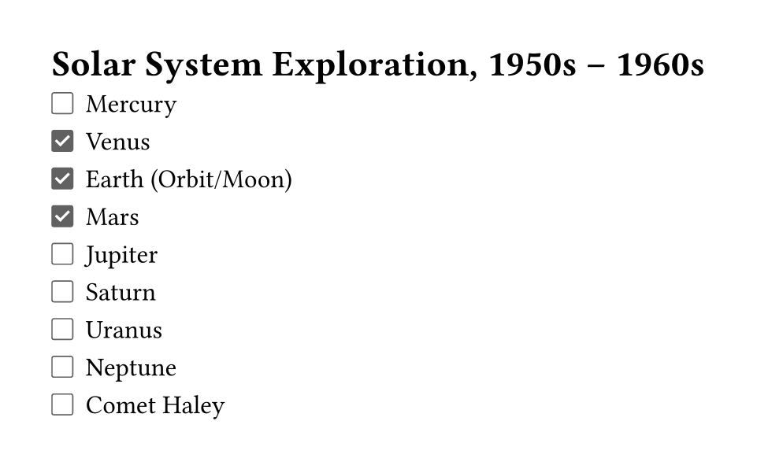
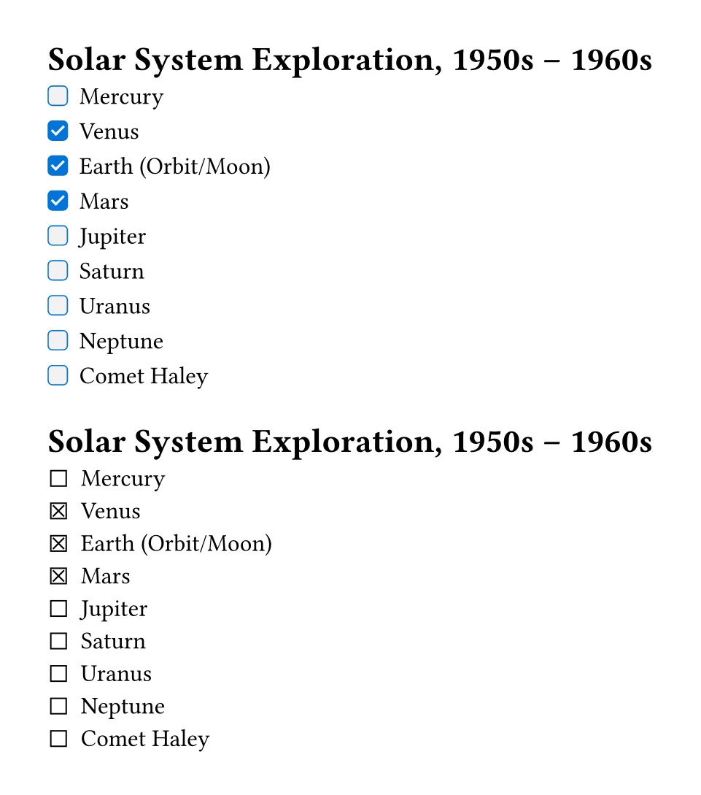

# Cheq

Write markdown-like checklist easily.

## Usage

Checklists are incredibly useful for keeping track of important items. We can use the cheq package to achieve checklist syntax similar to [GitHub Flavored Markdown](https://github.github.com/gfm/#task-list-items-extension-).

```typ
#import "@preview/cheq:0.1.0": checklist

#show: checklist

= Solar System Exploration, 1950s – 1960s

- [ ] Mercury
- [x] Venus
- [x] Earth (Orbit/Moon)
- [x] Mars
- [ ] Jupiter
- [ ] Saturn
- [ ] Uranus
- [ ] Neptune
- [ ] Comet Haley
```




## Custom Styles

```typ
#import "@preview/cheq:0.1.0": checklist

#show: checklist.with(fill: luma(95%), stroke: blue, radius: .2em)

= Solar System Exploration, 1950s – 1960s

- [ ] Mercury
- [x] Venus
- [x] Earth (Orbit/Moon)
- [x] Mars
- [ ] Jupiter
- [ ] Saturn
- [ ] Uranus
- [ ] Neptune
- [ ] Comet Haley

#show: checklist.with(unchecked: sym.ballot, checked: sym.ballot.x)

= Solar System Exploration, 1950s – 1960s

- [ ] Mercury
- [x] Venus
- [x] Earth (Orbit/Moon)
- [x] Mars
- [ ] Jupiter
- [ ] Saturn
- [ ] Uranus
- [ ] Neptune
- [ ] Comet Haley
```




## `checklist` function

```typ
#let checklist(
  fill: white,
  stroke: rgb("#616161"),
  radius: .1em,
  default: ([•], [‣], [–]),
  unchecked: auto,
  checked: auto,
  body,
) = { .. }
```

**Arguments:**

- `fill`: [`string`] &mdash; The fill color for the checklist marker.
- `stroke`: [`string`] &mdash; The stroke color for the checklist marker.
- `radius`: [`string`] &mdash; The radius of the checklist marker.
- `default`: [`tuple`] &mdash; The default markers for [Bullet List](https://typst.app/docs/reference/model/list/#parameters-marker), default to be `([•], [‣], [–])`.
- `unchecked`: [`string`] &mdash; The marker to represent unchecked item. If set to `auto`, it will use the `unchecked-sym()` function in the cheq package.
- `checked`: [`string`] &mdash; The marker to represent checked item. If set to `auto`, it will use the `checked-sym()` function in the cheq package.
- `body`: [`content`] &mdash; The main body from `#show: checklist` rule.


## `unchecked-sym` function

```typ
#let unchecked-sym(fill: white, stroke: rgb("#616161"), radius: .1em) = { .. }
```

**Arguments:**

- `fill`: [`string`] &mdash; The fill color for the unchecked symbol.
- `stroke`: [`string`] &mdash; The stroke color for the unchecked symbol.
- `radius`: [`string`] &mdash; The radius of the unchecked symbol.


## `checked-sym` function

```typ
#let checked-sym(fill: white, stroke: rgb("#616161"), radius: .1em) = { .. }
```

**Arguments:**

- `fill`: [`string`] &mdash; The fill color for the checked symbol.
- `stroke`: [`string`] &mdash; The stroke color for the checked symbol.
- `radius`: [`string`] &mdash; The radius of the checked symbol.


## License

This project is licensed under the MIT License.