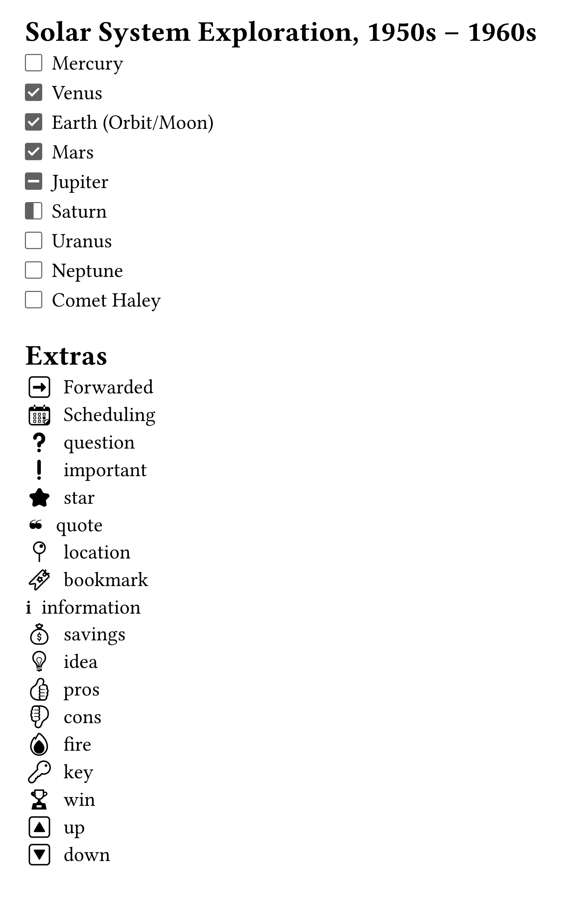
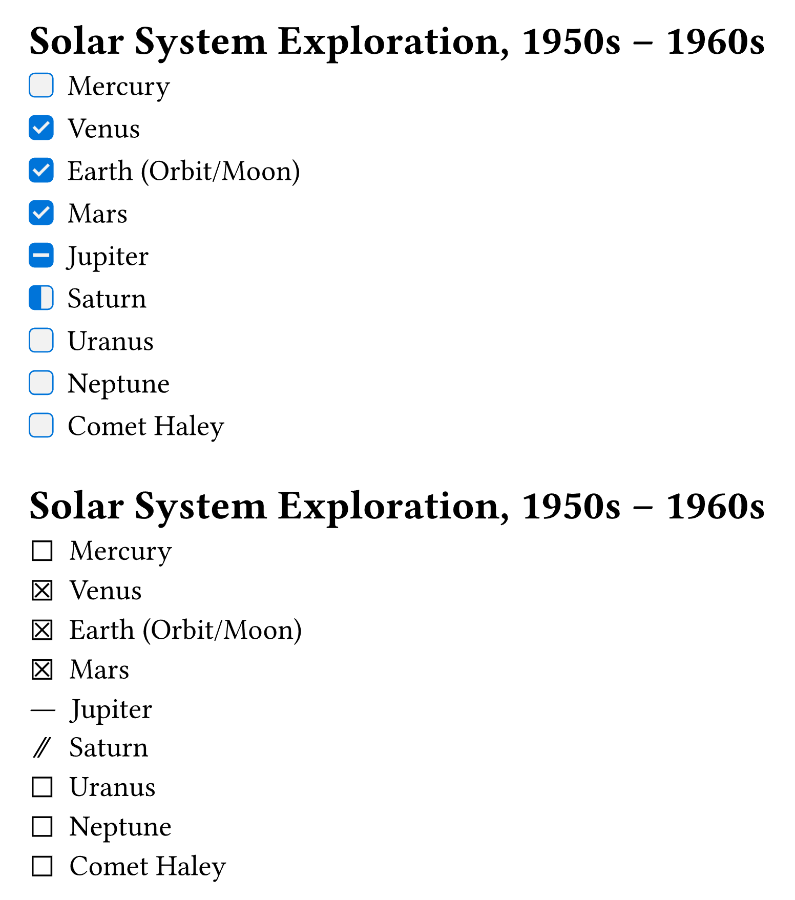
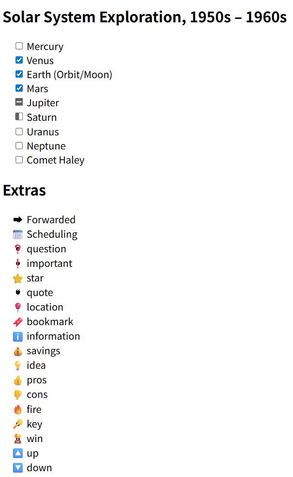

# Cheq

Write markdown-like checklist easily.

## Usage

Checklists are incredibly useful for keeping track of important items. We can use the cheq package to achieve checklist syntax similar to [GitHub Flavored Markdown](https://github.github.com/gfm/#task-list-items-extension-) and [Minimal](https://minimal.guide/checklists).

```typ
#import "@preview/cheq:0.2.3": checklist

#show: checklist

= Solar System Exploration, 1950s – 1960s

- [ ] Mercury
- [x] Venus
- [x] Earth (Orbit/Moon)
- [x] Mars
- [-] Jupiter
- [/] Saturn
- [ ] Uranus
- [ ] Neptune
- [ ] Comet Haley

= Extras

- [>] Forwarded
- [<] Scheduling
- [?] question
- [!] important
- [\*] star
- ["] quote
- [l] location
- [b] bookmark
- [i] information
- [S] savings
- [I] idea
- [p] pros
- [c] cons
- [f] fire
- [k] key
- [w] win
- [u] up
- [d] down
```



## Custom Styles

```typ
#import "@preview/cheq:0.2.3": checklist

#show: checklist.with(fill: luma(95%), stroke: blue, radius: .2em)

= Solar System Exploration, 1950s – 1960s

- [ ] Mercury
- [x] Venus
- [x] Earth (Orbit/Moon)
- [x] Mars
- [-] Jupiter
- [/] Saturn
- [ ] Uranus
- [ ] Neptune
- [ ] Comet Haley

#show: checklist.with(marker-map: (" ": sym.ballot, "x": sym.ballot.cross, "-": sym.bar.h, "/": sym.slash.double))

= Solar System Exploration, 1950s – 1960s

- [ ] Mercury
- [x] Venus
- [x] Earth (Orbit/Moon)
- [x] Mars
- [-] Jupiter
- [/] Saturn
- [ ] Uranus
- [ ] Neptune
- [ ] Comet Haley
```



## `checklist` function

```typ
#let checklist(
  fill: white,
  stroke: rgb("#616161"),
  radius: .1em,
  marker-map: (:),
  body,
) = { .. }
```

**Arguments:**

- `fill`: [`string`] &mdash; The fill color for the checklist marker.
- `stroke`: [`string`] &mdash; The stroke color for the checklist marker.
- `radius`: [`string`] &mdash; The radius of the checklist marker.
- `marker-map`: [`map`] &mdash; The map of the checklist marker. It should be a map of character to symbol function, such as `(" ": sym.ballot, "x": sym.ballot.cross, "-": sym.bar.h, "/": sym.slash.double)`.
- `show-list-set-block`: [`dictionary`] - The configuration of the block in list. It should be a dictionary of `above` and `below` keys, such as `(above: .5em)`.
- `body`: [`content`] &mdash; The main body from `#show: checklist` rule.

The default map is:

```typ
#let default-map = (
  "x": checked-sym(fill: fill, stroke: stroke, radius: radius),
  " ": unchecked-sym(fill: fill, stroke: stroke, radius: radius),
  "/": incomplete-sym(fill: fill, stroke: stroke, radius: radius),
  "-": canceled-sym(fill: fill, stroke: stroke, radius: radius),
  ">": "➡",
  "<": "📆",
  "?": "❓",
  "!": "❗",
  "*": "⭐",
  "\"": "❝",
  "l": "📍",
  "b": "🔖",
  "i": "ℹ️",
  "S": "💰",
  "I": "💡",
  "p": "👍",
  "c": "👎",
  "f": "🔥",
  "k": "🔑",
  "w": "🏆",
  "u": "🔼",
  "d": "🔽",
)
```


## `unchecked-sym` function

```typ
#let unchecked-sym(fill: white, stroke: rgb("#616161"), radius: .1em) = { .. }
```

**Arguments:**

- `fill`: [`string`] &mdash; The fill color for the unchecked symbol.
- `stroke`: [`string`] &mdash; The stroke color for the unchecked symbol.
- `radius`: [`string`] &mdash; The radius of the unchecked symbol.


## `checked-sym` function

```typ
#let checked-sym(fill: white, stroke: rgb("#616161"), radius: .1em) = { .. }
```

**Arguments:**

- `fill`: [`string`] &mdash; The fill color for the checked symbol.
- `stroke`: [`string`] &mdash; The stroke color for the checked symbol.
- `radius`: [`string`] &mdash; The radius of the checked symbol.

## `incomplete-sym` function

```typ
#let incomplete-sym(fill: white, stroke: rgb("#616161"), radius: .1em) = { .. }
```

**Arguments:**

- `fill`: [`string`] &mdash; The fill color for the incomplete symbol.
- `stroke`: [`string`] &mdash; The stroke color for the incomplete symbol.
- `radius`: [`string`] &mdash; The radius of the incomplete symbol.


## `canceled-sym` function

```typ
#let canceled-sym(fill: white, stroke: rgb("#616161"), radius: .1em) = { .. }
```

**Arguments:**

- `fill`: [`string`] &mdash; The fill color for the canceled symbol.
- `stroke`: [`string`] &mdash; The stroke color for the canceled symbol.
- `radius`: [`string`] &mdash; The radius of the canceled symbol.

## Experimental HTML Support

Cheq provides experimental support for HTML rendering, allowing you to embed HTML elements within Typst documents. This feature is still under active development, and the external API is not exposed at this time. It is subject to change without notice and may have compatibility issues.




## License

This project is licensed under the MIT License.
