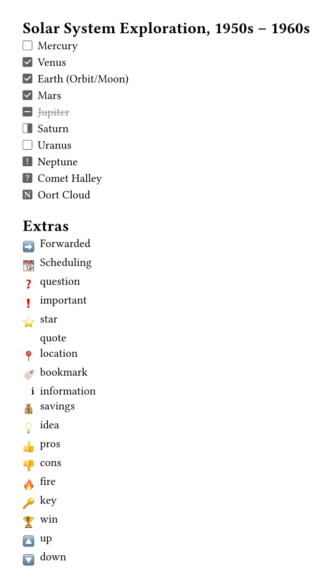
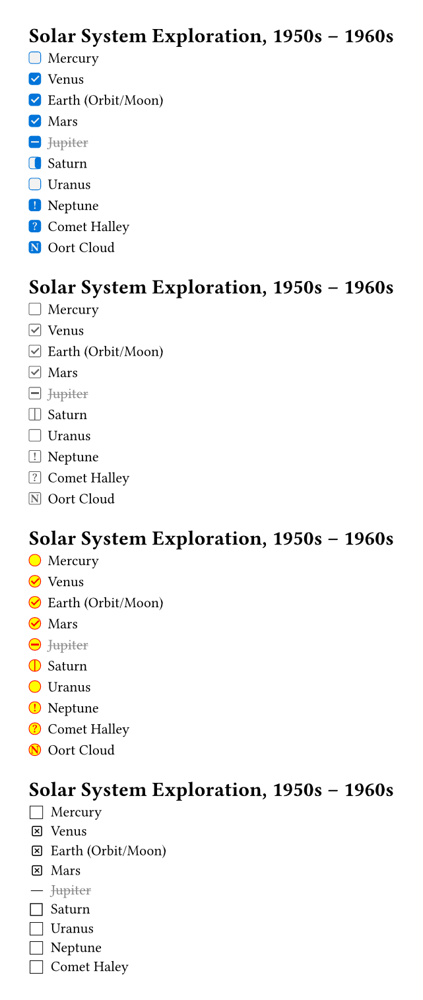
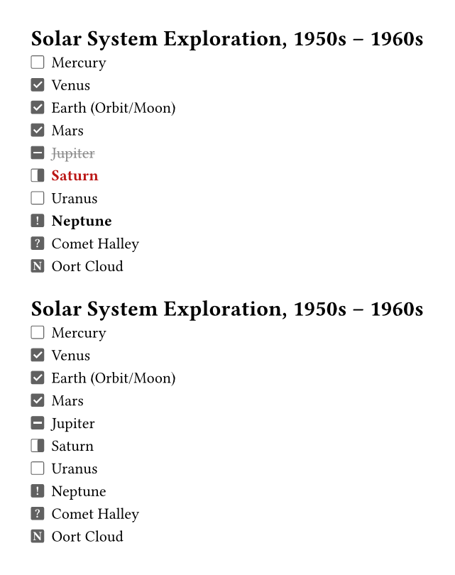
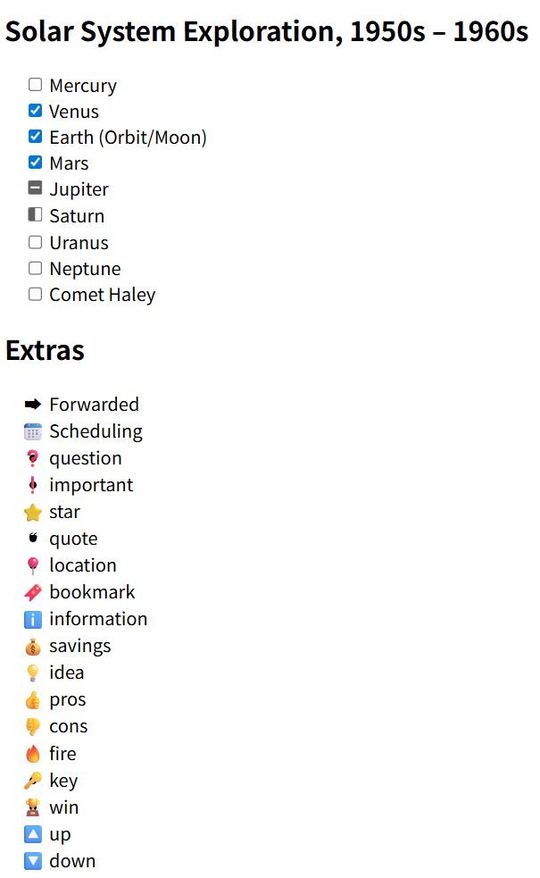

# Cheq

Write markdown-like checklist easily.

## Usage

Checklists are incredibly useful for keeping track of important items. We can use the cheq package to achieve checklist syntax similar to [GitHub Flavored Markdown](https://github.github.com/gfm/#task-list-items-extension-) and [Minimal](https://minimal.guide/checklists).

Cheq has 4 predefined symbols:[ ], [x], [/], [-]. If you put any other charachter between square parentheses at the beginning of a list item, that character will be simply displayed inside a checkbox (like [!], [?], [N] in the examples below)

```typ
#import "@preview/cheq:0.3.0": checklist

#set page(width: auto, height: auto, margin: 2em)

#show: checklist

= Solar System Exploration, 1950s – 1960s

- [ ] Mercury
- [x] Venus
- [x] Earth (Orbit/Moon)
- [x] Mars
- [-] Jupiter
- [/] Saturn
- [ ] Uranus
- [!] Neptune
- [?] Comet Halley
- [N] Oort Cloud

#show: checklist.with(extras: true)

= Extras

- [>] Forwarded
- [<] Scheduling
- [?] question
- [!] important
- [\*] star
- ["] quote
- [l] location
- [b] bookmark
- [i] information
- [S] savings
- [I] idea
- [p] pros
- [c] cons
- [f] fire
- [k] key
- [w] win
- [u] up
- [d] down
```



## Custom Styles

```typ
#import "@preview/cheq:0.3.0": checklist

#set page(width: auto, height: auto, margin: 2em)

#show: checklist.with(fill: luma(95%), stroke: blue, radius: .2em)

= Solar System Exploration, 1950s – 1960s

- [ ] Mercury
- [x] Venus
- [x] Earth (Orbit/Moon)
- [x] Mars
- [-] Jupiter
- [/] Saturn
- [ ] Uranus
- [!] Neptune
- [?] Comet Halley
- [N] Oort Cloud

#show: checklist.with(light: true)

= Solar System Exploration, 1950s – 1960s

- [ ] Mercury
- [x] Venus
- [x] Earth (Orbit/Moon)
- [x] Mars
- [-] Jupiter
- [/] Saturn
- [ ] Uranus
- [!] Neptune
- [?] Comet Halley
- [N] Oort Cloud


#show: checklist.with(light: true, stroke: rgb("FF0000"), fill: rgb("FFFF00"), radius: 0.4em)

= Solar System Exploration, 1950s – 1960s

- [ ] Mercury
- [x] Venus
- [x] Earth (Orbit/Moon)
- [x] Mars
- [-] Jupiter
- [/] Saturn
- [ ] Uranus
- [!] Neptune
- [?] Comet Halley
- [N] Oort Cloud

#show: checklist.with(marker-map: (" ": sym.ballot, "x": sym.ballot.cross, "-": sym.bar.h, "/": sym.slash.double))

= Solar System Exploration, 1950s – 1960s

- [ ] Mercury
- [x] Venus
- [x] Earth (Orbit/Moon)
- [x] Mars
- [-] Jupiter
- [/] Saturn
- [ ] Uranus
- [ ] Neptune
- [ ] Comet Haley
```



## Custom Highlight Of List Items

```typ
#import "@preview/cheq:0.3.0": checklist

#set page(width: auto, height: auto, margin: 2em)

#show: checklist.with(
  highlight-map: (
    "/": it => {text(weight: "bold", fill: rgb("#BB1615"), it)},
    "!": it => {text(weight: "bold", it)},
  ), 
)

= Solar System Exploration, 1950s – 1960s

- [ ] Mercury
- [x] Venus
- [x] Earth (Orbit/Moon)
- [x] Mars
- [-] Jupiter
- [/] Saturn
- [ ] Uranus
- [!] Neptune
- [?] Comet Halley
- [N] Oort Cloud

#show: checklist.with(highlight: false)

= Solar System Exploration, 1950s – 1960s

- [ ] Mercury
- [x] Venus
- [x] Earth (Orbit/Moon)
- [x] Mars
- [-] Jupiter
- [/] Saturn
- [ ] Uranus
- [!] Neptune
- [?] Comet Halley
- [N] Oort Cloud
```




## `checklist` function

```typ
#let checklist(
  fill: white,
  stroke: rgb("#616161"),
  radius: .1em,
  light: false, 
  marker-map: (:),
  highlight-map: (:),
  highlight: true,
  extras: false, 
  body,
) = { .. }
```

**Arguments:**

- `fill`: [`string`] &mdash; The fill color for the checklist marker.
- `stroke`: [`string`] &mdash; The stroke color for the checklist marker.
- `radius`: [`string`] &mdash; The radius of the checklist marker.
- `light`: [`bool'] &mdash; The style of the markers, light or dark.
- `marker-map`: [`map`] &mdash; The map of the checklist marker. It should be a map of character to symbol function, such as `(" ": sym.ballot, "x": sym.ballot.cross, "-": sym.bar.h, "/": sym.slash.double)`.
- `highlight-map`: [`map`] &mdash; The map of the highlight functions. It should be a map of characther to functions, see examples.
- `highlight`: [`bool`] &mdash; The flag to enable or disable the application of highlight functions to the list item.
- `extras`: [`bool`] &mdash; The flag that includes or excludes the extra map of symbols
- `body`: [`content`] &mdash; The main body from `#show: checklist` rule.

The default map is:

```typ
#let default-map = (
  "x": checked-sym(fill: fill, stroke: stroke, radius: radius),
  " ": unchecked-sym(fill: fill, stroke: stroke, radius: radius),
  "/": incomplete-sym(fill: fill, stroke: stroke, radius: radius),
  "-": canceled-sym(fill: fill, stroke: stroke, radius: radius),
)
```

The Extra map is:

```typ
#let extra-map = (
  ">": "➡",
  "<": "📆",
  "?": "❓",
  "!": "❗",
  "*": "⭐",
  "\"": "❝",
  "l": "📍",
  "b": "🔖",
  "i": "ℹ️",
  "S": "💰",
  "I": "💡",
  "p": "👍",
  "c": "👎",
  "f": "🔥",
  "k": "🔑",
  "w": "🏆",
  "u": "🔼",
  "d": "🔽",
)
```


## `unchecked-sym` function

```typ
#let unchecked-sym(fill: white, stroke: rgb("#616161"), radius: .1em) = { .. }
```

**Arguments:**

- `fill`: [`string`] &mdash; The fill color for the unchecked symbol.
- `stroke`: [`string`] &mdash; The stroke color for the unchecked symbol.
- `radius`: [`string`] &mdash; The radius of the unchecked symbol.


## `checked-sym` function

```typ
#let checked-sym(fill: white, stroke: rgb("#616161"), radius: .1em, light: false) = { .. }
```

**Arguments:**

- `fill`: [`string`] &mdash; The fill color for the checked symbol.
- `stroke`: [`string`] &mdash; The stroke color for the checked symbol.
- `radius`: [`string`] &mdash; The radius of the checked symbol.
- `light` : ['bool'] &mdash; The style of the checked symbol (light or dark)

## `incomplete-sym` function

```typ
#let incomplete-sym(fill: white, stroke: rgb("#616161"), radius: .1em, light: false) = { .. }
```

**Arguments:**

- `fill`: [`string`] &mdash; The fill color for the incomplete symbol.
- `stroke`: [`string`] &mdash; The stroke color for the incomplete symbol.
- `radius`: [`string`] &mdash; The radius of the incomplete symbol.
- `light` : ['bool'] &mdash; The style of the incomplete symbol (light or dark)


## `canceled-sym` function

```typ
#let canceled-sym(fill: white, stroke: rgb("#616161"), radius: .1em, light: false) = { .. }
```

**Arguments:**

- `fill`: [`string`] &mdash; The fill color for the canceled symbol.
- `stroke`: [`string`] &mdash; The stroke color for the canceled symbol.
- `radius`: [`string`] &mdash; The radius of the canceled symbol.
- `light` : ['bool'] &mdash; The style of the canceled symbol (light or dark)


## `character-sym` function

```typ
#let character-sym(symbol: " ", fill: white, stroke: rgb("#616161"), radius: .1em, light: false) = { .. }
```

**Arguments:**

- `symbol`: [`string`] &mdash; The character that will be put inside the checkbox
- `fill`: [`string`] &mdash; The fill color for the character symbol.
- `stroke`: [`string`] &mdash; The stroke color for the character symbol.
- `radius`: [`string`] &mdash; The radius of the character symbol.
- `light` : ['bool'] &mdash; The style of the character symbol (light or dark)


## Experimental HTML Support

Cheq provides experimental support for HTML rendering, allowing you to embed HTML elements within Typst documents. This feature is still under active development, and the external API is not exposed at this time. It is subject to change without notice and may have compatibility issues.




## License

This project is licensed under the MIT License.
