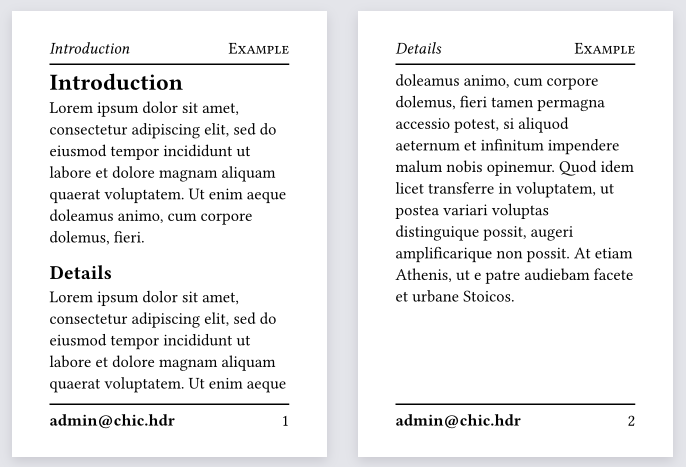

# Chic-header (v0.2.0)
**Chic-header** (chic-hdr) is a Typst package for creating elegant headers and footers

## Usage

To use this library through the Typst package manager (for Typst 0.6.0 or greater), write `#import "@preview/chic-hdr:0.2.0": *` at the beginning of your Typst file. Once imported, you can start using the package by writing the instruction `#show: chic.with()` and giving any of the chic functions inside the parenthesis `()`.

For example, the code below...

```java
#import "chic-hdr.typ": *

#set page(paper: "a7")

#show: chic.with(
  chic-footer(
    left-side: strong(
        link("mailto:admin@chic.hdr", "admin@chic.hdr")
    ),
    right-side: chic-page-number()
  ),
  chic-header(
    left-side: emph(chic-heading-name()),
    right-side: smallcaps("Example")
  ),
  chic-separator(1pt),
  chic-offset(7pt),
  chic-height(1.5cm)
)

= Introduction
#lorem(30)

== Details
#lorem(70)
```

...will look like this:

<h3 align="center">
  
</h3>

## Reference

_Note: For a detailed explanation of the functions and parameters, see Chic-header's Manual.pdf._

While using `#show: chic.with()`, you can give the following parameters inside the parenthesis:
- `width`: Indicates the with of headers and footers in all the document (default is `100%`).
- `skip`: Which pages must be skipped for setting its header and footer. Other properties changed with `chic-height()` or `chic-offset()` are preserved. (default is `()`).
- `even`: Header and footer for even pages. Here, only `chic-header()`, `chic-footer()` and `chic-separator()` functions will take effect. Other functions must be given as an argument of `chic()`.
- `odd`: Sets the header and footer for odd pages. Here, only `chic-header()`, `chic-footer()` and `chic-separator()` functions will take effect. Other functions must be given as an argument of `chic()`.
- `..functions()`: These are a variable number of arguments that corresponds to Chic-header’s style functions.

### Functions

1. `chic-header()` - Sets the header content.
    - `v-center`: Whether to vertically align the header content, or not (default is `false`).
    - `left-side`: Content displayed in the left side of the header (default is `none`).
    - `center-side`: Content displayed in the center of the header (default is `none`).
    - `right-side`: Content displayed in the right side of the header (default is `none`).
2. `chic-footer()` - Sets the footer content.
    - `v-center`: Whether to vertically align the header content, or not (default is `false`).
    - `left-side`: Content displayed in the left side of the footer (default is `none`).
    - `center-side`: Content displayed in the center of the footer (default is `none`).
    - `right-side`: Content displayed in the right side of the footer (default is `none`).
3. `chic-separator()` - Sets the separator for either the header, the footer or both.
    - `on`: Where to apply the separator. It can be `"header"`, `"footer"` or `"both"` (default is `"both"`).
    - `outset`: Space around the separator beyond the page margins (default is `0pt`).
    - `gutter`: How much spacing insert around the separator (default is `0.65em`).
    - (unnamed): A length for a `line()`, a stroke for a `line()`, or a custom content element.
4. `chic-styled-separator()` - Returns a pre-made custom separator for using it in `chic-separator()`
    - `color`: Separator's color (default is `black`).
    - (unnamed): A string indicating the separator's style. It can be `"double-line"`, `"center-dot"`, `"bold-center"`, or `"flower-end"`.
4. `chic-height()` - Sets the height of either the header, the footer or both.
    - `on`: Where to change the height. It can be `"header"`, `"footer"` or `"both"` (default is `"both"`).
    - (unnamed): A relative length (the new height value).
5. `chic-offset()` - Sets the offset of either the header, the footer or both (relative to the page content).
    - `on`: Where to change the offset It can be `"header"`, `"footer"` or `"both"` (default is `"both`).
    - (unnamed): A relative length (the new offset value).
6. `chic-page-number()` - Returns the current page number. Useful for header and footer `sides`. It doesn’t take any parameters.
7. `chic-heading-name()` - Returns the previous heading name. If there’s no previous headings, it returns the next heading name. Finally, if there’s no headings ahead, it returns nothing.

## Gallery

<h3 align="center">
  
</h3>

_Header with `chic-heading-name()` at left, and `chic-page-number()` at right. There's a `chic-separator()` of `1pt` only for the header._

<h3 align="center">
  
</h3>

_Footer with `chic-page-number()` at right, and a custom `chic-separator()` showing "end of page (No. page)" between 9 `~` symbols at each side._

## Changelog

### Version 0.1.0

- Initial release
- Implemented `chic-header()`, `chic-footer()`, `chic-separator()`, `chic-height()`, `chic-offset()`, `chic-page-number()`, and `chic-heading-name()` functions

### Version 0.2.0

_Thanks to Slashformotion (<https://github.com/slashformotion>) for noticing this version bugs, and suggesting a vertical alignment for headers._

- Fix alignment error in `chic-header()` and `chic-footer()`
- Add `v-center` option for `chic-header()` and `chic-footer()`
- Add `outset` option for `chic-separator()`
- Add `chic-styled-separator()` function