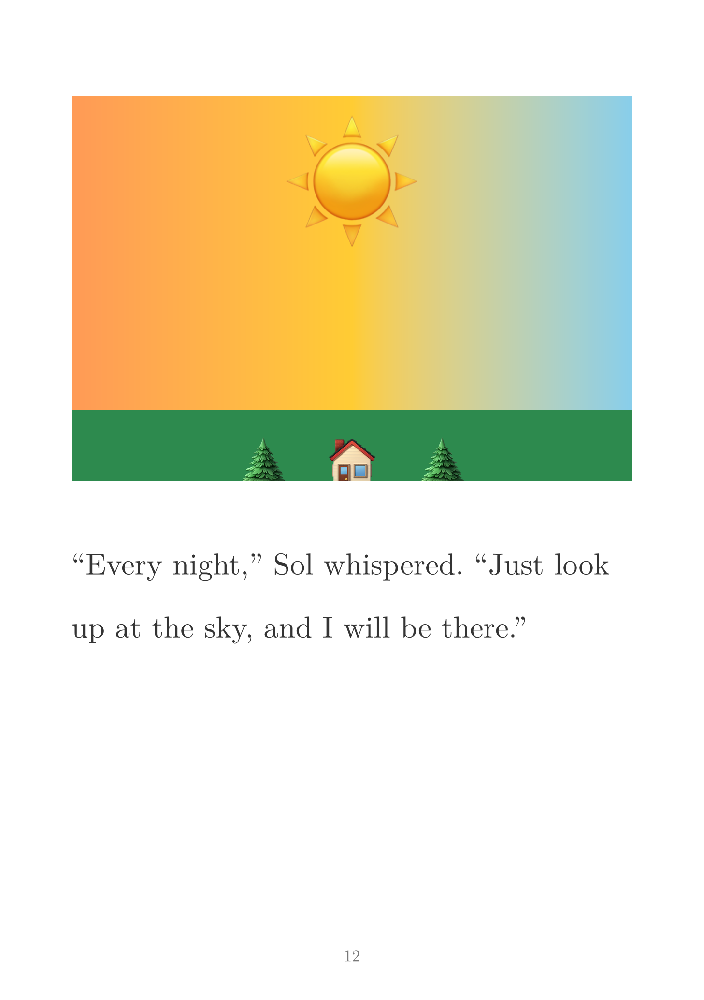

# childrens-book

A Typst template for children's picture books. Designed for early readers with large, legible text and support for full-page illustrations.

# Example

Here is a page from [example.pdf](template/example.pdf):



## Features

- **A5 page size** (148mm x 210mm) -- compact format common for children's books
- **Large 18pt body text** with generous line spacing for readability
- **Full-page illustrations** that bleed to the edges (zero margins)
- **Illustrated pages** combining an image area with story text
- **Story pages** with vertically centered text
- **Title page** with book title, author, and optional illustrator
- **"The End" closing page**
- Customizable fonts, colors, and page dimensions

## Quick start

```typst
#import "template.typ": *

#show: childrens-book.with(
  title: "My Story",
  author: "Jane Doe",
  illustrator: "John Doe",
)

#full-page-illustration(
  image("cover-art.png", width: 100%),
)

#story-page[
  Once upon a time ...
]

#illustrated-page(
  image("scene.png", width: 100%),
)[
  The story continues here.
]

#the-end()
```

Compile with:

```sh
typst compile book.typ book.pdf
```

or continuously work on it with `typst watch`.

## Template API

### `childrens-book`

The main show rule. Parameters:

| Parameter      | Default                | Description                   |
|----------------|------------------------|-------------------------------|
| `title`        | `"My Book"`            | Book title for the title page |
| `author`       | `"Author Name"`        | Author name                   |
| `illustrator`  | `none`                 | Optional illustrator name     |
| `page-width`   | `148mm`                | Page width (A5)               |
| `page-height`  | `210mm`                | Page height (A5)              |
| `font-family`  | `"New Computer Modern"`| Body font                     |
| `font-size`    | `18pt`                 | Body text size                |
| `line-spacing` | `1.4em`                | Paragraph leading             |
| `title-color`  | `rgb("#2b4c7e")`       | Title and heading color       |
| `text-color`   | `rgb("#333333")`       | Body text color               |

### Page functions

- **`full-page-illustration(content, caption: none)`** -- A full-bleed illustration page with optional caption overlay.
- **`story-page(body)`** -- A text-only page with content vertically centered.
- **`illustrated-page(illustration, body)`** -- Top illustration area (45% height) with story text below.
- **`the-end(color: rgb("#2b4c7e"))`** -- A centered "The End" closing page.

## Example

See [example.typ](./example.typ) for a complete sample children's book. The output of `$ just compile` is [example.pdf](./example.pdf).

## License

See [LICENSE](LICENSE).
