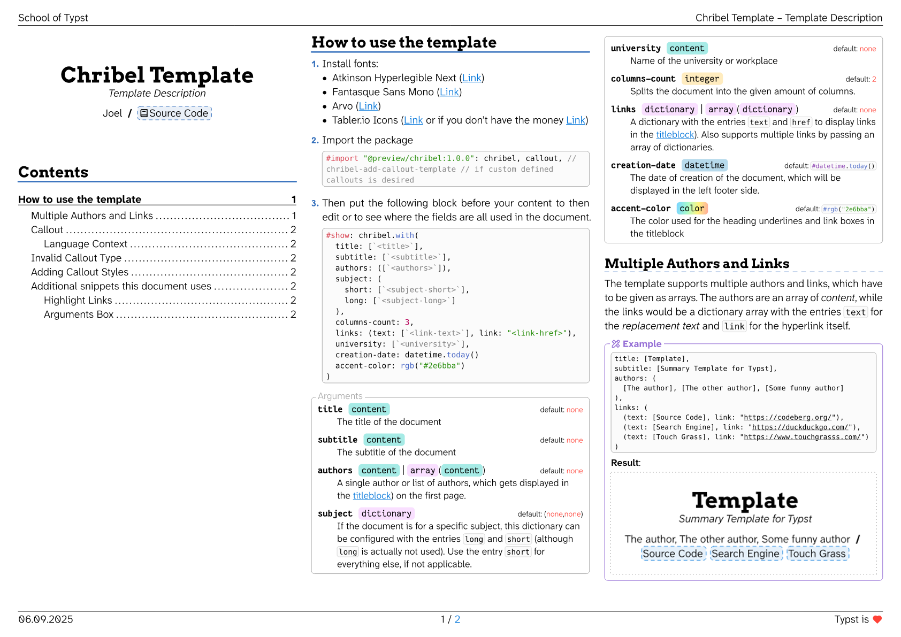

# Chribel

"Chribel" is a Swiss German word for a rough sketch (like crayon drawings drawn by babies).

This template can be used for summaries or, I don't know, technical documentation? It's a rather informal template.

**How to use the template** is described...

- ...in the [Manual](docs/manual.pdf)
- ...when copying this template
- ...when looking into the `template` folder in the repository

