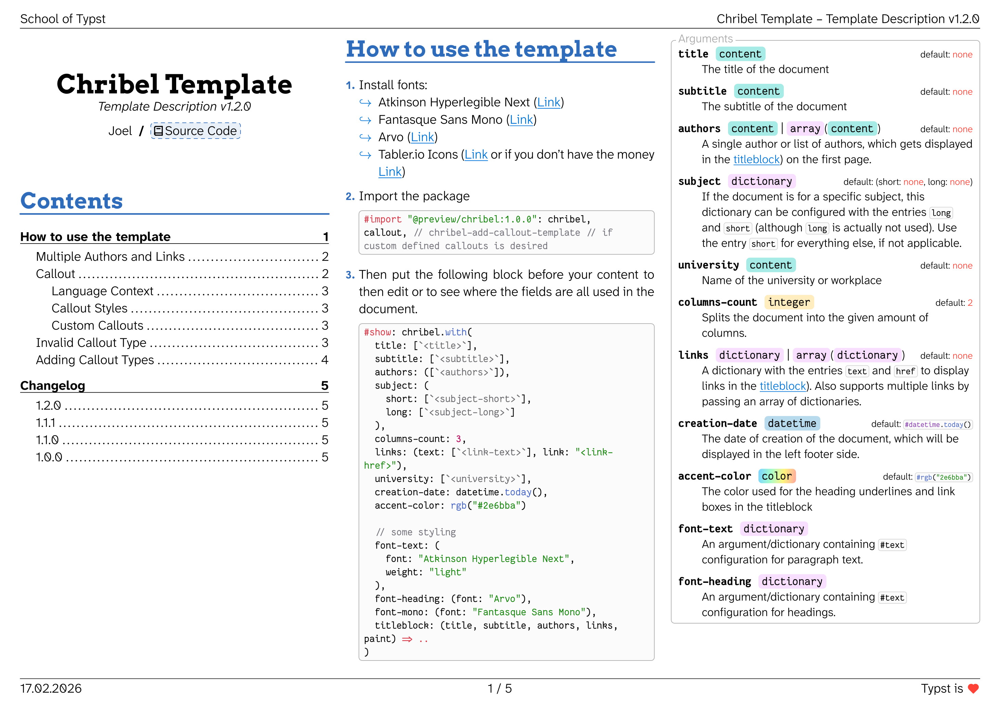

# Chribel

"Chribel" is a Swiss German word for a rough sketch (like crayon drawings drawn by babies).

This template can be used for summaries or, I don't know, technical documentation? It's a rather informal template.

**How to use the template** is described...

- ...in the [Manual](docs/manual.pdf)
- ...when copying this template
- ...when looking into the `template` folder in the [repository](https://codeberg.org/joelvonrotz/typst-chribel-template)

## Changelog

### 1.2.0

- Added `titleblock` parameter to set your own titleblock with parameters: `(title, subtitle, authors, links, paint)`.
- Added font parameters `font-text`, `font-heading` and `font-mono` to change the text styling of the document
- Updated `tableau-icons` from `0.334.1` to `0.336.0`

### 1.1.1

- Reimplemented the `"compact"` styling to work inside other callouts.
- Added current version number to this manual
- Replaced `func` with extended `style` parameter &rarr; allows now selecting custom functions or predefined styles.

### 1.1.0

- Expanded `#callout` functions with support for custom render functions (via parameter `func: ..`) 
- Added `style` parameter to `#callout` with three options: `"minimal"`, `"quarto"` and `"compact"`
- Added callou type `"caution"` and `"important"`.
- Removed `sticky` parameter from raw blocks
- Adjusted heading vertical spacing

### 1.0.0

- initial release -- added functions `#callout`\ `#chribel`, `#chribel-add-callout-template`